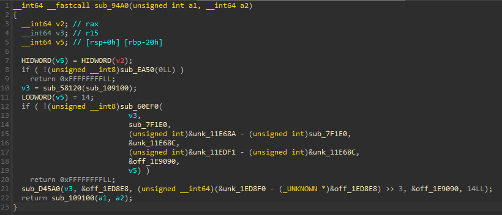
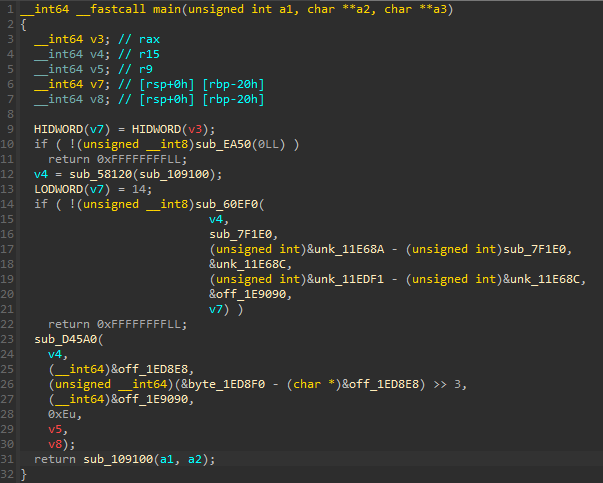

## Find Me
<p align="center">
    
</p>

We are given a binary to reverse in this challenge, and after looking at it in IDA it looks horrible!
<p align="center">
    
</p>
<p align="center">
    
</p>

The reason for this can be found in the `strings` of the program, indicating that this might be some `dotnet` program. This would also explain why the code looks so *messy* when decompiled.
```
$ strings findme | grep .NET
@0.NETCoreApp,Version=v8.0
 .NET}I
.NET 8.0
DOTNET_
Cannot use regions without specifying the range (using DOTNET_GCRegionRange)
.NET BGC
DOTNET_DbgEnableMiniDump is set and the createdump binary does not exist: %s
.NET SigHandler
```

Running the binary reveals the first 5 bytes of the flag, so we must find a way to recover the rest.
```
$ ./findme
This is the 5 first bytes of the flag: EPT{Y
Can you find the rest?
```

One of my teammates found that the flag is printed to stdout with the `write` function. Half-seriously, I then loaded up the binary in GDB (with pwndbg extension), set a breakpoint on the `write` function, and searched for the flag-prefix `EPT{` in memory with pwndbg's `search` command. The flag was apparently stored in *plaintext* in one of the memory sections of the program...
```
pwndbg> search "EPT{"
Searching for value: 'EPT{'
[anon_7fbffa800] 0x7fbffa8056e8 'EPT{YOU_FOUND_4_WAY_TO_R3AD_M3_W3LL_DON3}NP3V1jrPEW3O3GOm74AzQ0eVtf7PzEno9OpwU6cA'
```