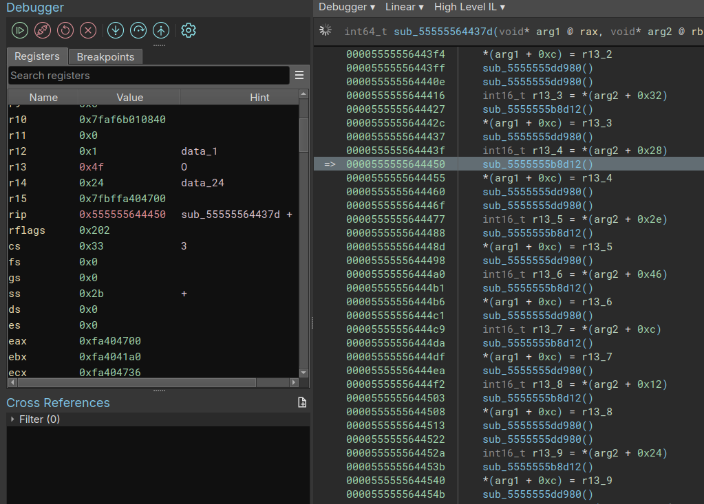
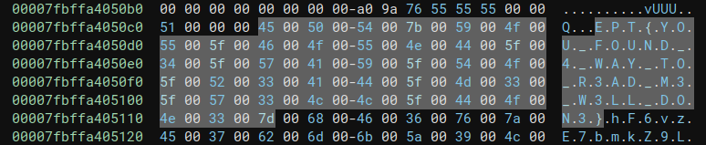

# Find Me
Author: iLoop

Flag: `EPT{YOU_FOUND_4_WAY_TO_R3AD_M3_W3LL_DON3}`
## Description
```
This time, the author is in way too deep; he has no clue what he is doing other than thinking it is so fancy. Run the program and find out.
```

## Provided challenge files
* [findme](findme)

---

Author: [FoxMaccloud](https://github.com/FoxMaccloud/)

Website: [Foxmaccloud.com](https://foxmaccloud.com/)

## Description

This is a binary where at some point the flag is stored somewhere in memory and you have to find it.

## Hypothesis

When you run this binary, it will give you the first part of the flag. My thought was that the flag was somewhere in the binary stored encrypted and running the binary will at some point decrypt it and print the first bytes of it.

## Solution


The first solution is to hit step into until you find the flag... This is the way I did it during the ctf. After hitting it for approximately 96 837 times you will eventually get a ptr to string and continuing hitting step into will eventually decrypt the entire flag for you.

Eventually after stepping enough I found this:



Where each character is made one by one and stored in the r13 register. Now stepping over these functions and following the rax ptr, we get our flag:

