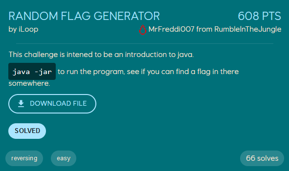
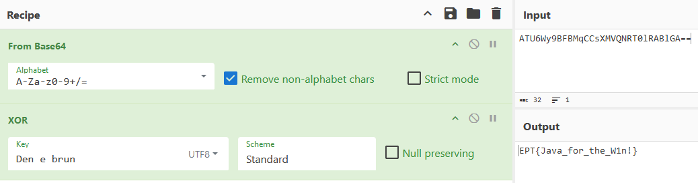

# Random Flag Generator
<p align="center">
    
</p>

The challenge provides us with a jar file, `RandomFlagGenerator.jar`, which we have to reverse.

Loading the file into [JDec](https://jdec.app/) reveals the following code:
```java
import java.util.Base64;
import java.util.Random;
import java.util.Base64.Decoder;
import java.util.Base64.Encoder;

public class RandomFlagGenerator {
   public static void main(String[] var0) {
      String var1 = "ATU6Wy9BFBMqCCsXMVQNRT0lRABlGA==";
      String var2 = "Den e brun";
      String var3 = xorString(base64Decode(var1), var2);
      String var4 = generateRandomString(20, var3);
      System.out.println("Random Flag: " + var4);
   }

   public static String generateRandomString(int var0, String var1) {
      String var2 = "ABCDEFGHIJKLMNOPQRSTUVWXYZ0123456789abcdefghijklmnopqrstuvwxyz" + var1;
      Random var3 = new Random();
      StringBuilder var4 = new StringBuilder(var0);

      for(int var5 = 0; var5 < var0; ++var5) {
         var4.append(var2.charAt(var3.nextInt(var2.length())));
      }

      return var4.toString();
   }

   public static String xorString(String var0, String var1) {
      StringBuilder var2 = new StringBuilder();

      for(int var3 = 0; var3 < var0.length(); ++var3) {
         var2.append((char)(var0.charAt(var3) ^ var1.charAt(var3 % var1.length())));
      }

      return var2.toString();
   }

   public static String base64Encode(String var0) {
      Encoder var1 = Base64.getEncoder();
      return var1.encodeToString(var0.getBytes());
   }

   public static String base64Decode(String var0) {
      Decoder var1 = Base64.getDecoder();
      return new String(var1.decode(var0));
   }
}
```

The program base64 decodes `var1` and xor it with the string `Den e brun`. It then uses the result of the xor to generate and print a random flag. Because `var4` is not the correct flag, it is reasonable to think that `var3` might be the *decrypted* flag, so we base64 decode `var1` and xor it with `var2` with [CyberChef](https://gchq.github.io/CyberChef/).

<p align="center">
    
</p>