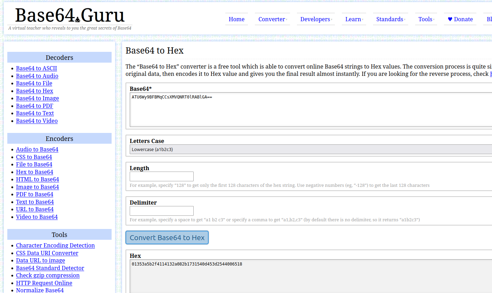
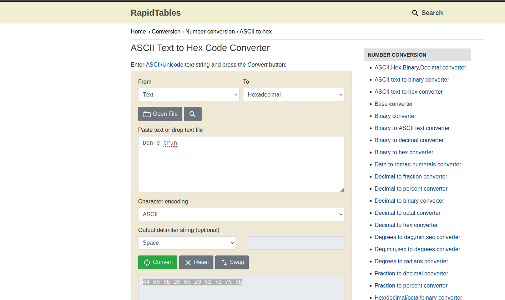
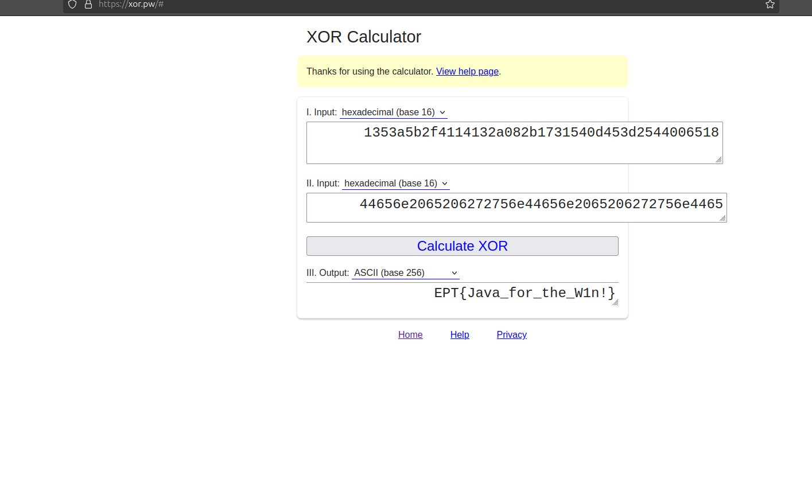
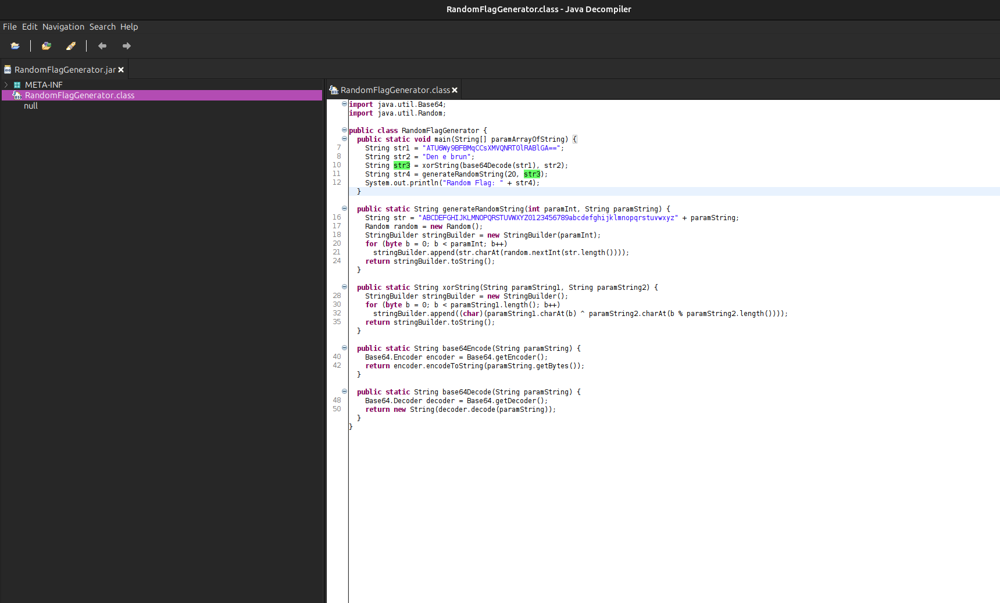

# Writeup
by fluffyhake

## Solution
Reversing the provided .jar file we can recreate parts of the code to find the flag. 

First we base 64 decode a variable and then we XOR it with another variable. This results in data which can be converted to ASCII to reveal the flag. The XOR needs to be done in the same way as the `xorString` function in the .jar.

We used jd-gui to reverse the jar file.


### Example
```java
    String str1 = "ATU6Wy9BFBMqCCsXMVQNRT0lRABlGA==";
    String str2 = "Den e brun";
    String str3 = xorString(base64Decode(str1), str2);
```
1. Convert `str1` and `str2` to hex:

    str1:
    

    str2:
    


2. Make `str2` the same length as str1 by repeating it.
    ```
    str1: 01353a5b2f4114132a082b1731540d453d2544006518
    str2: 44656e2065206272756e
    ```

    ```
    str1: 01353a5b2f4114132a082b1731540d453d2544006518
    str2: 44656e2065206272756e44656e2065206272756e4465 (6e2065206272756e cut off)
    ```


3. XOR `str1` and `str2` and convert the result to ASCII:
    

## Explanation

Using jd-gui we can get source code from the provided .jar file.
To run jd-gui we download the jar file and execute it in the command-line:
```bash
java -jar jd-gui-1.6.6.jar 
```

Once the GUI opens we can load the challenge .jar file by doing `File -> Open File` and selecting our .jar



 Looking through the code we see `str1`, `str2`, `str3` and `str4`. `str4` is the one we get output, however `str3` seems more interesting for reversing. 

Looking at `str3` we see that it most likely is our flag in plaintext. In order to create the flag it uses `str1` and `str2`, which we know the values of, so there must be a way to reverse this.

```java
import java.util.Base64;
import java.util.Random;

public class RandomFlagGenerator {
  public static void main(String[] paramArrayOfString) {
    String str1 = "ATU6Wy9BFBMqCCsXMVQNRT0lRABlGA==";
    String str2 = "Den e brun";
    String str3 = xorString(base64Decode(str1), str2);
    String str4 = generateRandomString(20, str3);
    System.out.println("Random Flag: " + str4);
  }
  
  public static String generateRandomString(int paramInt, String paramString) {
    String str = "ABCDEFGHIJKLMNOPQRSTUVWXYZ0123456789abcdefghijklmnopqrstuvwxyz" + paramString;
    Random random = new Random();
    StringBuilder stringBuilder = new StringBuilder(paramInt);
    for (byte b = 0; b < paramInt; b++)
      stringBuilder.append(str.charAt(random.nextInt(str.length()))); 
    return stringBuilder.toString();
  }
  
  public static String xorString(String paramString1, String paramString2) {
    StringBuilder stringBuilder = new StringBuilder();
    for (byte b = 0; b < paramString1.length(); b++)
      stringBuilder.append((char)(paramString1.charAt(b) ^ paramString2.charAt(b % paramString2.length()))); 
    return stringBuilder.toString();
  }
  
  public static String base64Encode(String paramString) {
    Base64.Encoder encoder = Base64.getEncoder();
    return encoder.encodeToString(paramString.getBytes());
  }
  
  public static String base64Decode(String paramString) {
    Base64.Decoder decoder = Base64.getDecoder();
    return new String(decoder.decode(paramString));
  }
}
```

We see that `str3` is the result of doing XOR on a decoded version of `str1` with `str2`. Let's try to reproduce this.

The `xorString` function takes two arguments and repeats over argument 2 until all bytes of argument 1 are XORed. The program uses a modulo operator to accomplish this. `paramString2.charAt(b % paramString2.length())`

Knowing the operation of `xorString` we can try to run our own XOR. Since `str1` is b64 encoded and not decodable to ASCII we try using hex. We convert `str1` from b64 to hex [here](https://base64.guru/converter/decode/hex), and `str2` to hex [here](https://www.rapidtables.com/convert/number/ascii-to-hex.html), before our XOR. This results in the following values:

```
str1: 01353a5b2f4114132a082b1731540d453d2544006518

str2: 44656e2065206272756e
```

Let's extend `str2` to be the same length as `str1` to mimic the `xorString` function:

```
str1: 01353a5b2f4114132a082b1731540d453d2544006518

str2: 44656e2065206272756e44656e2065206272756e4465
```

Now lets do the XOR. The [xor.pw](https://xor.pw/#) website lets us XOR and convert to ASCII.


This results in the flag for the challenge:
`EPT{Java_for_the_W1n!}`

