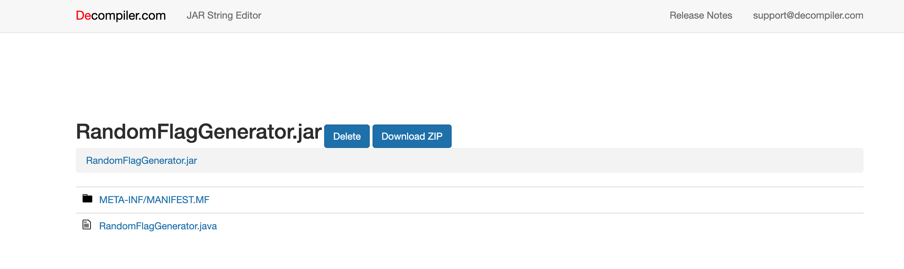

# Random Flag Generator

Writeup Author: `gardc`

## Analysis

We are given a JAR file. The first step when analyzing a JAR file is to simply decompile the JAR, which is easily done using a Java/JAR Decompiler. For ease of use, I used the online JAR decompiler at [decompiler.com](https://www.decompiler.com/).



Inspecting the decompiled RandomFlagGenerator.java, we see the following code:

```java
import java.util.Base64;
import java.util.Random;
import java.util.Base64.Decoder;
import java.util.Base64.Encoder;

public class RandomFlagGenerator {
   public static void main(String[] var0) {
      String var1 = "ATU6Wy9BFBMqCCsXMVQNRT0lRABlGA==";
      String var2 = "Den e brun";
      String var3 = xorString(base64Decode(var1), var2);
      String var4 = generateRandomString(20, var3);
      System.out.println("Random Flag: " + var4);
   }

   public static String generateRandomString(int var0, String var1) {
      String var2 = "ABCDEFGHIJKLMNOPQRSTUVWXYZ0123456789abcdefghijklmnopqrstuvwxyz" + var1;
      Random var3 = new Random();
      StringBuilder var4 = new StringBuilder(var0);

      for(int var5 = 0; var5 < var0; ++var5) {
         var4.append(var2.charAt(var3.nextInt(var2.length())));
      }

      return var4.toString();
   }

   public static String xorString(String var0, String var1) {
      StringBuilder var2 = new StringBuilder();

      for(int var3 = 0; var3 < var0.length(); ++var3) {
         var2.append((char)(var0.charAt(var3) ^ var1.charAt(var3 % var1.length())));
      }

      return var2.toString();
   }

   public static String base64Encode(String var0) {
      Encoder var1 = Base64.getEncoder();
      return var1.encodeToString(var0.getBytes());
   }

   public static String base64Decode(String var0) {
      Decoder var1 = Base64.getDecoder();
      return new String(var1.decode(var0));
   }
}

```

## Solution

The solution is to simply reverse the operations done in the main function.

```java
import java.util.Base64;
import java.util.Random;

public class CTFFlagFinder {
    public static void main(String[] args) {
        // Base64 encoded string
        String var1 = "ATU6Wy9BFBMqCCsXMVQNRT0lRABlGA==";

        // Second string for XOR operation
        String var2 = "Den e brun";

        // Decode the Base64 encoded string
        String decodedVar1 = base64Decode(var1);

        // XOR the decoded string with var2
        String xorResult = xorString(decodedVar1, var2);

        // Output the XOR result, which is part of the flag generation
        System.out.println("XOR Result: " + xorResult);
    }

    public static String xorString(String str1, String str2) {
        StringBuilder result = new StringBuilder();
        for (int i = 0; i < str1.length(); i++) {
            result.append((char) (str1.charAt(i) ^ str2.charAt(i % str2.length())));
        }
        return result.toString();
    }

    public static String base64Decode(String encoded) {
        return new String(Base64.getDecoder().decode(encoded));
    }
}

```

Compiling this `CTFFlagFinder.java` with `javac CTFFlagFinder.java` and running it with `java CTFFlagFinder` gives us the output:

`XOR Result: EPT{Java_for_the_W1n!}`
