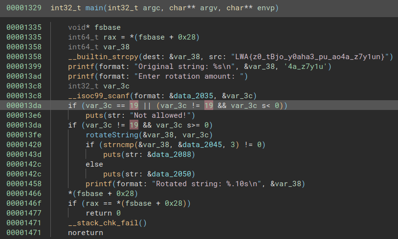
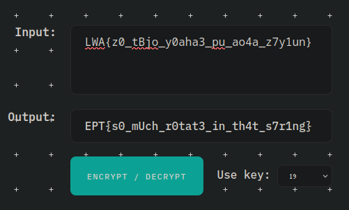

# 👶 RotC 👶
Author: nordbo

Flag: `EPT{s0_mUch_r0tat3_in_th4t_s7r1ng}`
## Description
```
Just let me rotate.
```

## Provided challenge files
* [rot_C](rot_C)

---

Author: [FoxMaccloud](https://github.com/FoxMaccloud/)

Website: [Foxmaccloud.com](https://foxmaccloud.com/)

## Description

This is a mini crackme where the program presents you with a string and then with the rotation amount. Trying to rotate, we see that it will rotate the first bit of the "obfuscated" flag and print it out.

---

Opening the binary up in binja, we can immediately see the string presented to us as well as the rotation amount it compares against.



A cipher which rotates like this is probably a `caesar cipher` and putting it into a solver with rotation on 19, we have our flag.

