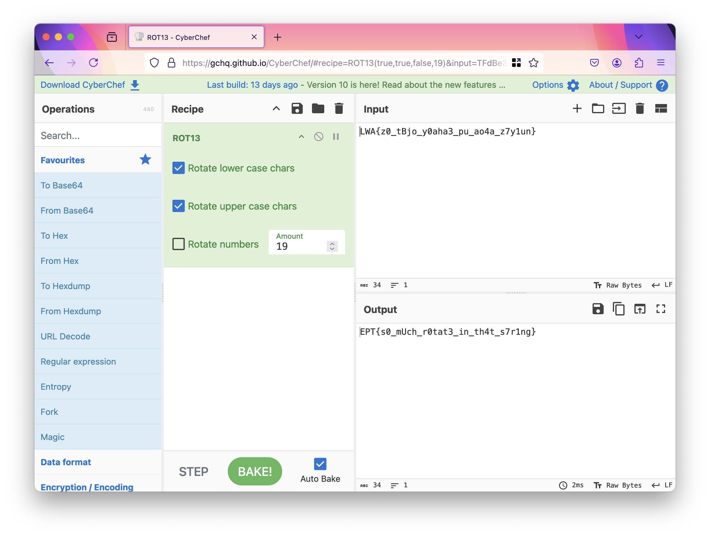

# Writeup

by .spydx @ bwnfools

## RotC :baby:

Downloading the challange we got a file named `rot_C`.
Decided to run it in a sandbox to see its output:

```shell
└─$ ./rot_C
Original string: LWA{z0_tBjo_y0aha3_pu_ao4a_z7y1un}
Enter rotation amount: 1
👎 That does not look like the start of a flag to me. 👎
Rotated string: MXB{a0_uCk
                                                  
```

Since the `LWA{}` string shared the same pattern as the flag, and the userinput requested a number for rotations, I assumed it was some kind of ROT (Caesar cipher[1]).

Opened CyberChef, and just clicked a few times getting the number 19, and then the flag was revealed int in the output:

```shell
EPT{s0_mUch_r0tat3_in_th4t_s7r1ng}
```

[CyberChef - Output](https://gchq.github.io/CyberChef/#recipe=ROT13(true,true,false,19)&input=TFdBe3owX3RCam9feTBhaGEzX3B1X2FvNGFfejd5MXVufQ)


Just for fun, tried the lucky number 19 in the sandbox, getting a `Not allowed` message.
But we already had the flag.

```shell
└─$ ./rot_C
Original string: LWA{z0_tBjo_y0aha3_pu_ao4a_z7y1un}
Enter rotation amount: 19
Not allowed!
```

## Sources

1. [https://en.wikipedia.org/wiki/Caesar_cipher](https://en.wikipedia.org/wiki/Caesar_cipher)
2. [CyberChef : ROT13 - Bruteforce](https://gchq.github.io/CyberChef/#recipe=ROT13_Brute_Force(true,true,false,100,0,true,'')&input=TFdBe3owX3RCam9feTBhaGEzX3B1X2FvNGFfejd5MXVufQ)
