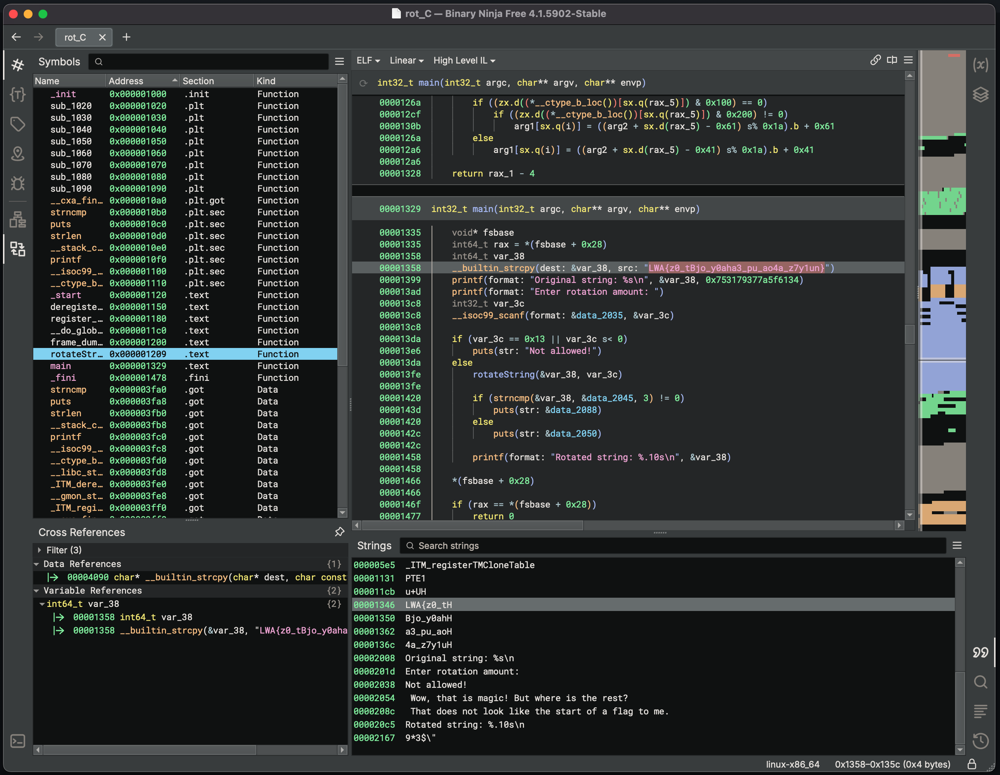
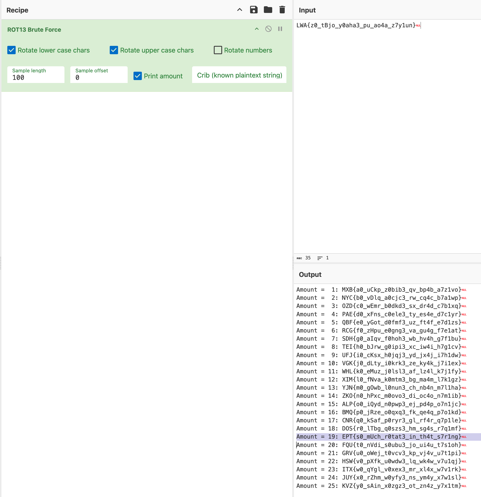

# ROTC Writeup

Writeup Author: `gardc`

## Analysis

Since this is a reversing challenge, we start by opening the binary in the reverser’s tool of choice. In this case, I’m using Binary Ninja.

Instantly we see a string of interest in the decompiled main function: `LWA{z0_tBjo_y0aha3_pu_ao4a_z7y1un}`. This appears to be our flag, but it’s encoded with a Caesar cipher.

## Decoding the Cipher

Using [CyberChef](https://gchq.github.io/CyberChef), we can perform a brute force Caesar shift to decode the flag.

By applying a shift of 19, we successfully decode the flag: `EPT{s0_mUch_r0tat3_in_th4t_s7r1ng}`.
