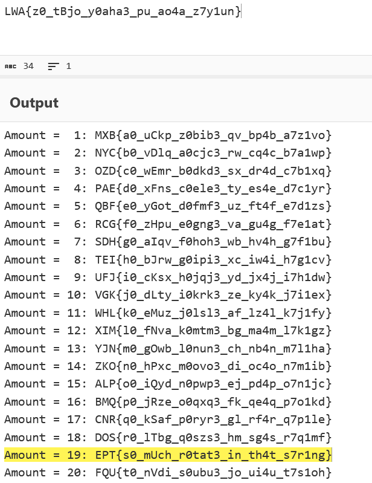

# Leftovers - writeup

## Description

Just let me rotate.

## Writeup

### Analysis

When running the file, the string ```LWA{z0_tBjo_y0aha3_pu_ao4a_z7y1un}``` is printed, which has the same format as the flag. Considering the name of the challenge, this string is likely obfuscated with a rotational cipher.

### Deciphering

- While it is possible to find the number to rotate the string, given that the three first letters in plaintext are known (ept), one can also simply use CyberChef to brute force it
- Copy the string into [CyberChef](https://gchq.github.io/CyberChef/), then choose the "ROT13 Brute Force" operation
- Either look for the flag starting with "ept" or ctrl+f for it to find the flag: ```EPT{s0_mUch_r0tat3_in_th4t_s7r1ng}``` (19 rotations)

