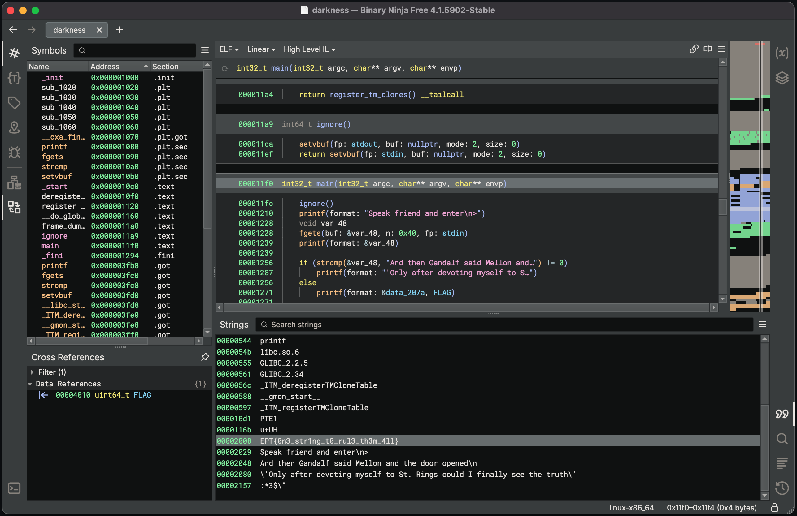
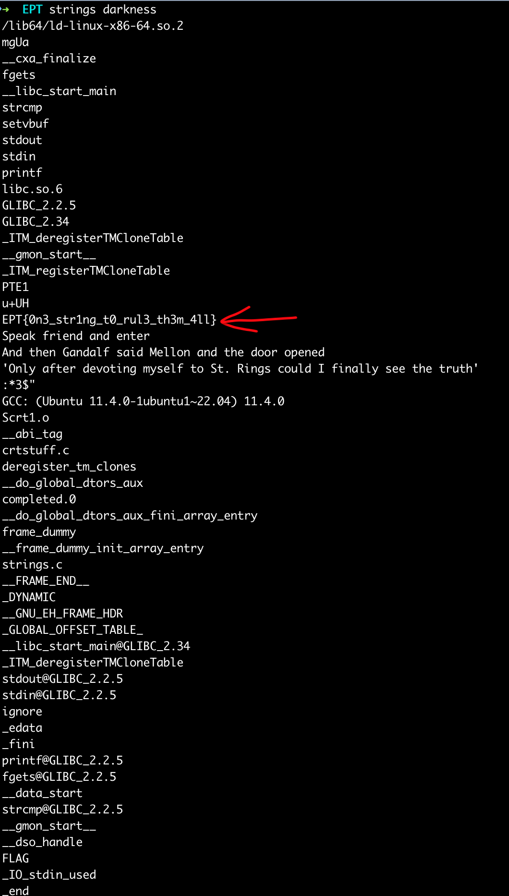

# Saint Rings writeup

Writeup Author: `gardc`

## Analysis & solution

Since this is a reversing challenge, we start by opening the binary in the reverser’s tool of choice. In this case, I’m using Binary Ninja.

Opening strings, we are instantly presented with the flag! `EPT{0n3_str1ng_t0_rul3_th3m_4ll}`

## Alternative solution

By simply using `strings` on the binary which is common when inspecting a binary, we can also find the flag.

