# Waves
By: n0k0 and poiko

This chall was a bit hard to get rendering properly for many users, so there is a video of what is acutally looks like:
https://youtu.be/hybopUPKeT8

It should be noted that it can still be solved without the rendering support, but it does help _a lot_.

## Solution

This was an interesting, lets start with the giant hint in the description before we get going:

```
I found a formula that lets me create ocean waves out of images of flags. Check out the ocean I made from my flag! You can also draw your own flag, and enjoy your waves.
```

```
I found a formula that lets me create ocean waves
```

We know that there might be some sort of transform going on with our image data.

```
Check out the ocean I made from my flag! 
```

Already here we can see a huge hint in the text, which is made clearer by a quick peek at the source of the html page where we can enter our own flags:

```js

img.onload = () => {
                  console.log(url);
                  console.log(img);
                  
                  var h = img.height;
                  var w = img.width;
                  if (h != 23 || w != 23) {
                    alert("Image must be 23x23 px!");
                    return;
                  }

                  clearArea();
                  btn.value = "";
                  context.drawImage(img, 0, 0);
                  process_canvas();
                }
```

Here we can see that the system supports images that are 23x23 pixels, can we can assume that the flag is already embedded in such an image when loading the main page.
The question now is just where and how.

Using the webgpu-devtools as adviced we can get some more information out of the pipeline, mainly about how is it structured.

First lets look a the "whole" pipeline:
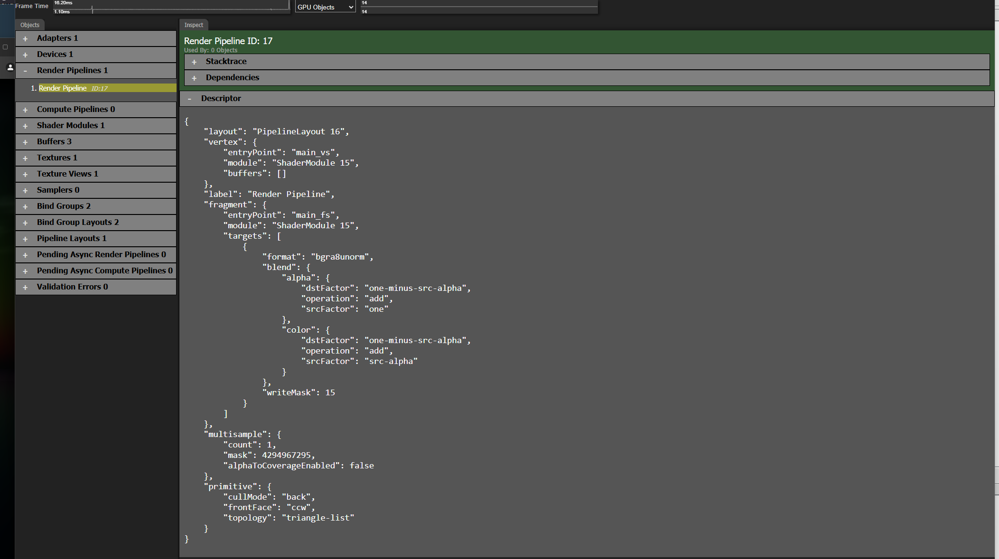


The important part here is the "layout" as it defines the "inputs" so to speak.

The layout is made out of two Bind Groups:
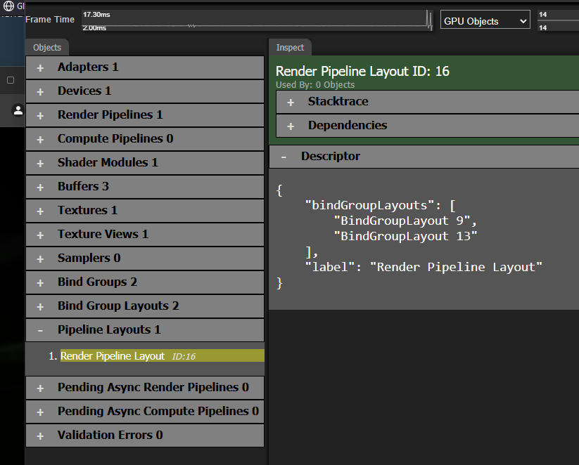


There are two bind groups, "Push bind group" and "Img Bind Group" that are defined as follow:
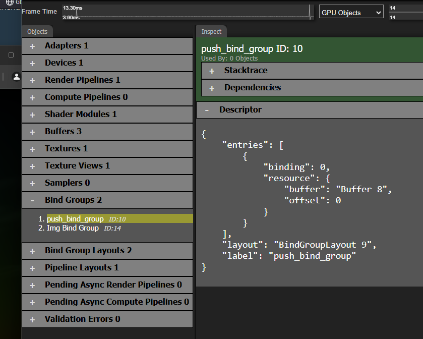
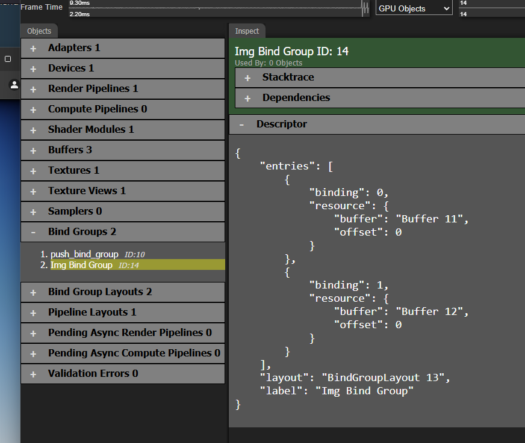

This is _very_ interesting, as its a image we are looking for!

The three refered to buffers is as follows:

Push buffer:
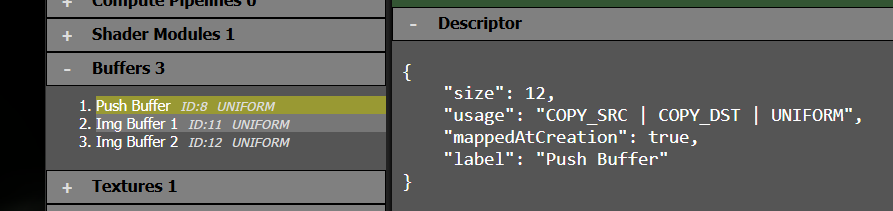

Img buffer 1:
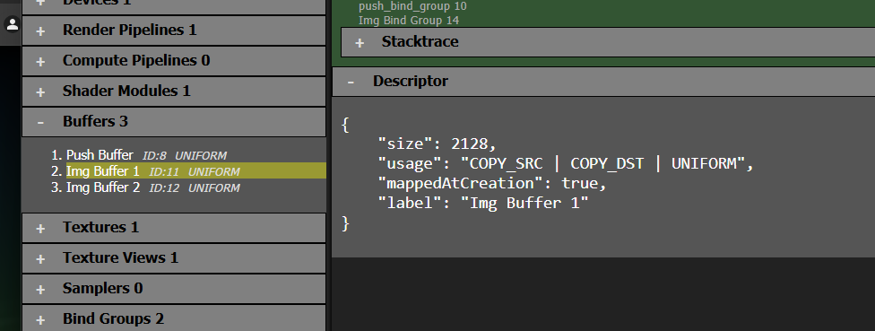

Img buffer 2:
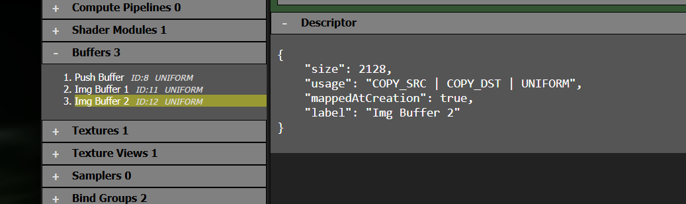


So the question on my mind now is what the content of the buffers acutally are. We note that the push buffer seems a bit small with only 12 bytes, but the Image buffers has a more "roomy" outlook with 2128 bytes each.

This is "almost" the same as 23 x 23 floats (32bit), which looks like something we should follow up.


Next up for my part was figuring out how we can get the content from the buffers.

The solution we ended on to get the data was to override several JS prototypes to console log and breakpoint where we wanted. 

We checked out the docs to get some hints to what we should override:
https://developer.mozilla.org/en-US/docs/Web/API/GPUBuffer


The following code was added into `fwaves_rs.js` by using Chrome's `override content` function. Allowing me to load my own JS file instead of the one from the server. 

```js
window.mappedBuffers = [];
// Array to store references to all created GPUBuffers
window.createdBuffers = [];

// Function to wrap the createBuffer method
(function wrapCreateBuffer() {
    const originalCreateBuffer = GPUDevice.prototype.createBuffer;
    
    GPUDevice.prototype.createBuffer = function(descriptor) {
        const buffer = originalCreateBuffer.call(this, descriptor);
        console.log(`createBuffer called with descriptor:`, descriptor);
        console.log(`Created buffer:`, buffer);
        window.createdBuffers.push(buffer);
        debugger; // Add a breakpoint
        return buffer;
    };
})();

console.log("Breakpoint added to the createBuffer method of GPUDevice.");

// Function to wrap the mapAsync method
(function wrapMapAsync() {
    const originalMapAsync = GPUBuffer.prototype.mapAsync;
    
    GPUBuffer.prototype.mapAsync = function(mode, offset, size) {
        if (mode === GPUMapMode.WRITE) {
            console.log(`mapAsync called for writing on buffer:`, this, `with offset:`, offset, `and size:`, size);
        }
        debugger; // Add a breakpoint
        return originalMapAsync.call(this, mode, offset, size);
    };
})();

console.log("Breakpoint added to the mapAsync method of GPUBuffers for write operations.");

// Function to wrap the getMappedRange method
(function wrapGetMappedRange() {
    const originalGetMappedRange = GPUBuffer.prototype.getMappedRange;
    
    GPUBuffer.prototype.getMappedRange = function(offset, size) {
        const mappedRange = originalGetMappedRange.call(this, offset, size);
        console.log(`getMappedRange called on buffer:`, this, `with offset:`, offset, `and size:`, size);
        console.log(`Mapped range object:`, mappedRange);
        debugger; // Add a breakpoint
        return mappedRange;
    };
})();

console.log("Breakpoint added to the getMappedRange method of GPUBuffers for write operations.");

// Function to wrap the ArrayBuffer constructor
(function wrapArrayBuffer() {
    const OriginalArrayBuffer = ArrayBuffer;

    // Custom ArrayBuffer constructor
    function CustomArrayBuffer(length) {
        const buffer = new OriginalArrayBuffer(length);
        console.log(`ArrayBuffer created with length: ${length}`);
        debugger; // Add a breakpoint
        return buffer;
    }

    // Copy prototype and static properties
    CustomArrayBuffer.prototype = OriginalArrayBuffer.prototype;
    Object.setPrototypeOf(CustomArrayBuffer, OriginalArrayBuffer);

    // Replace global ArrayBuffer with custom constructor
    window.ArrayBuffer = CustomArrayBuffer;
})();

console.log("Breakpoint added to the ArrayBuffer constructor.");

// Function to wrap the set method of TypedArray views
(function wrapTypedArraySet() {
    const typedArrayConstructors = [
        Int8Array, Uint8Array, Uint8ClampedArray, Int16Array, Uint16Array,
        Int32Array, Uint32Array, Float32Array, Float64Array
    ];

    typedArrayConstructors.forEach(TypedArray => {
        const originalSet = TypedArray.prototype.set;

        TypedArray.prototype.set = function(array, offset) {
            console.log(`set called on ${TypedArray.name} with array:`, array, `and offset:`, offset);
            debugger; // Add a breakpoint
            return originalSet.call(this, array, offset);
        };
    });
})();

console.log("Breakpoint added to the set method of TypedArray views.");

// Function to wrap the writeBuffer method
(function wrapWriteBuffer() {
    const originalWriteBuffer = GPUQueue.prototype.writeBuffer;
    
    GPUQueue.prototype.writeBuffer = function(buffer, bufferOffset, data, dataOffset = 0, size) {
        console.log(`writeBuffer called on buffer:`, buffer, `with bufferOffset:`, bufferOffset, `data:`, data, `dataOffset:`, dataOffset, `size:`, size);
        return originalWriteBuffer.call(this, buffer, bufferOffset, data, dataOffset, size);
    };
})();
```


Running the JS code with out new breakpoints and info gave some interesting readouts:

Push buffer creation:
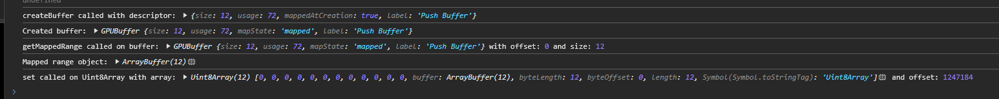

Push buffer is initialized with something:


Image buffer 1 is created and initialized:
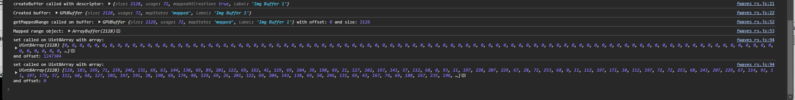

Image buffer 2 is created and initialized:
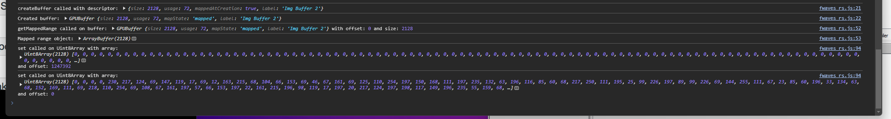


So now we hopefully have content that is the flag!

Push:
```
179,0,0,0,32,63,18,0,16,0,0,0
```

Img 1:
```
128,183,199,71,239,246,131,69,63,144,130,69,89,201,122,69,162,41,129,69,104,39,190,69,21,127,102,197,141,57,112,68,0,93,11,197,220,207,229,67,28,72,253,68,0,11,112,197,171,10,112,197,72,72,253,68,243,207,229,67,114,93,11,197,179,57,112,68,68,127,102,197,191,38,190,69,174,40,129,69,26,201,122,69,204,143,130,69,50,246,131,69,43,167,74,69,188,167,235,196,18,209,201,68,94,226,138,67,115,235,19,197,47,74,77,69,241,243,195,196,248,56,194,67,4,13,134,196,200,38,155,195,101,60,114,197,177,229,95,69,152,234,26,197,1,105,134,69,128,33,94,64,88,73,203,68,133,38,134,196,37,145,165,195,114,17,205,196,42,102,56,196,182,200,150,195,89,120,189,196,178,220,80,68,246,111,67,69,252,85,210,67,148,128,209,196,173,196,132,66,224,164,116,67,95,129,235,195,211,113,139,68,165,36,20,68,36,215,249,195,55,144,71,68,110,69,40,197,56,225,254,67,104,104,55,196,137,221,104,68,92,144,20,195,163,77,206,67,225,148,131,68,230,24,5,69,200,33,34,197,0,253,174,67,221,97,102,196,117,54,187,196,78,34,1,196,231,204,30,70,95,39,133,196,39,31,164,196,226,211,36,196,2,252,73,195,213,24,209,196,201,90,88,196,143,120,189,196,15,233,61,69,252,159,226,196,56,231,193,68,92,212,79,196,28,154,93,69,155,81,112,197,73,57,217,68,240,119,152,68,130,216,108,194,154,213,71,68,204,145,60,197,36,198,220,196,226,175,146,195,170,254,159,67,106,13,88,197,64,129,60,196,121,83,154,68,226,180,136,196,249,83,58,196,191,100,244,195,183,168,253,195,244,29,248,68,70,134,109,196,182,58,194,194,214,134,146,195,223,27,198,68,188,136,84,194,93,245,182,194,222,220,125,68,134,252,142,196,69,175,103,196,115,61,164,196,87,188,29,67,140,153,79,68,188,105,132,68,28,63,192,195,209,87,38,68,206,36,155,67,0,67,67,69,52,85,177,196,247,176,72,68,41,226,129,67,193,113,52,196,94,239,54,68,8,43,252,67,29,118,45,197,143,205,25,68,86,255,82,67,103,36,148,196,245,99,103,68,197,249,3,69,47,21,24,196,65,125,21,68,238,60,206,196,162,170,183,67,45,210,62,67,80,246,147,194,166,8,89,68,64,77,195,196,105,223,167,196,220,55,225,65,228,42,118,69,238,44,23,195,232,161,57,68,82,232,174,196,28,118,53,195,174,178,145,67,200,243,157,67,204,68,185,66,210,38,141,196,162,254,131,67,60,16,125,196,190,129,238,195,47,60,51,68,24,15,156,68,202,66,63,196,148,8,171,68,208,122,134,195,174,126,222,68,8,255,145,196,64,243,70,196,99,186,214,196,75,114,13,197,125,150,14,68,249,64,121,197,165,8,70,68,188,109,34,68,41,88,181,195,161,13,124,68,129,218,67,197,104,195,27,196,44,232,108,69,16,131,26,193,51,203,204,67,153,9,247,68,188,238,165,195,175,119,34,197,209,77,56,197,221,237,117,68,82,150,154,67,202,114,215,68,46,152,147,67,4,201,17,196,206,35,237,196,55,94,39,69,127,94,19,69,105,44,248,195,232,14,67,196,48,45,146,195,136,34,144,193,33,62,31,196,81,173,31,68,107,86,121,195,123,117,227,195,228,190,22,69,93,1,160,196,148,98,133,193,93,17,49,196,124,40,110,67,186,196,14,196,96,106,163,68,46,55,207,66,68,6,146,195,76,28,149,195,84,24,177,196,212,255,42,68,221,5,102,68,90,218,141,66,45,180,146,193,82,163,36,68,80,164,92,68,152,35,161,193,105,225,47,195,212,232,186,68,42,168,150,196,21,29,162,196,28,45,25,68,10,107,162,68,214,165,100,196,184,104,109,195,96,47,140,68,131,238,46,67,116,55,173,196,138,21,14,69,7,121,55,197,135,202,27,197,127,80,97,69,18,164,193,68,32,150,95,64,224,177,59,195,248,131,183,196,161,131,140,196,218,109,213,67,177,102,243,196,195,8,9,196,81,5,35,197,195,181,255,195,80,219,63,68,123,78,145,68,185,246,247,68,97,251,89,196,57,240,158,67,244,63,133,196,73,106,134,67,28,120,146,196,187,114,219,68,20,117,63,67,48,5,43,66,152,80,63,68,18,114,228,196,194,121,135,197,221,24,27,69,15,92,191,68,25,252,35,68,136,184,33,69,74,29,188,67,28,46,44,196,112,187,180,66,234,20,154,67,18,11,62,67,26,21,177,194,239,203,15,68,222,29,108,196,207,112,234,196,141,143,179,67,111,199,6,69,169,180,88,196,189,149,45,69,96,130,221,196,190,107,0,197,82,83,112,68,92,28,32,69,88,243,87,197,138,235,73,68,96,13,139,67,177,102,92,196,33,51,157,68,200,52,210,67,186,201,231,194,41,45,44,196,236,197,231,194,195,52,210,67,207,51,157,68,1,103,92,196,113,15,139,67,95,236,73,68,141,243,87,197,56,28,32,69,123,83,112,68,153,107,0,197,97,130,221,196,186,149,45,69,52,181,88,196,97,199,6,69,233,142,179,67,217,112,234,196,76,29,108,196,71,205,15,68,189,21,177,194,107,11,62,67,32,27,154,67,106,196,180,66,73,102,243,196,154,30,188,67,131,184,33,69,21,252,35,68,192,91,191,68,75,25,27,69,133,121,135,197,150,114,228,196,27,81,63,68,124,14,43,66,208,116,63,67,7,115,219,68,65,120,146,196,149,102,134,67,141,63,133,196,3,242,158,67,24,252,89,196,235,246,247,68,34,78,145,68,90,220,63,68,185,182,255,195,93,5,35,197,115,7,9,196,240,163,92,68,222,109,213,67,12,132,140,196,64,132,183,196,51,184,59,195,160,159,96,64,75,163,193,68,177,80,97,69,71,202,27,197,47,121,55,197,26,21,14,69,67,55,173,196,51,237,46,67,176,47,140,68,47,103,109,195,127,165,100,196,216,106,162,68,166,44,25,68,199,28,162,196,91,168,150,196,227,232,186,68,208,222,47,195,248,82,161,193,56,16,67,196,126,163,36,68,32,177,146,193,140,210,141,66,114,6,102,68,205,254,42,68,156,24,177,196,182,27,149,195,6,6,146,195,70,47,207,66,89,106,163,68,27,196,14,196,73,39,110,67,217,16,49,196,145,78,133,193,242,1,160,196,204,190,22,69,200,117,227,195,132,84,121,195,81,173,31,68,28,62,31,196,104,4,144,193,42,45,146,195,17,65,121,197,135,46,248,195,174,94,19,69,92,94,39,69,233,35,237,196,169,201,17,196,221,150,147,67,124,114,215,68,64,148,154,67,170,238,117,68,254,77,56,197,176,119,34,197,195,238,165,195,222,9,247,68,76,202,204,67,80,86,26,193,239,231,108,69,134,194,27,196,86,218,67,197,10,13,124,68,26,90,181,195,2,108,34,68,87,9,70,68,120,42,118,69,83,150,14,68,149,114,13,197,117,185,214,196,147,243,70,196,76,255,145,196,153,126,222,68,250,121,134,195,144,8,171,68,15,66,63,196,200,14,156,68,162,59,51,68,48,128,238,195,159,16,125,196,190,0,132,67,192,38,141,196,192,72,185,66,238,238,157,67,206,177,145,67,57,124,53,195,130,232,174,196,208,160,57,68,198,48,23,195,16,66,67,69,20,80,225,65,79,223,167,196,27,77,195,196,37,9,89,68,68,248,147,194,85,211,62,67,220,171,183,67,160,60,206,196,227,124,21,68,54,23,24,196,169,249,3,69,164,101,103,68,36,37,148,196,219,248,82,67,66,207,25,68,249,117,45,197,214,42,252,67,23,241,54,68,98,114,52,196,28,223,129,67,34,178,72,68,183,85,177,196,200,135,60,196,74,39,155,67,237,86,38,68,2,62,192,195,168,105,132,68,59,153,79,68,120,189,29,67,128,61,164,196,108,175,103,196,214,251,142,196,90,221,125,68,19,243,182,194,128,118,84,194,111,27,198,68,34,134,146,195,34,59,194,194,194,133,109,196,60,29,248,68,54,171,253,195,90,94,244,195,35,83,58,196,120,180,136,196,55,83,154,68,196,204,30,70,116,13,88,197,26,254,159,67,140,174,146,195,13,198,220,196,18,146,60,197,184,213,71,68,54,207,108,194,203,119,152,68,7,57,217,68,19,82,112,197,100,154,93,69,28,213,79,196,212,231,193,68,205,159,226,196,80,233,61,69,150,121,189,196,64,92,88,196,168,25,209,196,72,245,73,195,94,213,36,196,166,31,164,196,219,39,133,196,41,111,67,69,244,33,1,196,154,54,187,196,149,96,102,196,193,252,174,67,219,33,34,197,59,25,5,69,186,148,131,68,183,74,206,67,24,139,20,195,221,220,104,68,135,103,55,196,96,229,254,67,109,69,40,197,206,143,71,68,8,213,249,195,90,35,20,68,119,113,139,68,92,124,235,195,244,166,116,67,181,197,132,66,235,127,209,196,98,84,210,67,198,165,74,69,113,219,80,68,254,120,189,196,143,201,150,195,218,103,56,196,3,18,205,196,157,144,165,195,220,37,134,196,185,73,203,68,64,88,94,64,229,104,134,69,100,234,26,197,7,230,95,69,67,60,114,197,40,38,155,195,190,13,134,196,180,54,194,67,43,244,195,196,5,74,77,69,153,235,19,197,134,223,138,67,120,209,201,68,245,168,235,196,0,0,0,0,0,0,0,0,0,0,0,0
```

Img 2:
```
0,0,0,0,230,217,124,69,147,119,17,69,12,163,215,68,104,66,153,69,46,67,161,69,125,110,254,197,150,168,111,197,235,132,63,196,116,85,60,68,217,250,111,195,25,99,226,197,89,99,226,69,144,255,111,67,23,85,60,196,33,134,63,68,152,169,111,69,218,110,254,69,108,67,161,197,57,66,153,197,22,161,215,196,98,119,17,197,20,217,124,197,198,117,149,196,235,55,159,68,108,102,91,194,78,84,173,195,117,215,129,196,84,29,86,196,237,166,127,195,43,12,172,196,147,220,151,68,108,165,103,195,65,71,73,68,207,63,71,69,43,171,30,197,68,35,23,69,88,133,142,196,207,102,49,196,145,97,60,196,76,120,186,196,64,49,126,196,69,124,197,68,180,95,186,194,198,63,56,68,45,95,235,68,32,118,168,67,155,70,112,67,229,118,20,195,120,11,82,196,182,76,129,68,155,49,144,196,102,2,177,67,184,174,109,68,155,162,84,196,58,108,134,196,108,217,114,195,21,70,59,195,142,207,229,68,21,39,156,195,39,221,145,68,230,25,175,68,222,139,251,196,6,223,216,196,195,46,129,67,239,62,58,67,158,218,58,195,215,164,19,194,154,157,125,68,43,224,193,69,183,68,145,197,108,182,236,194,184,140,109,68,175,210,128,197,214,75,117,197,4,37,128,69,174,235,37,69,213,94,77,67,206,196,95,68,126,103,132,196,80,148,16,69,60,210,61,197,148,102,32,194,102,110,117,68,147,99,210,196,140,115,38,68,57,162,247,196,156,81,96,66,92,255,253,68,63,163,22,67,200,142,52,196,70,224,254,66,66,118,218,194,129,98,112,68,111,17,156,196,27,131,155,196,144,254,32,68,208,124,79,65,170,215,173,68,111,252,195,67,132,226,227,67,249,127,63,196,165,176,163,68,130,185,23,197,63,115,143,68,78,37,22,197,237,38,87,68,164,31,55,196,198,146,5,69,68,44,112,68,74,131,94,196,10,70,153,195,82,91,70,66,38,6,39,68,158,215,87,196,184,186,251,68,121,29,134,195,188,251,137,196,224,152,193,196,113,240,179,67,210,127,206,195,20,113,91,68,158,212,113,68,80,56,215,196,16,57,245,67,26,74,236,195,228,250,41,69,36,245,172,196,20,59,132,67,184,136,230,65,136,182,251,65,77,228,233,196,148,1,5,68,112,92,16,196,4,116,5,68,104,251,206,67,36,153,14,67,240,250,121,193,7,168,133,69,225,72,100,68,98,172,155,196,171,42,24,197,123,157,63,196,161,195,102,196,178,30,238,68,93,167,23,196,4,26,28,67,238,44,220,196,85,60,27,69,30,110,99,68,149,225,45,68,90,75,137,196,78,132,190,196,67,224,70,68,8,13,10,67,242,169,50,65,242,19,66,68,12,89,251,196,148,119,194,196,190,134,8,68,193,168,159,67,196,153,179,197,47,151,8,195,170,92,37,69,52,142,61,69,86,144,6,69,251,135,173,67,41,129,125,197,148,40,42,196,72,0,186,67,182,111,18,69,194,151,248,195,137,204,25,197,165,105,181,68,58,235,82,68,76,35,91,197,22,33,177,68,210,234,169,67,177,91,9,68,66,217,85,69,239,185,121,196,232,33,32,196,12,128,154,67,194,180,250,195,50,241,27,197,240,21,165,194,94,79,143,68,44,249,70,193,68,235,182,195,15,173,160,68,150,73,156,196,0,8,91,67,52,233,26,68,198,28,34,195,148,102,152,195,96,26,167,67,223,108,6,197,59,16,175,68,66,122,17,68,188,106,30,68,28,113,38,196,200,238,180,195,237,218,14,195,68,212,10,195,75,230,129,68,46,82,217,195,147,123,163,68,54,169,46,195,150,115,64,68,119,213,249,196,199,95,62,68,6,230,249,66,144,3,148,67,122,223,150,68,103,120,252,195,174,228,5,195,69,137,20,68,235,182,60,197,74,191,196,195,228,23,190,68,24,36,198,68,70,229,206,68,180,220,215,196,237,43,201,196,116,235,211,66,122,8,199,67,234,17,152,67,113,254,55,68,64,172,130,196,48,23,9,68,32,55,227,197,250,13,125,196,37,122,248,68,37,54,7,69,162,197,99,68,2,231,14,69,224,97,240,196,215,136,62,196,142,233,25,68,107,64,130,195,117,128,60,196,138,231,88,195,93,193,117,196,240,108,187,195,254,205,80,69,52,188,151,195,10,32,156,194,228,217,102,197,62,118,136,195,24,3,72,69,72,139,23,69,44,64,166,68,252,61,177,195,164,60,248,195,55,148,116,68,213,146,37,196,66,243,11,68,100,170,24,196,204,209,42,195,160,103,205,67,8,239,229,65,246,1,49,196,153,56,3,195,111,111,39,69,149,163,131,195,11,149,144,195,154,148,199,196,108,187,219,196,60,42,168,67,30,148,144,68,186,98,215,68,52,84,126,194,98,48,144,196,42,44,214,67,228,144,6,66,112,164,215,195,36,62,248,67,132,159,215,67,192,162,6,194,92,44,214,195,84,48,144,68,148,64,126,66,156,98,215,196,187,147,144,196,8,46,168,195,197,187,219,68,180,148,199,68,79,146,144,67,201,162,131,67,100,111,39,197,103,56,3,67,3,5,49,68,200,14,230,193,246,103,205,195,178,222,42,67,33,170,24,68,146,243,11,196,142,149,37,68,72,147,116,196,18,55,227,69,204,61,177,67,100,64,166,196,57,139,23,197,247,2,72,197,134,118,136,67,42,218,102,69,4,24,156,66,97,190,151,67,157,205,80,197,234,111,187,67,104,192,117,68,158,232,88,67,61,128,60,68,176,65,130,67,84,233,25,196,200,136,62,68,106,97,240,68,49,231,14,197,19,199,99,196,44,54,7,197,31,122,248,196,196,12,125,68,64,169,46,67,78,23,9,196,215,172,130,68,129,253,55,196,60,18,152,195,30,2,199,195,42,237,211,194,222,43,201,68,51,222,215,68,38,229,206,196,86,35,198,196,22,23,190,196,146,192,196,67,215,182,60,69,240,132,20,196,254,228,5,67,129,118,252,67,214,222,150,196,228,4,148,195,121,228,249,194,123,96,62,196,16,213,249,68,176,115,64,196,130,241,27,69,149,123,163,196,224,84,217,67,17,230,129,196,193,213,10,67,54,222,14,67,167,243,180,67,240,112,38,68,70,106,30,196,226,120,17,196,209,15,175,196,152,108,6,69,217,20,167,195,123,105,152,67,232,29,34,67,26,230,26,196,246,10,91,195,172,73,156,68,234,171,160,196,230,236,182,67,0,67,71,65,121,78,143,196,104,20,165,66,76,154,179,69,76,183,250,67,213,127,154,195,74,32,32,68,238,187,121,68,60,217,85,197,167,91,9,196,0,235,169,195,21,33,177,196,105,35,91,69,108,235,82,196,151,105,181,196,13,204,25,69,240,151,248,67,2,112,18,197,44,0,186,195,103,41,42,68,17,129,125,69,204,134,173,195,244,143,6,197,116,142,61,197,171,92,37,197,246,153,8,67,235,167,133,197,24,169,159,195,211,130,8,196,59,120,194,68,98,89,251,68,42,17,66,196,142,121,50,193,19,11,10,195,214,222,70,196,174,132,190,68,221,75,137,68,112,225,45,196,110,110,99,196,81,60,27,197,68,45,220,68,93,26,28,195,90,167,23,68,103,30,238,196,131,195,102,68,42,158,63,68,221,42,24,69,188,171,155,68,114,72,100,196,79,187,251,196,112,209,121,65,169,151,14,195,112,247,206,195,54,116,5,196,84,91,16,68,32,255,4,196,17,228,233,68,24,122,251,193,192,53,230,193,50,57,132,195,66,244,172,68,51,250,41,197,168,71,236,67,224,58,245,195,130,57,215,68,90,212,113,196,66,112,91,196,112,131,206,67,100,242,179,195,172,152,193,68,7,253,137,68,116,29,134,67,62,125,218,66,212,215,87,68,157,5,39,196,188,73,70,194,64,71,153,67,242,130,94,68,155,43,112,196,124,146,5,197,8,32,55,68,123,38,87,196,168,37,22,69,178,115,143,196,243,184,23,69,206,176,163,196,216,127,63,68,128,227,227,195,30,250,195,195,22,216,173,196,224,224,79,193,10,1,33,196,120,131,155,68,113,17,156,68,84,98,112,196,145,223,193,197,106,211,254,194,78,145,52,68,203,162,22,195,196,254,253,196,192,31,96,194,35,162,247,68,196,115,38,196,158,99,210,68,157,110,117,196,92,128,32,66,76,210,61,69,87,148,16,197,28,103,132,68,151,196,95,196,25,98,77,195,133,235,37,197,242,36,128,197,221,75,117,69,215,210,128,69,229,138,109,196,140,181,236,66,178,68,145,69,224,118,168,195,212,157,125,196,25,166,19,66,117,229,58,67,183,61,58,195,60,45,129,195,130,224,216,68,37,140,251,68,100,25,175,196,178,220,145,196,46,39,156,67,148,207,229,196,107,77,59,67,69,215,114,67,158,107,134,68,158,164,84,68,144,173,109,196,208,3,177,195,121,51,144,68,44,77,129,196,194,11,82,68,42,107,20,67,97,76,112,195,73,119,149,68,77,95,235,196,160,62,56,196,116,106,186,66,229,123,197,196,58,49,126,68,235,120,186,68,224,98,60,68,232,101,49,68,207,133,142,68,223,35,23,197,212,170,30,69,24,64,71,197,180,69,73,196,213,165,103,67,247,219,151,196,157,12,172,68,202,170,127,67,56,29,86,68,221,215,129,68,189,83,173,67,192,77,91,66,14,56,159,196,0,0,0,0,0,0,0,0,0,0,0,0
```


At this point, I (n0k0) was stumped and tried to encode the bytes as image. Every resolution, grayscale, bitmap, rgb and rgba only outputted nonsense.

Poiko did the smarter thing and started to reverse more of the code to figure out how the images are processed.

By looking at the page where we can input our own "flag" we see that the code `process_canvas()` is called by a event listener when something is drawn. Which is turn calls `process()`.

```js
// index.html
async function process_canvas() {
        var img = context.getImageData(0, 0, 23, 23);
        var data = monochrome(img.data);
        var pdata = process(data);
        var a = Array.from(pdata.slice(0, 529)).concat(0.0,0.0,0.0);
        var b = Array.from(pdata.slice(529)).concat(0.0,0.0,0.0);
        update(a, b);
    }

// process.js
export function process(a) {
    const ptr0 = passArrayF32ToWasm0(a, wasm.__wbindgen_malloc);
    const len0 = WASM_VECTOR_LEN;
    const ret = wasm.process(ptr0, len0);
    return takeObject(ret);
}
```

`process(a)` forwards the buffer to the wasm function with the same name.

Ghidra code with some cleanup:
```c
undefined4 export::process(undefined4 ptr0,int len0)
{
  undefined4 uVar1;
  
  uVar1 = Process::process_img::h68e5f95be1a9876a(ptr0,len0);
  if (len0 != 0) {
    __rust_dealloc(ptr0,len0 << 2,4);
  }
  return uVar1;
}
```

Note some magic values in the next code that hinted to what the variables are:

**529:** Same as 23x23
**4232:** Same as 529 items times 4 bytes (ie a float)

```c
undefined4 Process::process_img::h68e5f95be1a9876a(undefined4 ptr0,undefined4 len0)
{
    
  int index_row?;
  undefined8 *float_array_pointer;
  int index_col?;
  undefined8 *num_items_array_pointer;
  uint param1;
  undefined4 uVar1;
  undefined8 float_output;
  undefined float_image_array_1 [4232];
  undefined8 num_items [529];
  undefined float_image_array_2 [4232];
  uint local_4;
  
  Process::from_js_array::h7647fe95965235cb(float_image_array_1,ptr0,len0);
                    /* Init num_items with zeroes */
  Process::empty_array::ha62f0654796b9933(num_items);
  index_col? = 0;
  num_items_array_pointer = num_items;
  do {
    index_row? = 0;
    float_array_pointer = num_items_array_pointer;
    do {
      Process::process_single::h90452eeeb2b02ea0
                (&float_output,float_image_array_1,index_row?,index_col?);
      *float_array_pointer = float_output;
      float_array_pointer = float_array_pointer + 1;
      index_row? = index_row? + 1;
    } while (index_row? != 23);
    num_items_array_pointer = num_items_array_pointer + 0x17;
    index_col? = index_col? + 1;
  } while (index_col? != 23);
  Process::to_js_array::h74ffa3a05e0cfbe0(float_image_array_2,num_items);
  param1 = js_sys::Float32Array::view::haaaa5a72a92c0514(float_image_array_2,0x422);
  local_4 = param1;
  uVar1 = js_sys::Float32Array::new::h27ff6280cf813025(&local_4);
  if (0x83 < param1) {
    import::wbg::wasm_bindgen::__wbindgen_object_drop_ref::hbd64080e39e75629(param1);
  }
  return uVar1;
}


```

The most interesting part here must be `Process::from_js_array::h7647fe95965235cb` and `Process::process_single::h90452eeeb2b02ea0`


```c
void Process::from_js_array::h7647fe95965235cb(void *float_image_array,int pointer,int length)
{
  undefined4 *float_pointer;
  int index;
  undefined4 *end_pointer;
  undefined4 *input_image_pointer;
  undefined4 init_empty_array [2];
  float4 local_1080;
  undefined4 local_107c [1055];
  
  Process::empty_array::ha62f0654796b9933(init_empty_array);
  if (length != 0) {
    end_pointer = (undefined4 *)(pointer + length * 4);
    float_pointer = init_empty_array;
    index = 0;
    do {
      float_pointer[1] = 0;
      input_image_pointer = (undefined4 *)(pointer + index);
      *float_pointer = *input_image_pointer;
      if (input_image_pointer + 1 == end_pointer) break;
      index = index + 8;
      if (index == 2120) {
        core::panicking::panic_bounds_check::hbb84afc4048f1792(0x211,0x211,0x10000c);
        do {
          halt_trap();
        } while( true );
      }
      float_pointer[3] = 0;
      float_pointer[2] = input_image_pointer[1];
      float_pointer = float_pointer + 4;
    } while (input_image_pointer + 2 != end_pointer);
  }
  memcpy(float_image_array,init_empty_array,4232);
  return;
}
```

And the process single code.
```c
void Process::process_single::h90452eeeb2b02ea0(float *output,int float_image_array,int index_row,int index_col)
{
  int iVar1;
  uint uVar2;
  int iVar3;
  float fVar4;
  float fVar5;
  float fVar6;
  float fVar7;
  float __x;
  
  iVar1 = 0;
  fVar4 = 0.0;
  fVar5 = 0.0;
  do {
    uVar2 = 0;
    iVar3 = 0;
    do {
      fVar7 = *(float *)(float_image_array + iVar3);
      __x = ((float)(uint)(iVar1 * index_col) / 23.0 + (float)uVar2 / 23.0) * -6.2831855;
      fVar6 = sinf(__x);
      fVar4 = fVar4 + fVar7 * fVar6;
      fVar6 = cosf(__x);
      fVar5 = fVar5 + fVar7 * fVar6;
      uVar2 = uVar2 + index_row;
      iVar3 = iVar3 + 8;
    } while (iVar3 != 0xb8);
    float_image_array = float_image_array + 0xb8;
    iVar1 = iVar1 + 1;
  } while (iVar1 != 0x17);
  output[1] = fVar4;
  *output = fVar5;
  return;
}
```

`Process::process_img()` sets up a double 23x23 for loop, and calls `Process::process_single()` on each iteration. 
`Process::process_single()` itself also does a 23x23 double for loop, and calls both `cosf()` and `sinf()` on each iteration, 
summing up the values separately. 
You can probably set up breakpoints in the chrome debugger to see exactly what data goes through these functions; 
I just assumed it was the pixels of the 23x23 canvas image.

If you've seen a variant of the Fourier transform before, this might look familiar. And since we are dealing with a 2d image, it should be a 2d variant of the transform. Indeed, if we know/google the formula for it we see that it's precisely that, or rather, the inverse transform. This makes sense since we are going from an image of "frequency pixels" to a "wave" image, and the forward Fourier transform goes the other way.


At this point I just tried to run the image through a forward Fourier transform to see what I got. This is easily done with python's numpy:

```py
import struct
import numpy as np
import matplotlib.pyplot as plt

def process_file(file):
    data = open(file).read().split(",")[:-12]
    byte_data = bytearray(int(num) for num in data)
    return np.frombuffer(byte_data, dtype=np.float32)

buf1 = process_file("buf1.txt")
buf2 = process_file("buf2.txt")

wave = buf1 + 1j * buf2
wave = wave.reshape((23, 23))

freq = np.fft.ifft2(wave)

plt.imshow(np.abs(freq))
plt.show()
```

And voila!

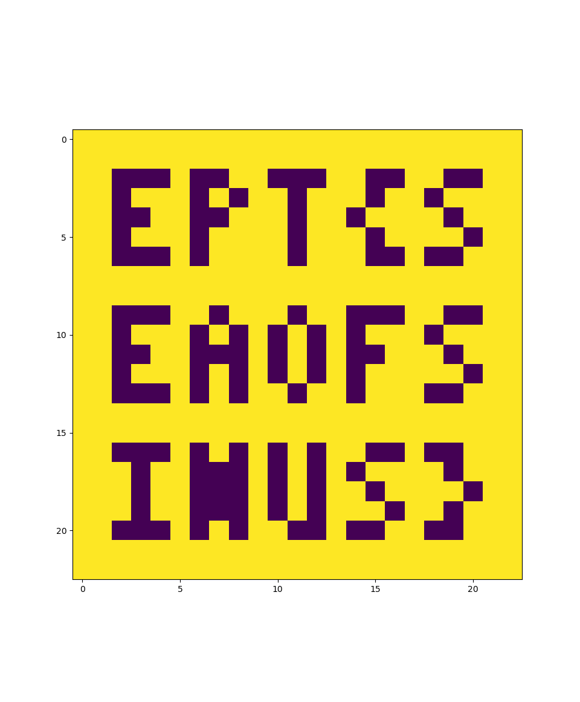

**Flag:** `EPT{SEAOFSINUS}` 