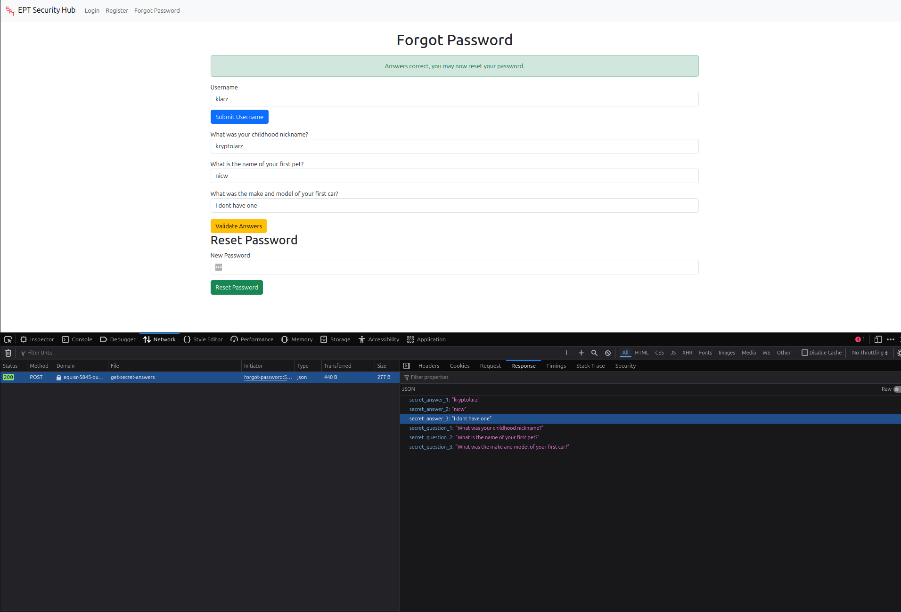
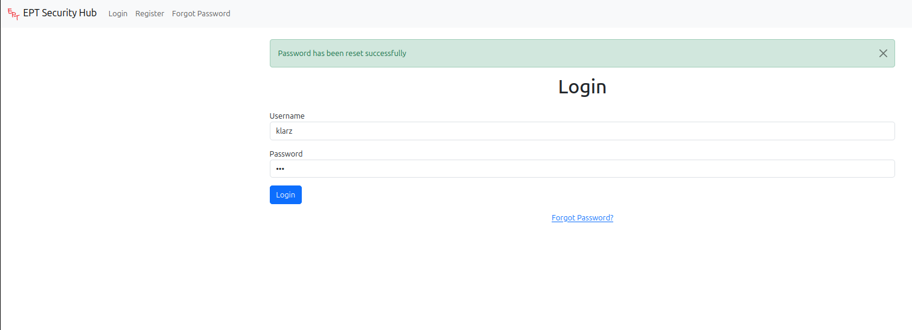
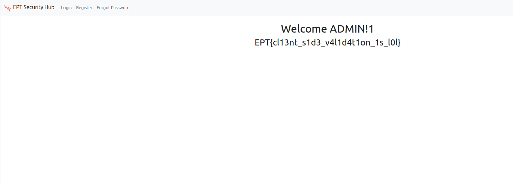
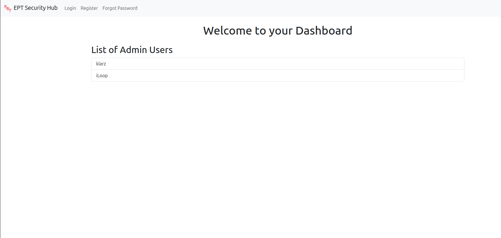
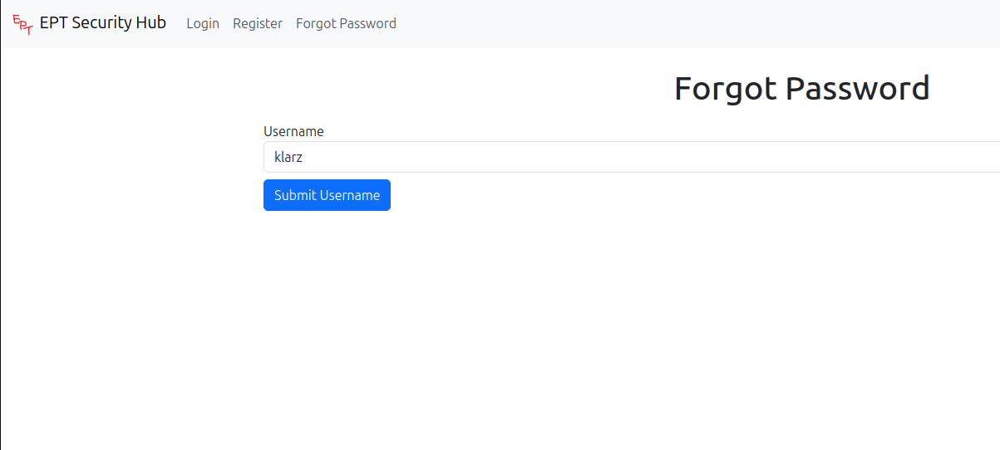
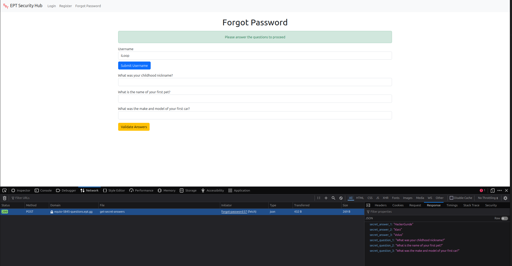

# Writeup
by fluffyhake

## Solution
By looking through the responses from the webserver when requesting a password reset, we see answers for security questions present in the response. By putting answers into the Forgot Password form we can reset `klarz` password and get the flag.

### Example

Resetting password with answers present in the response for `/get-secret-answers`: 

Logging in with our new password:

Flag is presented upon successful login:

## Explanation

After registering a user we get a list of all admin users

On the webpage we see a option for resetting passwords. Let's explore it further.
Starting at the top of the list we chose klarz as the first victim for a password reset.

Usually during web challenges we use developer tools in the Network tab to keep an eye on all requests.

When submitting the username we se a request going to `/get-secret-answers`. Taking a look at the response we see the answers for our security questions.

Filling these answers into the webpage and pressing submit we are prompted to enter a new password.

We now see `Password has been reset successfully` and we can try our new password:

Logging in we get the flag!

---

After the initial solve i tried with the other Admin user called iLoop. It results in the same outcome and the flag. iLoop has some other answers to the security questions:
