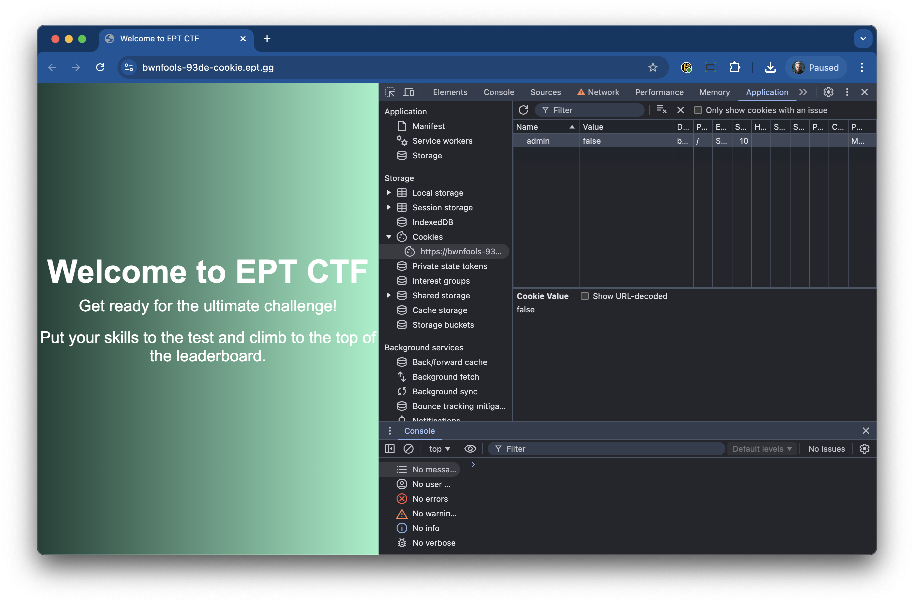
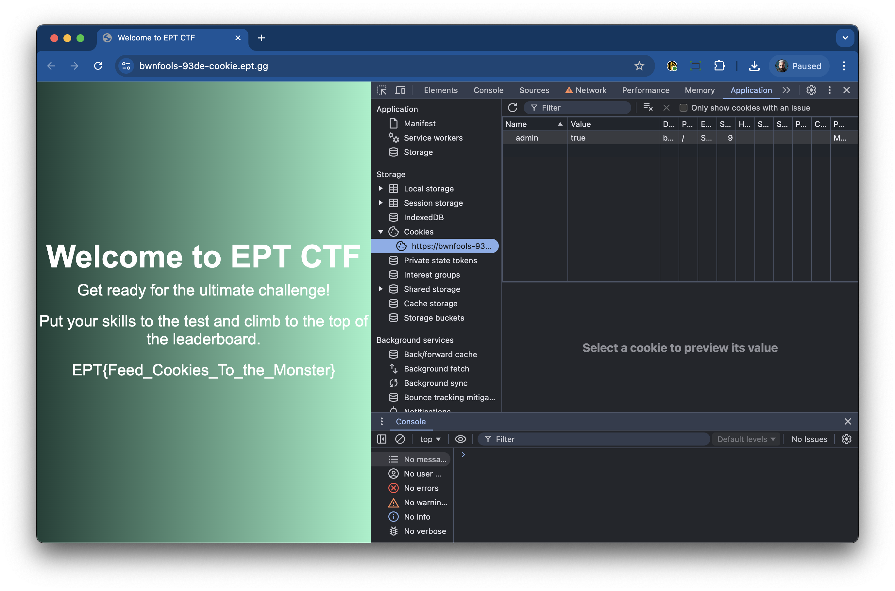

# Writeup

author: .spydx & fullsn4ck @ bwnfools

## Let's bake :baby:

Since we are entering the cookie season, we decided to add our own ingrediants to the cookie.

Uppon checking the Developer Console, there already was a cookie for us, but it did not have the correct taste. We like em with chocolate, and set its value to `true`.

Refreshed the page and the flag was shown.

