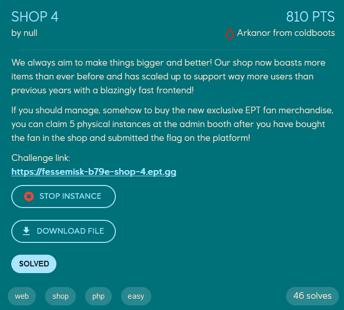
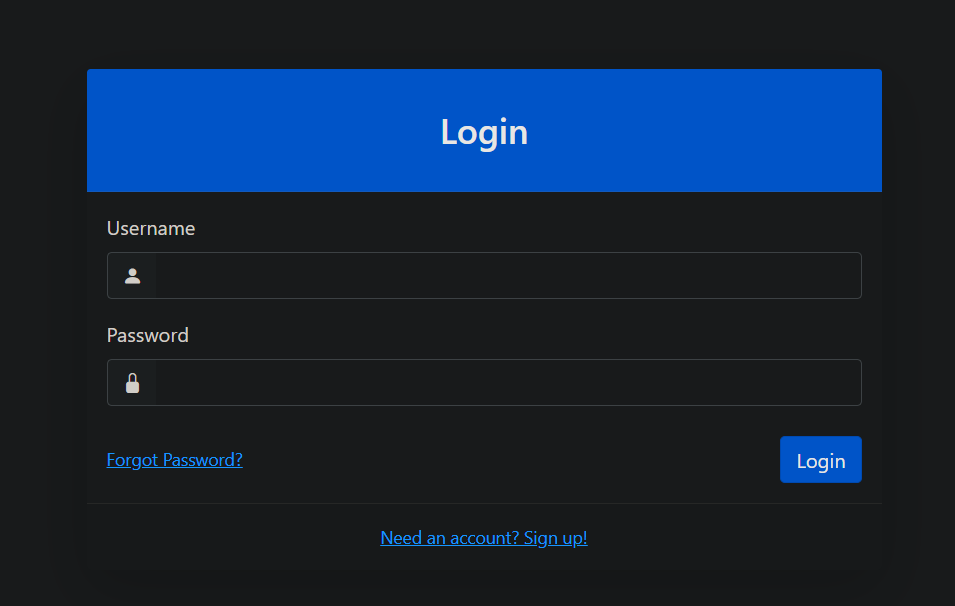
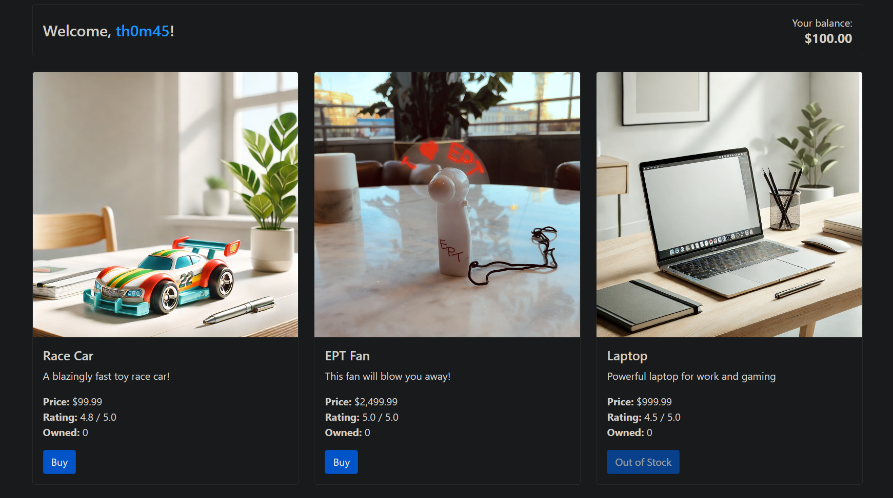
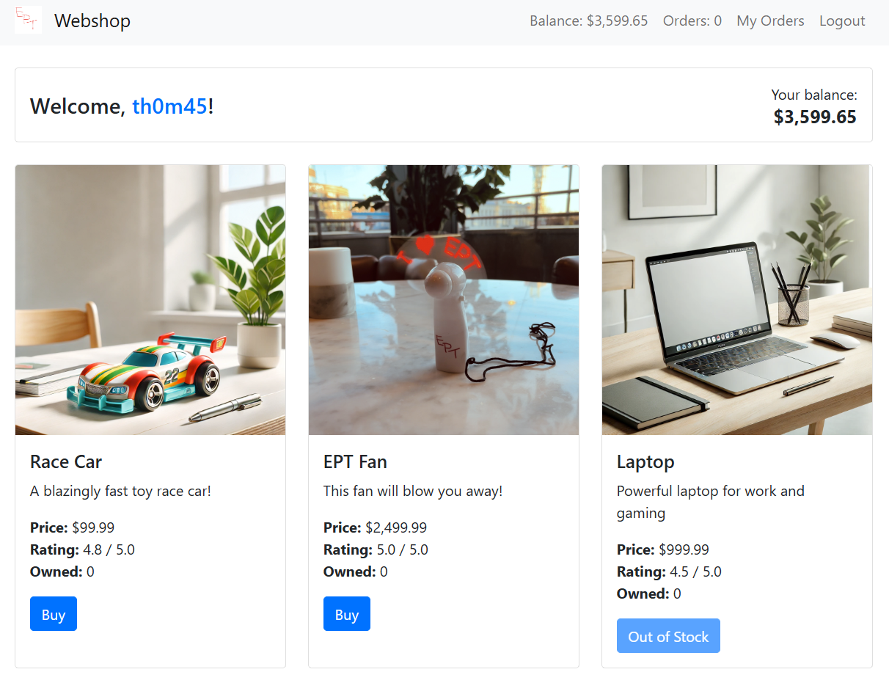
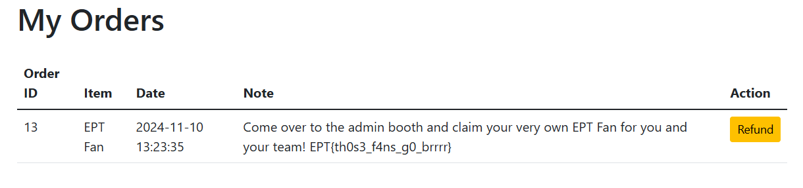

# Writeup
author: th@m456 @ FesseMisk

## Shop 4 (web chal)


### Solution
We are provided a link of the challenge, taking us to a login form.


Here we need to create a random user and log in. When logging in, we have $100 to spend. A `racing car` costs  $99.99, while a `EPT Fan` costs $2,499.99. All other items are "out of stock".



I already know that we can win the actual EPT-fan for this challenge, so that must be how we get the flag!

I discovered that there is a race condition vulnerability in the "refund" functionality of the shop. By exploiting this, we can perform multiple refunds on a single item.

I created a [script](solve.py) to exploit the race condition by sending multiple refund requests concurrently.

I have to buy one race car, and then run the script in order to get as much cash as possible. Had to redo it a couple of times before we had enough cash to get the flag (and five of the actual EPT fan!)



When we have enough cash, we are able to buy the EPT fan - also giving us the flag!





```text
EPT{th0s3_f4ns_g0_brrrr}
```