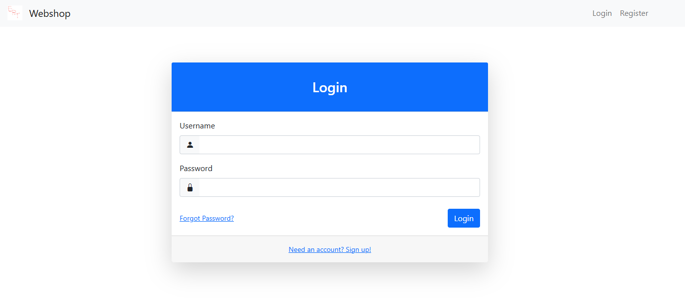
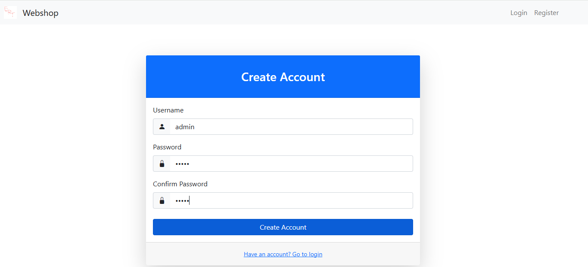
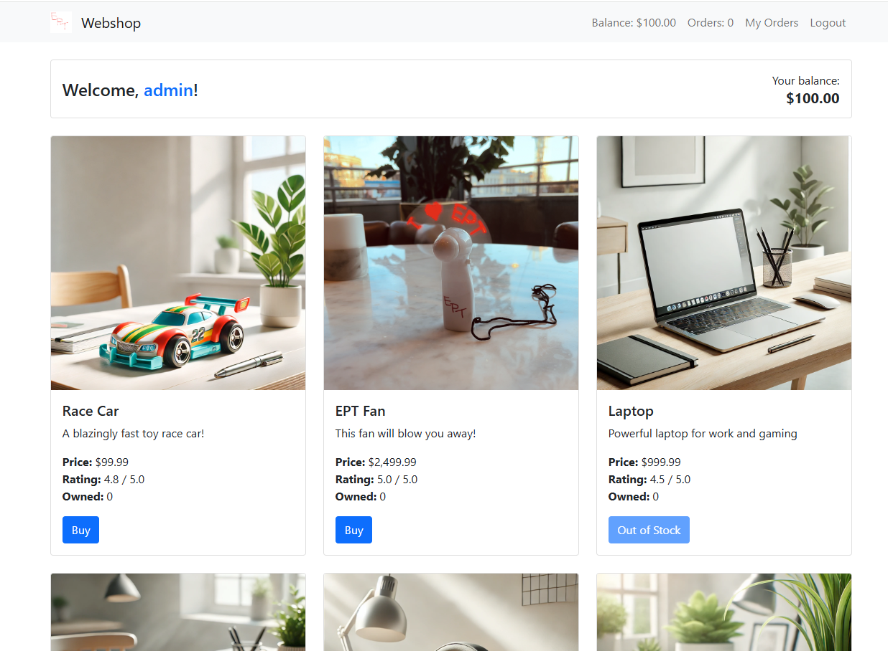
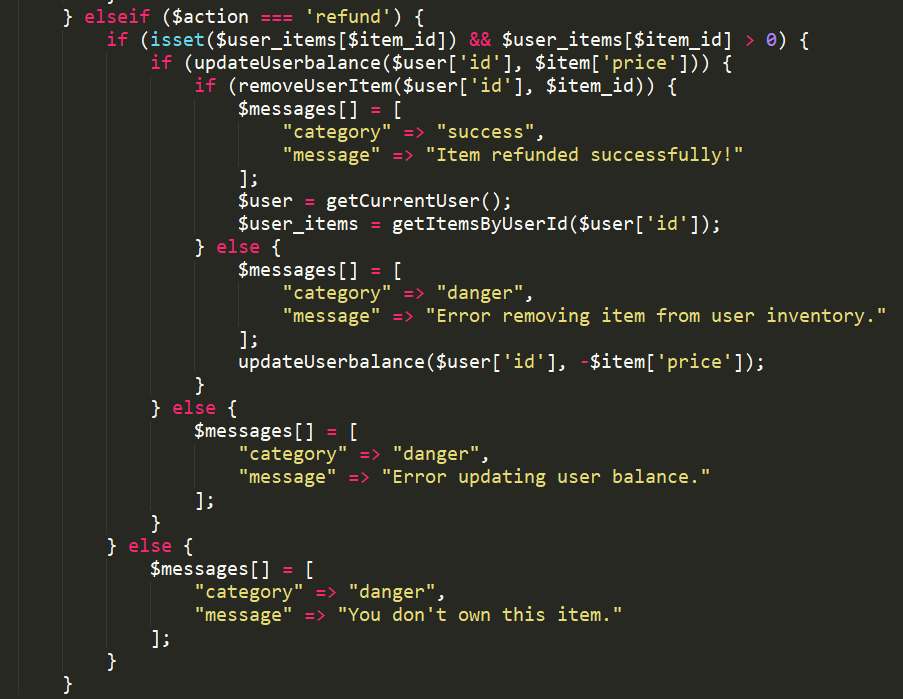
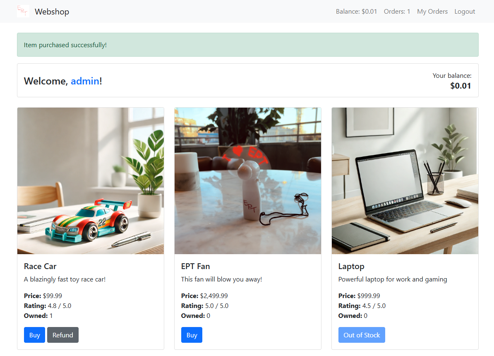
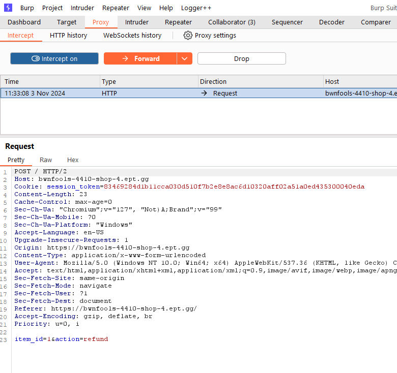
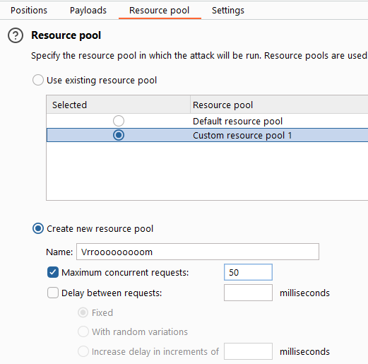
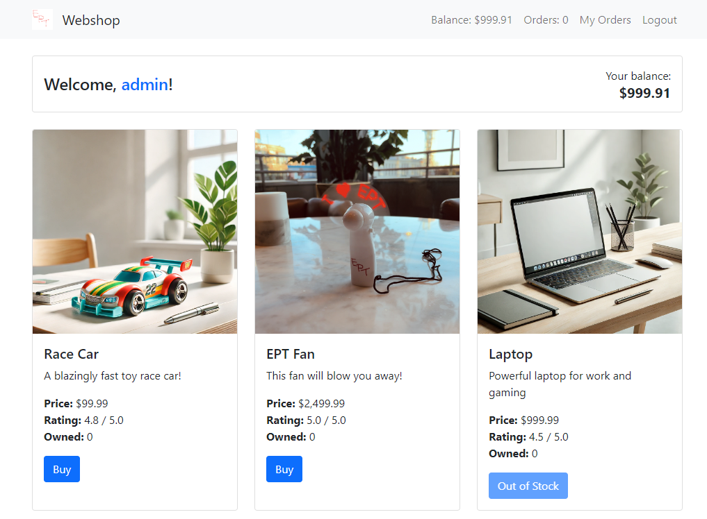
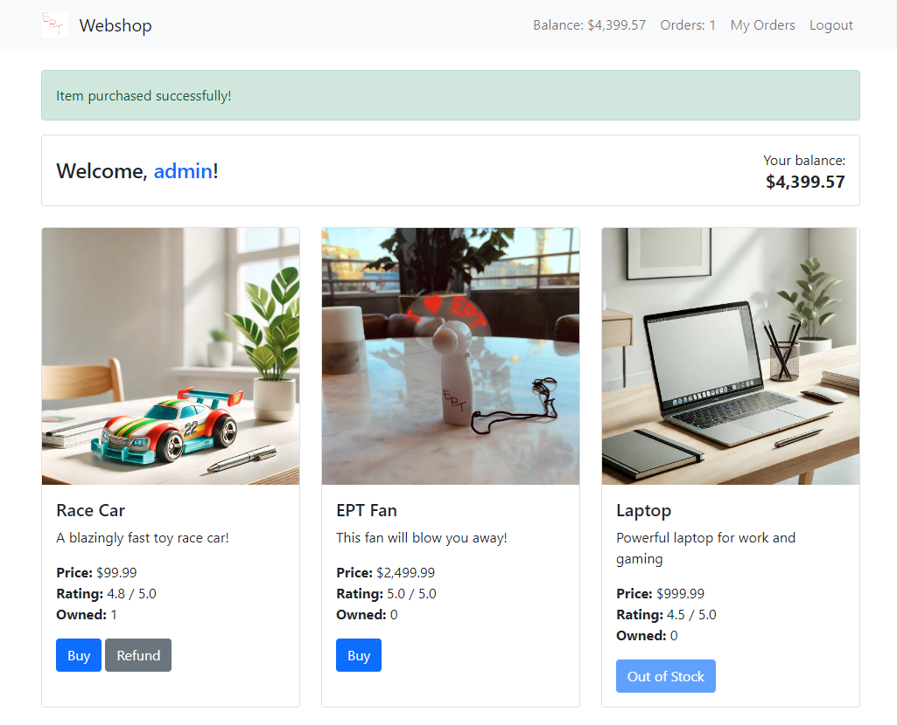
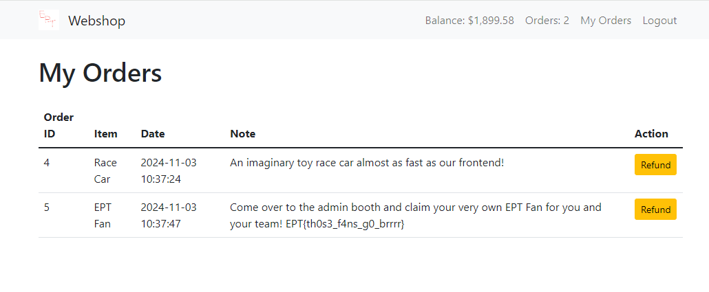

# Writeup

Author: loca1gh0st

## Shop 4
Shop4 was a nice web challenge illustrating issues that are very relevant to date. As I missed the very sexy EPT socks last year (only due to not being present on-site) I was determined to get my hands on this very usable/practical multipurpose device that has the EPT logo printed on it. 

If you succeeded in getting the flag for this challenge, you were, per se, able to get the intended product for free. And you know what they say, if the product is free, then you are the product. I am an EPT fan! Thanks for this nice challenge.

We get a nice URL to go to for the webshop. Provided are also the source-code in PHP for the site.

### Challenge Description
``` 
We always aim to make things bigger and better! Our shop now boasts more items than ever before and has scaled up to support way more users than previous years with a blazingly fast frontend!

If you should manage, somehow to buy the new exclusive EPT fan merchandise, you can claim 5 physical instances at the admin booth after you have bought the fan in the shop and submitted the flag on the platform!
```

## First look

Looking at the webshop, we can register an account, login and make one-click purchases, and even immediatly invoke the [customer return right](https://lovdata.no/artikkel/nar_kan_jeg_angre_pa_kjopet/4498) and get an instant refund. 


I register as admin, as one does.


Sadly most items seems out of stock. On a positive note, ~~the website are deeply integrated with my bank account - 100$ is the exact amount that I have in my checkings account~~ we are awarded with a 100$ signup balance.


## The c0de

I started out spending more time (a lot more) than necessary reviewing source code looking for vulnerabilities like RCE,LFI and the likes. The only thing we needed to confirm, was that the refund functionality does not implement any thread-safe operations. This means, we there is a possibility for a race condition. Yup, that's a nice little hint with the race-car product.


## The race

So how does a race condition work in an web environment? Well, let's say you go to an actual store and make a purchase. Let's say you purchase an AI designed race-car:


This is a big store (**busy website**), so there are a lot of cashiers (**threads**) there to handle your requests (yes, **HTTP requests**). As you are only one person, you proceed to **ONE** of the cashiers to make the purchase (your **Buy-Product HTTP POST request**). That is all good and you now proudly own an AI designed race-car.

Because of reasons, we regret the purchase and want our money back. Now imagine if we were able to ask like 10 cashiers about the refund.... at the same time. What would happen?
Well, based on the source code:



it would look something like this, remember this happens simultaneously:
- All 10 cashiers check their system for if you have the item you want a refund for
- They all discover that yes, you have an item eligible for a refund
- They transfer 99.99$ back to you
- When you have received the money, they all register that you have given the item back


So we need to ask for a refund in parallel so fast, that when the cashiers check their system, no refund has already been registered. It is a race to ask for a refund as many times as possible before any refund request is completely registered.

## The how

This can be done in many many ways. You can write your own multithreaded python script. You can use the free tool from OWASP, OWASP ZAP. We can even use well known content-discovery, or dirbusting tools like gobuster or ffuff. If you go for the latter, keep in mind you need to bring your logged in session cookie and put the FUZZ parameter somewhere (as it is required if I remember correctly) it will not damage the attack. You just want to repeat the same attack many times, not changing the payload.

Lazy as I am, I used the professional edition of Burpsuite in the following manner:

Buying my first race-car:



Asking for a refund using the GUI (I know - so total n00b), only to have Burp intercept the request:


(AI AI AI my EYES!!!) (Burp HAS dark-mode you know....)

Sending it to intruder and setting payload position somewhere in the user-agent string, I create a new resource pool with 50 concurrent requests maximum.



Running the attack gives us back around 1000$. 



That is not enough, so we'll just repeat the steps (buy a racecar, nag for a refund from everyone):

![Refund again][moneyback3.jpeg]

until we have enough money for the nice EPT fan promising to blow us away!



## The Win

Purchasing the fan AND the race-car, we still want the race-car - I mean look at it, checking the order page we indeed do have a flag :D



We get the flag from Order page: EPT{th0s3_f4ns_g0_brrrr}
