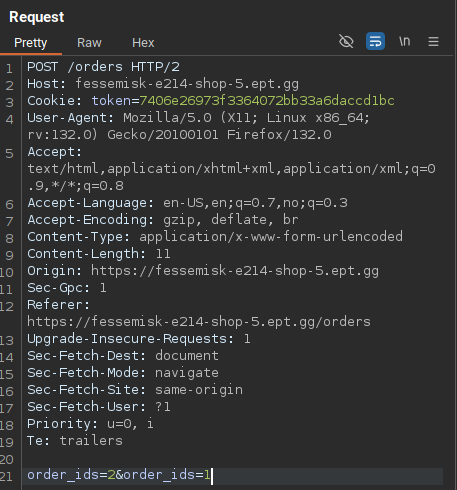
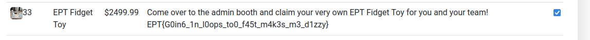

# Shop 5

## Description

It appears that PHP was not the solution after all, so we switched to the much more modern and secure Python language. Fortunatly, using modern frameworks also guarantees that our application is fully secure!

If you should manage, somehow to buy the new exclusive EPT fidget toy merchandise, you can claim 5 physical instances at the admin booth after you have bought the toy in the shop and submitted the flag on the platform!

Challenge link:
https://fessemisk-e214-shop-5.ept.gg

## Solution

After experimenting with the site, I discovered that I could sell other users orders by modifying the `order_id`. Observing that `order_id` was set to `1` for the first user and `2` for the second, I changed my sell payload to `order_ids=2&order_ids=1`, allowing me to sell orders from both users into one account:  

This worked and doubled my balance.  
 

Next, I tried purchasing two "Fun toys" with my 200 balance, but only one toy was removed from my inventory when I sold them both. This allowed me to continually buy and sell toys, doubling my balance each time. Repeating this process enough times gave me enough funds to purchase the EPT fidget toy.

