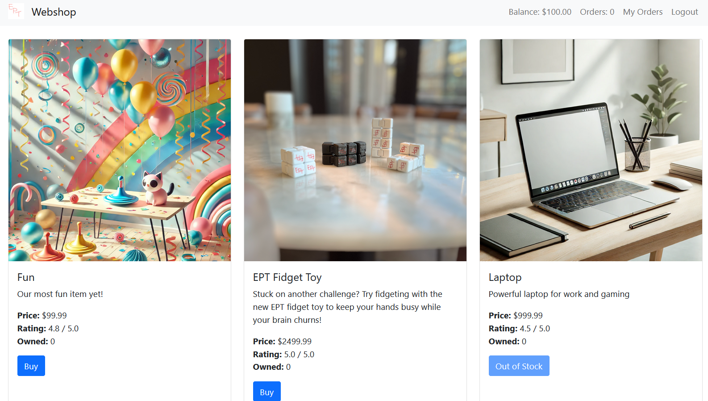
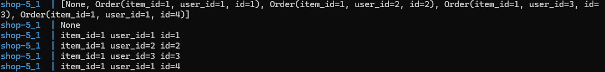
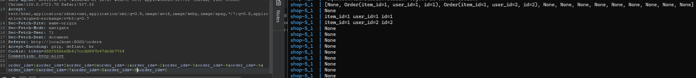
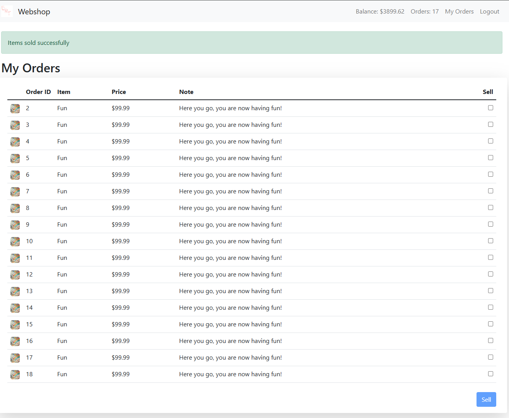
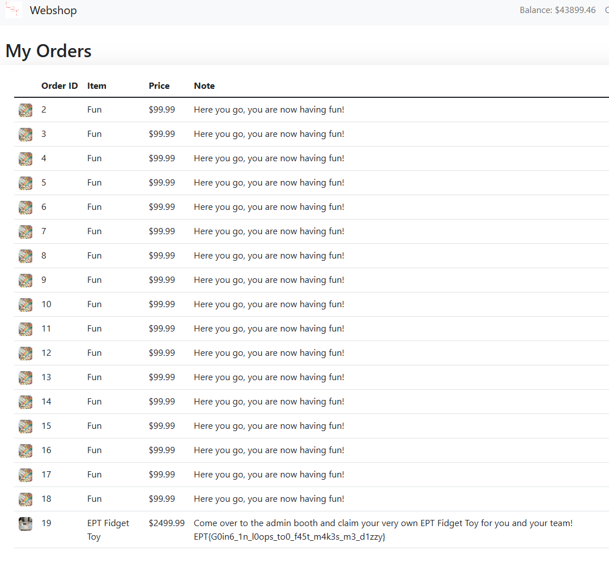

# Shop 5
Solved by TGC, Sakarl
# Challenge
Author: null

## Provided challenge files
* [shop-5.zip](shop-5.zip)

# Writeup
Looking through the challenge files we see that the challenge has two functions, buy an object and sell an object.
We only have 100 dollars and buying the flag costs 2500. So we need to increase our cash.



Looking at the code we see that the buy function places an order for an item and updates our orders, nothing to exploit here.

```python
@app.get("/orders", response_class=HTMLResponse)
async def orders(request: Request, session: SessionDep, error: str = "", success: str = ""):
    user, order_count = get_user(request, session)
    if not user:
        return RedirectResponse(url="/login")

    user_orders = session.exec(select(Order).filter_by(user_id=user.id)).scalars().all()
    items = session.exec(select(Item)).scalars().all()
    items = {item.id: item for item in items}
    return templates.TemplateResponse("orders.html", {"title": "Orders", "request": request, "user": user, "order_count": order_count, "orders": user_orders, "items": items, "error": error, "success": success})
```

The sell function however accepts a list of `order_ids`. For each order_id it does a stream_sell function, and that function has the perfect storm for our exploitation.

The sell order removes duplicates from the order list with `order_ids = list(set(order_ids))`, then it calls the sell order function for each order in the `order_ids` list.
In `stream_sell_orders` the `sell_order` function is referencing order from the outer scope, resulting in a condition where the order might be altered during runtime and the conditions for what order is what has changed. This means that by the time the sell_order gets called, it might sell a different order that belongs to another user or nothing at all.

```python
def stream_sell_orders(session: Session, orders: list[Order]):
    for order in orders:

        def sell_order(user: User):
            if not order or order.user_id != user.id:
                return False
            item = session.get(Item, order.item_id)
            user.balance += item.price
            session.delete(order)
            session.commit()
            return True

        yield sell_order

@app.post("/orders")
async def sell(request: Request, session: SessionDep, order_ids: list[int] = Form(...)):
    user, _ = get_user(request, session)
    if not user:
        return RedirectResponse(url="/login?error=Please log in to sell items", status_code=303)
    order_ids = list(set(order_ids))
    for sell_order in list(stream_sell_orders(session, [session.get(Order, order_id) for order_id in order_ids])):
        if not sell_order(user):
            return await orders(request, error="Failed to sell all orders", session=session)

    return await orders(request, success="Items sold successfully", session=session)

```

As the orders are also user traversable, as long as the final order is a valid order for the user, it will be processed. This is becuase the for loop `for order in orders:` ends on the last entry, and will then give a true statement and subsequently sell the rest of the orders that don't belong to us. In the screnshot below, you see that user id 1 can sell order 4 as it's the last entry, and that will sell the rest of the list for the amount the last entry is worth becuase it sells order 4, 4 times.
So by passing the list `order_ids=0&order_ids=1` the first time, the server will see a NULL order and a order 1, so it sells order 1 twice, doubling your money. If you have more users with an order each, each the final user with the highest id can sell the other users orders for x amount of times.



By passing a letter, you will get an invalid input so that doesn't work, and by passing a negative number will add that order to the end



The idea is now to:
- Buy a toy
- Sell the toy and a null order, make sure our valid order is last
- Generate cash
- Keep buying and selling for more cash
- Eventually you can buy the flag



Buy the EPT fidget toy and get the flag



Flag: `EPT{G0in6_1n_l0ops_to0_f45t_m4k3s_m3_d1zzy}`